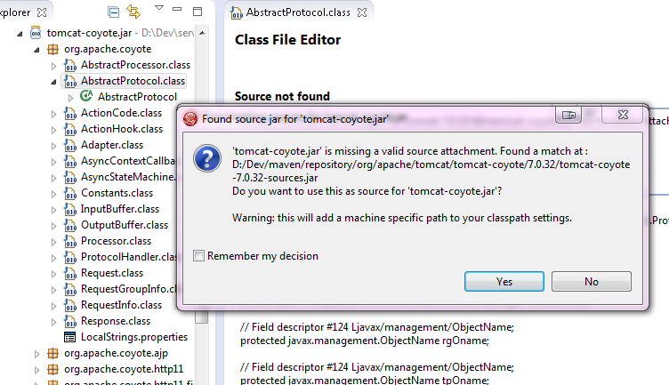
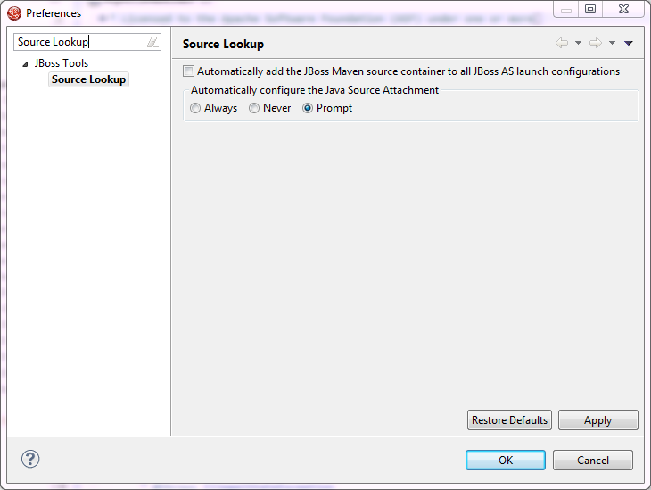

= Maven Tools What's New in 4.1.0.Alpha2
:page-layout: whatsnew
:page-component_id: maven
:page-component_version: 4.1.0.Alpha2
:page-product_id: jbt_core 
:page-product_version: 4.1.0.Alpha2

== JBoss Maven Integration
=== Source lookup for the masses

Maven projects always had an this awesome feature where, clicking on any jar dependency, source would be downloaded automatically for you if needed.
We now give you the same level of awesomeness for *any* kind of (non-maven) project.

The automatic Source Lookup feature is based on Maven. As such, downloaded sources will be stored under your local Maven repository.

Since JDT doesn't support variables in source attachments (such as M2_REPO), source attachments use absolute (non-portable) paths. It's ok when the jar is part of a Classpath Library, since the path is stored in your own workspace. But it can become a problem if your jar dependency is listed in your project's .classpath descriptor, potentially shared with other developers. For this reason, by default, you'll be warned when a compatible source has been found :

See it in action in this http://goo.gl/rzzXr[screencast].

If you click on "Remember my decision", your choice will be applied for subsequent source lookups. Your choice can be modified under Window > Preferences > JBoss Tools > Source Lookup :

One advantage of the Source Lookup feature is it'll check if source attachments are valid. for instance, if the source attachment points to a missing / invalid file, the proper source will be mapped instead. This mitigates the non-portable issue mentioned previously.

Under the hood, the source lookup mechanism is based on various identification strategies :

* checks if the jar contains maven descriptors under META-INF/maven.
* checks if the SHA1 checksum of the jar can be found in m2e's nexus indexes.
* checks if the SHA1 checksum of the jar can be identified from one of the remote Nexus repository instances defined in Window > Preferences > JBoss Tools > Remote Repositories.
* checks if the SHA1 checksum of the jar can be identified on http://search.maven.org/[http://search.maven.org]

related_jira::JBIDE-14003[]

