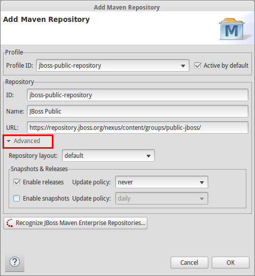

= Maven Tools What's New in 4.2.0.CR1
:page-layout: whatsnew
:page-component_id: usage
:page-component_version: 4.2.0.CR1
:page-product_id: jbt_core 
:page-product_version: 4.2.0.CR1

== JBoss Maven Integration
=== Advanced options for maven repositories

Configure Maven Repositories wizard now allow you to choose repository layout, enable/disable snapshots or releases and change update policy. These options can be found under `advanced`. 

related_jira::JBIDE-14553[]