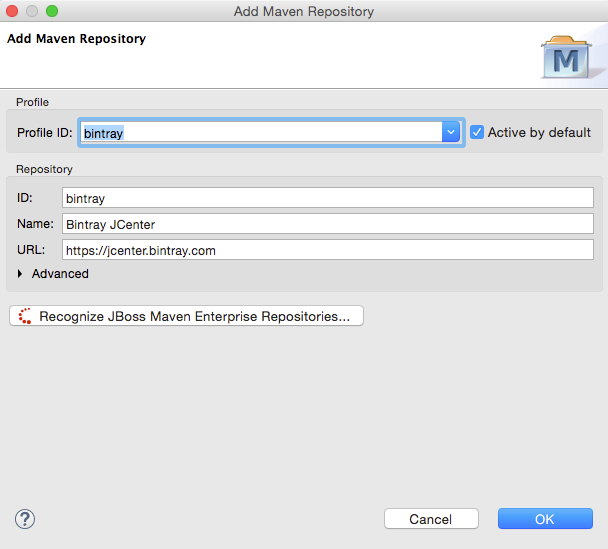

= Maven Tools What's New in 4.3.0.Beta1
:page-layout: whatsnew
:page-component_id: maven
:page-component_version: 4.3.0.Beta1
:page-product_id: jbt_core 
:page-product_version: 4.3.0.Beta1

== JBoss Maven Integration
=== new Bintray JCenter profile 	

https://bintray.com/bintray/jcenter[Bintray JCenter] is an alternative (and superset) to the Maven Central repository. From JBoss Tools/Developer Studio, you can now easily add it in a profile of your Maven settings.xml. Go to `Preferences > JBoss Tools > Maven Integration > Configure Maven Repositories...`, click on the `Add Repository...` button and select the `bintray` profile :

related_jira::JBIDE-19816[]

