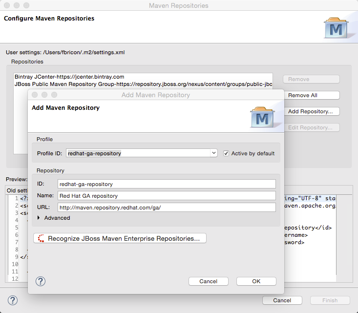

= Maven Tools What's New in 4.3.0.CR1
:page-layout: whatsnew
:page-component_id: maven
:page-component_version: 4.3.0.CR1
:page-product_id: jbt_core
:page-product_version: 4.3.0.CR1

== JBoss Maven Integration
=== new Maven Red Hat GA repository
In the Maven Repository Configuration wizard, accessible from `Preferences` > `JBoss Tools` > `JBoss Maven Integration` > `Configure Maven Repositories...`,
the predefined `Red Hat TechPreview All` Maven repository has been replaced with the new,
official `Red Hat GA` (GA: General Availability) repository, for released Red Hat JBoss Middleware artifacts.

It is recommended you replace the old `TechPreview All` repository with the new `GA` one, in your Maven settings.xml file.

related_jira::JBIDE-20192[]
