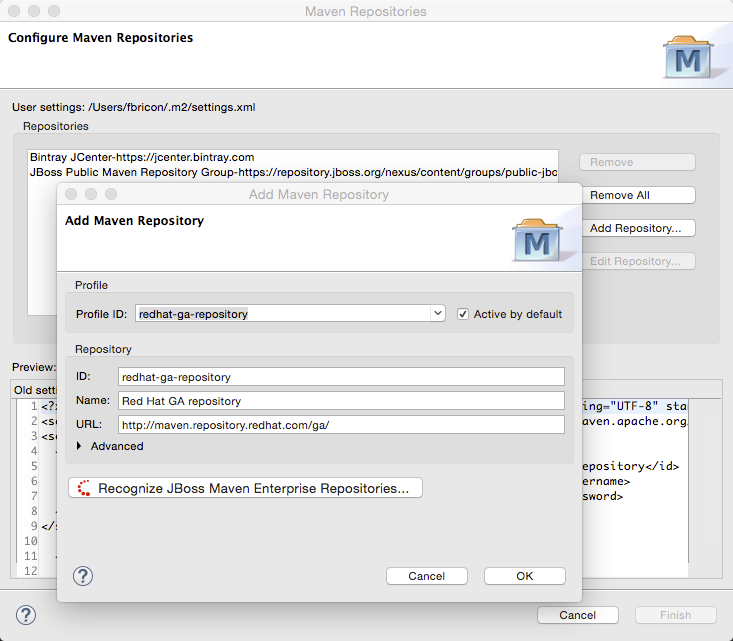

= Maven Tools What's New in 4.3.0.Final
:page-layout: whatsnew
:page-component_id: maven
:page-component_version: 4.3.0.Final
:page-product_id: jbt_core
:page-product_version: 4.3.0.Final
:page-include-previous: false

== Maven Repository Wizard
=== new Maven Red Hat GA repository
In the Maven Repository Configuration wizard, accessible from `Preferences` > `JBoss Tools` > `JBoss Maven Integration` > `Configure Maven Repositories...`,
the predefined `Red Hat TechPreview All` Maven repository has been replaced with the new,
official `Red Hat GA` (GA: General Availability) repository, for released Red Hat JBoss Middleware artifacts.

It is recommended you replace the old `TechPreview All` repository with the new `GA` one, in your Maven settings.xml file.

related_jira::JBIDE-20192[]

=== new Bintray JCenter profile

https://bintray.com/bintray/jcenter[Bintray JCenter] is an alternative (and superset) to the Maven Central repository. From JBoss Tools/Developer Studio, you can now easily add it in a profile of your Maven settings.xml file.
Go to `Preferences > JBoss Tools > Maven Integration > Configure Maven Repositories...`, click on the `Add Repository...` button and select the `bintray` profile :

image::./images/bintray-repo.png[]

related_jira::JBIDE-19816[]
