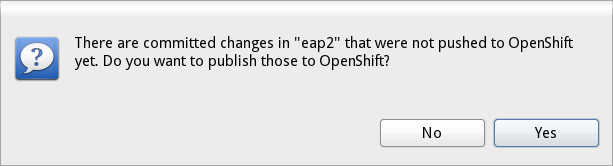

= OpenShift What's New in 2.5.0.Beta1
:page-layout: whatsnew
:page-component_id: openshift
:page-component_version: 2.5.0.Beta1
:page-feature_jbt_only: true
:page-product_id: jbt_core 
:page-product_version: 4.1.0.Beta1

== Application Wizard
=== Verbose Cartridge Labels 
In Beta1 we gave labels in the OpenShift application wizard some love. We show you better descriptions of what application you're about to create and what cartridge you're about to embed:

image::images/cartridge-labels.png[]

related_jira::JBIDE-14459[]

=== Publish Right Away
To create or import an OpenShift application in JBoss Tools you launch the application wizard that does all the heavy lifting for you. This wizard creates the application and imports it to a new project or merges it into an existing one. To then publish these changes to OpenShift, you get over to the server adapter and tell it to publish your Eclipse project.
In Alpha2 you had to think about publishing and manually trigger the adapter once you had run through the wizard. Beta1 now prompts you right away and asks you if you want to push once the import/merge is done.

related_jira::JBIDE-13075[]

== Server adapter
=== See it pushing while it's happening
JBoss Tools offers you a server adapter to publish your local changes to OpenShift. This adapter does all git pushing for you. In case of maven projects publishing will usually trigger a maven build on OpenShift. This may therefore take quite some time. In Alpha2 you had to wait for this to complete in order to see the results. A limitation in Eclipse EGit prevented us from showing you the output while it was occurring.
We improved EGit/JGit and contributed this enhancement to Eclipse. We are therefore now able to give you immediate feedback while we push to OpenShift.

image::images/publishing-to-openshift.png[publishing to OpenShift]

related_jira::JBIDE-12137[]

=== Restart Application 	
In Alpha2 we allowed you to restart an application from the context menu in the OpenShift Explorer. Beta2 now adds this option to the context menu of the server adapter.

image::images/server-adapter-restart.png[restart application]

related_jira::JBIDE-13960[]

=== Binary Deploy to JBoss EWS (Tomcat 6/7)
If you want to deploy some binary artifact (ex. your application war) in JBoss Tools you simply drag and drop your Eclipse project to the OpenShift server adapter. The adapter will then war and push it to OpenShift. While this worked fine with JBoss AS and EAP, things didn't work out of the box for tomcat 6 and 7. We now fixed this for Beta1.

related_jira::JBIDE-13401[]

== Various Improvements
=== Removing Cartridges
Removing cartridges may cause loss of data. This is especially true when you remove databases like mysql, postgres or mongo db. Thus we now remind you of this potential risk and ask you to confirm this irreversible removal.

image::images/remove-cartridge.png[confirm cartridge removal]

related_jira::JBIDE-13961[]

=== Upload SSH Keys
Various operations like cloning and inspecting your application logs require you to upload your SSH keys to OpenShift. In order to have an even smoother workflow the application wizard will prompt you if you have no keys on OpenShift yet. It will ask you right away to create a new or upload your existing key(s).

image::images/add-ssh-keys.png[add ssh keys]

related_jira::JBIDE-13020[]

=== Port Forwarding for Scalable Apps
In Alpha2 port forwarding failed for scalable applications. In Beta1 we now made sure that you can forward the ports of any OpenShift application be it scalable or not.

related_jira::JBIDE-14404[]

=== Missing credentials when Creating Jenkins
Before Beta1 it could happen that you created a jenkins application but didn't get the credentials for it. The dialog that reported these was empty.
In order to fix this we increased the timeouts that made you miss these informations.
To make your experience even smoother in case it still fails we now offer you a link to the environments variables in the creation dialog. This link allows you to easily look the credentials via a single click.

image::images/timouted-see-in-envvars.png[link to environment variables]

related_jira::JBIDE-14342[]

== OpenShift Java Client
=== New Version 2.2.0
The latest openshift-java-client 2.2.0 moved to exclusively support protocol 1.2. With this upgrade JBoss Tools and all other user application will benefit from far more informative descriptions for cartridges. Further additional enhancement will make it to the library with the upcoming releases.

related_jira::JBIDE-12320[]
