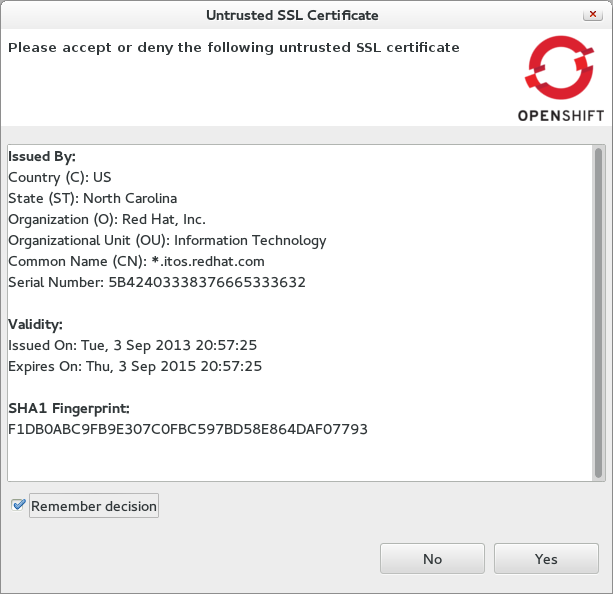
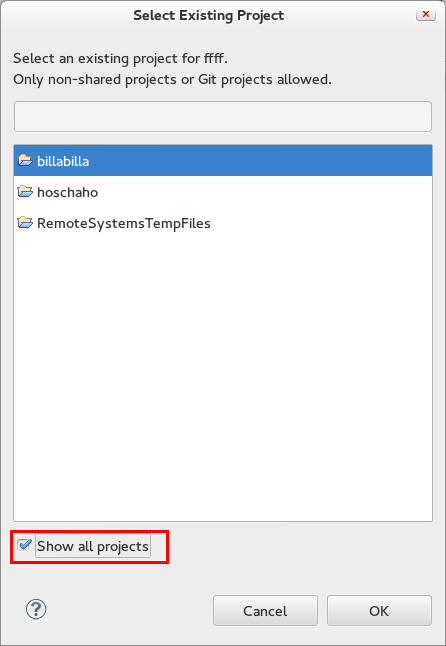

= OpenShift What's New in OpenShift 2.6.0.Alpha2
:page-layout: whatsnew
:page-component_id: openshift
:page-component_version: 2.6.0.Alpha2
:page-product_id: jbt_core 
:page-product_version: 4.2.0.Alpha2

== SSL Certificates
=== Untrusted SSL Certificates 	

In case the server sends an SSL certificate that we cannot verify, we'll now present it to you. Allowing you to accept or refuse it.

related_jira::JBIDE-14768[]

== Existing Projects
=== Show All Projects 	

When creating a new OpenShift application you can choose to merge it with your existing workspace project. By default, the selection dialog will filter out projects that are shared with a non-git source control and internal Remote System Explorer projects. Nevertheless We'll show all projects if you check *Show all projects*.

related_jira::JBIDE-16357[]
