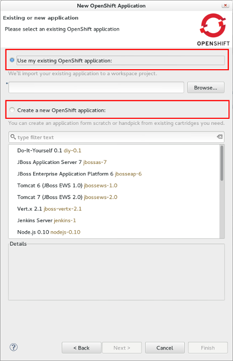
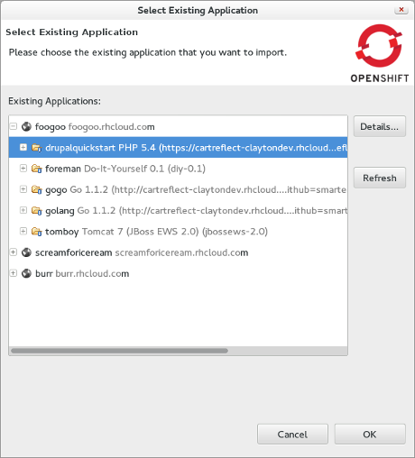
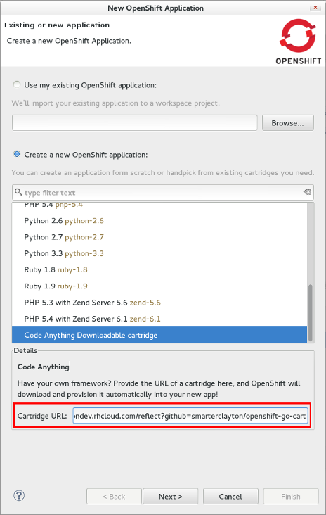
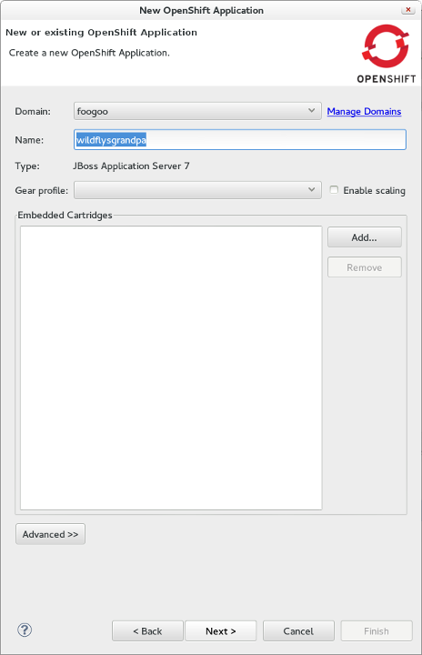
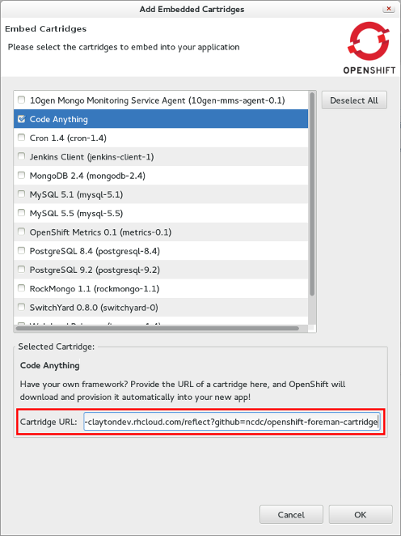

= OpenShift What's New in OpenShift 2.6.0.Beta1
:page-layout: whatsnew
:page-component_id: openshift
:page-component_version: 2.6.0.Beta1
:page-product_id: jbt_core 
:page-product_version: 4.2.0.Beta1

== Application wizard
=== Downloadable Cartridges and all new UX

We overhauled the application wizard that was becoming pretty crowded. 

We also introduced support for downloadable cartridges. Downloadable
cartridges in OpenShift allow you to pass a git repository url which
contains your custom cartridge.

Your cartridge code may run as web- (standalone) or add-on-cartridge
(embedded cartridge). JBoss Tools supports both breeds.

=== New Application wizard

When you launch the OpenShift application wizard you will get to chose whether you want to use your existing application or create a new one. 

=== Use an Existing Application

Using your existing application is as easy as picking it from the list of all your OpenShift applications. 
You may freely type it's name and get content assisted when typing. 
Alternatively you may hit browse and choose among your applications across all your domains. 

=== Code Anything custom cartridge

When creating a new application you will have to choose the application type (cartridge) up-front. 
You may choose among the predefined cartridges that are shipped with your OpenShift server.
Alternatively you may also decide to provide your own framework code via the url of your git repository ("Code Anything"). 

=== Adding Cartridges

The page for configuring application details such as the name, domain, gear and the add-on (embeddable) cartridges now only shows
cartridges you have added. Initially the list will be empty.

You now can add embeddable cartridges. Here you can choose among the predefined ones or provide your own cartridge code.

related_jira::JBIDE-15905[]
