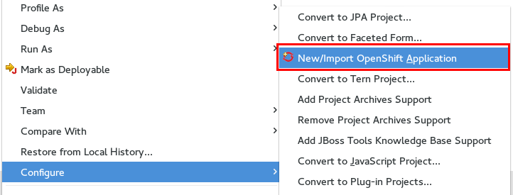
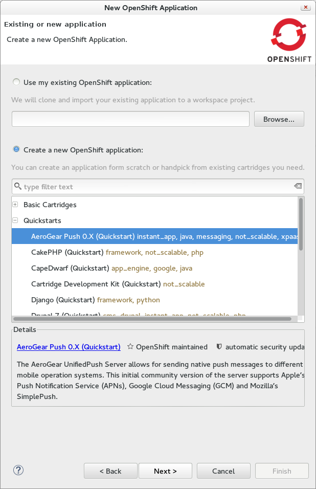
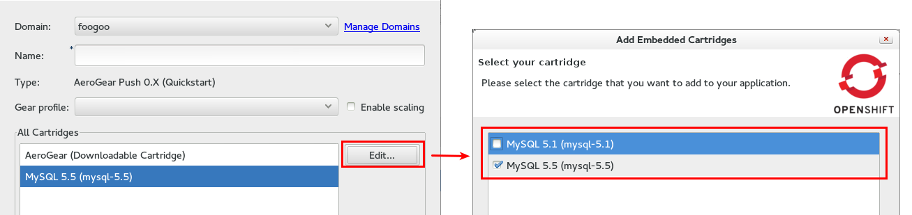
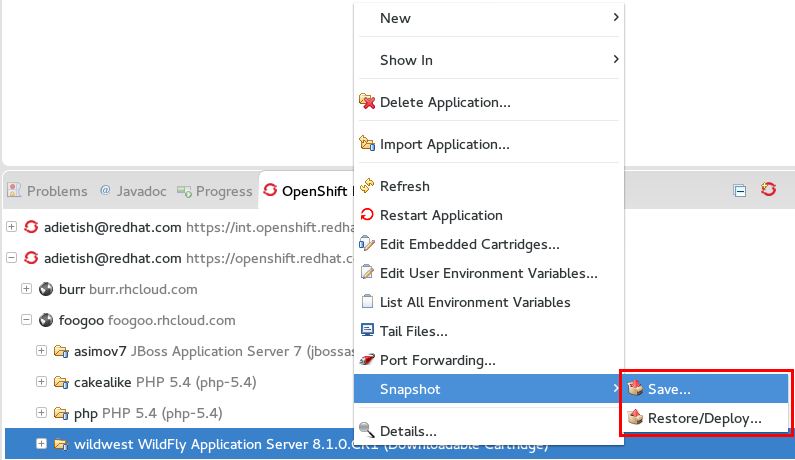
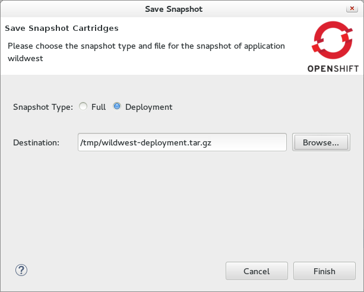
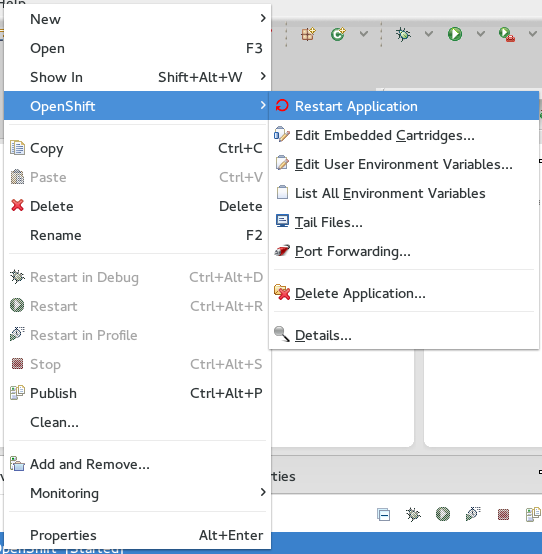

= OpenShift What's New in OpenShift 2.6.0.Beta2
:page-layout: whatsnew
:page-component_id: openshift
:page-component_version: 2.6.0.Beta2
:page-product_id: jbt_core 
:page-product_version: 4.2.0.Beta2

== Configure an OpenShift Application for your project 
JBoss Tools 4.2.0.Beta adds *New/Import OpenShift Application* to the configure context menu of your workspace project in the package explorer and navigator. 
This allows you to create a new OpenShift application for your project via its the context menu. 
Simply pick Configure -> New/Import OpenShift application and we'll present you the application wizard.
 
Once the OpenShift application is created, we'll merge it into your project. 
Pushing it back via our server adapter or via (E)git will deploy your project to OpenShift.

related_jira::JBIDE-10546[]

== Start an Application from Quickstarts

In JBoss Tools 4.2.0 Beta2 you will be able to start new applications from the promoted OpenShift quickstarts. 
A quickstart will configure the appication-, add-on cartridge(s) and the application template code for you. 

The quickstarts comes with predefined list of cartridges for setup. If that list allows you to choose between versions you can Edit them.

related_jira::JBIDE-14744[]

== Snapshot and Restore/Deploy

Snapshots allow you to backup and restore your OpenShift application to and from a .tar.gz archive. Full snapshots contain all local files of your application, including the logs. 

There is more than just backup and restore in snapshots: Binary deployments are also possible via *Deployment* snapshots. 
Deployment Snapshots allow you to deploy to OpenShift without using git.

JBoss Tools allows you both full and deployment snapshot via radio buttons in the snapshot wizard. +
You can read all the details about (deployment) snaphots in the https://access.redhat.com/site/documentation/en-US/OpenShift_Online/2.0/html/User_Guide/chap-Application_Backup_and_Restoration_with_Snapshots.html[OpenShift user guide]

related_jira::JBIDE-10456[]

== Fully fledged Server Adapter context menu

We geared towards making your life easier and added all application related actions to the OpenShift server context menu (Servers view).
We also reorganized the context menu of the OpenShift Explorer to better match the defaults used in Eclipse.

related_jira::JBIDE-15897[]

