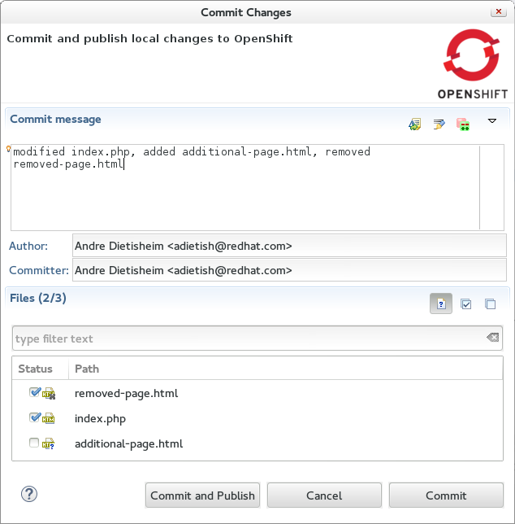

= OpenShift What's New in OpenShift 2.6.0.Beta3
:page-layout: whatsnew
:page-component_id: openshift
:page-component_version: 2.6.0.Beta3
:page-product_id: jbt_core 
:page-product_version: 4.2.0.Beta3

== Edit domain members 
OpenShift allows you to add and remove other users to your domain and grant them view or write permissions. 
In JBoss Tools 4.2.0.Beta3 we added a link to the domain wizard. Hitting this link will point your browser to the webpage in the OpenShift where you can manage your domain members.

related_jira::JBDS-2777[]

== Choose the local changes that you want to publishing to OpenShift

JBoss Tools 4.2.0.Beta3 now allows you to pick the files that you want to publish. +
Once you tell the OpenShift server adapter to publish it'll check the pending changes and list them in a dialog. 
You may then stage the ones you want to push and provide a commit message. +
The very same is true for the inital import of your OpenShift application: 
The application-/import-wizard shows you what files it changed and allows you commit and push them back to OpenShift.

related_jira::JBIDE-10541[]

== Save and restore Snapshots to/from your workspace

We now allow you to save and restore your OpenShift application snapshots to and from your Eclipse workspace:

related_jira::JBIDE-17413[]

 

