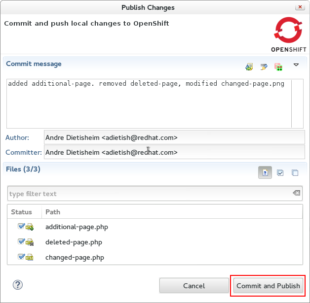
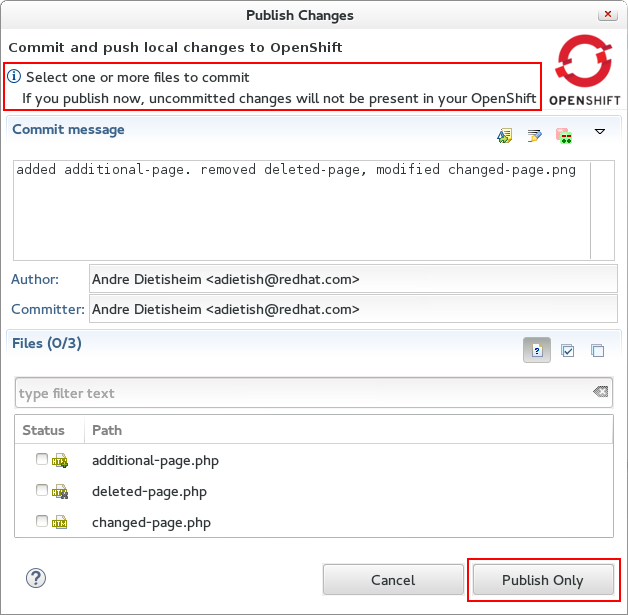
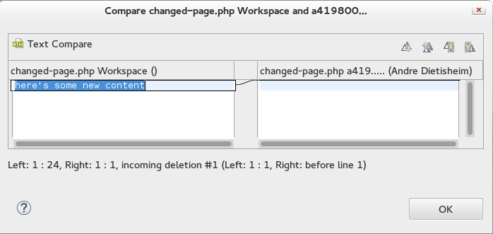
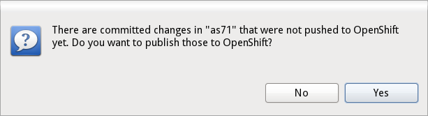
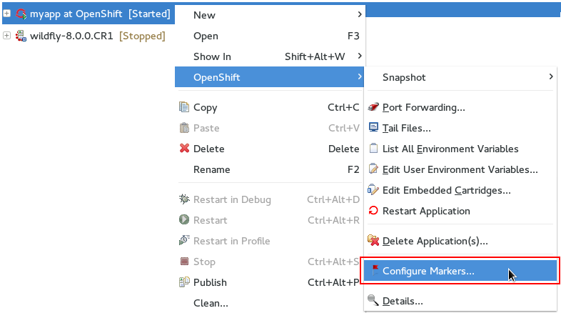

= OpenShift What's New in OpenShift 2.6.0.CR1
:page-layout: whatsnew
:page-component_id: openshift
:page-component_version: 2.6.0.CR1
:page-product_id: jbt_core 
:page-product_version: 4.2.0.CR1

== New Github page for openshift-java-client
Corey Daley, Ninja Hacker and Stackoverflower for OpenShift, created an extensive project page for the openshift-java-client at http://openshift.github.io/openshift-java-client/. 
You can get verbose instructions on how get started, sample code and where to get further help. Kudos!

== Publish local commits only
Lately we introduced a commit dialog that allows you to take full control of the files being published: you can pick the files, provide the commit message etc.
This commit dialog had now been simplified to have just two buttons: One to cancel and another one to commit and publish.  
If the only thing that you want to do is committing (without pushing), then you should be using git operations directly on the project.

Once you selected files and provided a commit message JBoss Tools will commit and push to OpenShift. 
If there are no local changes missing in the OpenShift remote the "Commit and Publish"-button turns to "Publish Only". 
The dialog will then warn you that you are only pushing local commits leaving the dirty files alone.

Our commit dialog is based on the http://www.eclipse.org/egit/[EGit] commit dialog and we thus can take advantage of existing features like the possibility to inspect changes: +
Double click on the dirty files and get a visual diff of them. 

related_jira::JBIDE-17905[]

== No automatic Commit nor Publishing upon Import
When you import an OpenShift application to your workspace we add/modify a .gitignore file, possibly add an OpenShift profile to your maven pom, etc. to increase the likelihood of your project working out-of-the-box. In prior releases JBoss Tools committed those changes directly without giving you a chance to review them.

In CR1 we made publishing more explicit, we do not commit nor publish upon import. We allow you to decide what files you want to commit, what message you want to use and when you want to publish. 

With the more flexible commit dialog this gives a more unified and powerful workflow. 

related_jira::JBIDE-17984[]

== Configure OpenShift Markers now from Server Adapter
You can now access OpenShift markers from the server adapter context menu.

related_jira::JBIDE-17977[]

