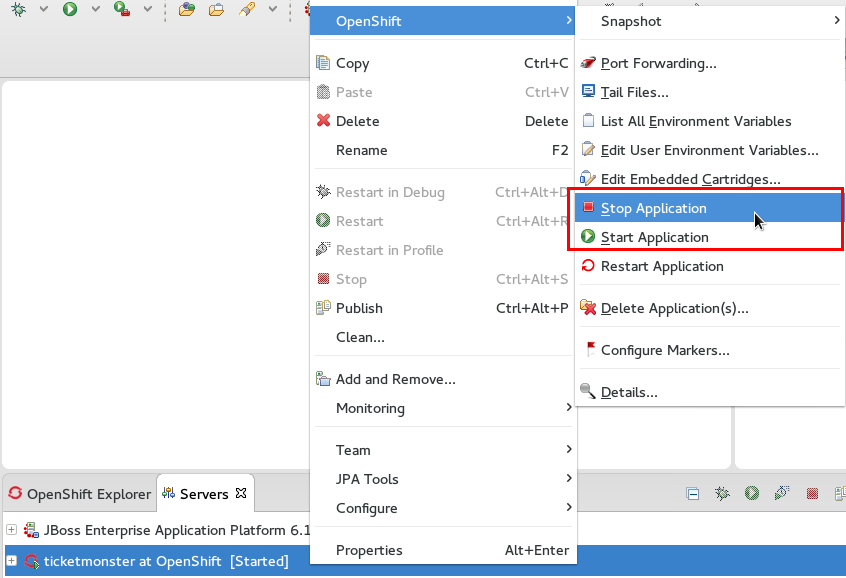

= OpenShift What's New in OpenShift 2.6.1.Final
:page-layout: whatsnew
:page-component_id: openshift
:page-component_version: 2.6.1.Final
:page-product_id: jbt_core 
:page-product_version: 4.2.1.Final

== Start and Stop Applications
Starting with JBoss Tools 4.2.1.Final you can now start and stop your application within Eclipse. 
OpenShift tools offers start- and stop-actions in the context menu of the server adapter and the application
in the OpenShift Explorer. 

related_jira::JBIDE-11903[]
