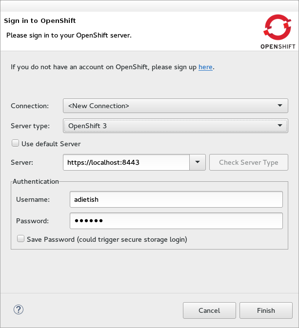
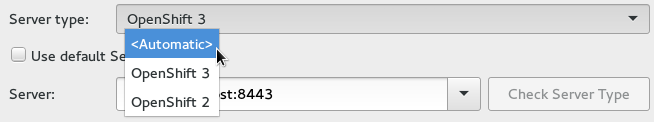
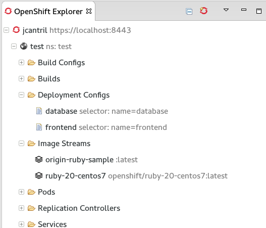
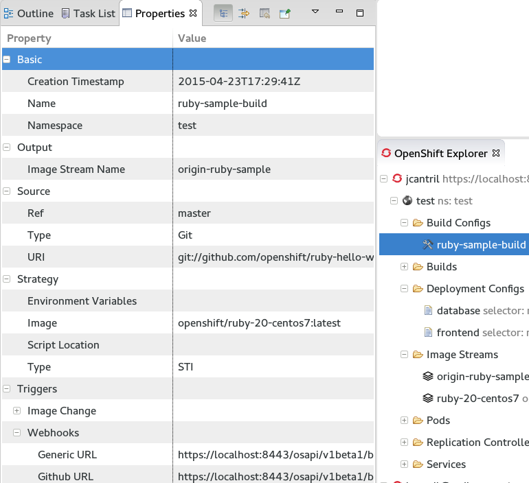

= OpenShift What's New in OpenShift 3.0.0.Alpha2
:page-layout: whatsnew
:page-component_id: openshift
:page-component_version: 3.0.0.Alpha2
:page-product_id: jbt_core 
:page-product_version: 4.3.0.Alpha2

== Connect to OpenShift v3 servers
Starting with JBoss Tools 4.3.0.Alpha2 support was added for OpenShift v3. Versions 2 and version 3 can be installed independently.
When connecting you can now choose between a v2 or v3 server.

If you do not know about the server type simply pick "Automatic" and we will figure for out. 

related_jira::JBIDE-19096[]

== Browse OpenShift v3 resources
In JBoss Tools 4.3.0.Alpha2 you can now browse the resources of your OpenShift v3 server once you connected to it. 
Decorations and child items unveil further informations about the given resource.

related_jira::JBIDE-19000[]

== Display OpenShift v3 resource properties
Whenever you select an OpenShift v3 resource in the OpenShift Explorer the properties view will show you further details of the selected resource.

related_jira::JBIDE-19006[]

== New OpenShift v3 java client library
The OpenShift v3 tooling is based upon a new java client library to talk to the OpenShift v3 backend. This all new client library is hosted at 

  https://github.com/openshift/openshift-restclient-java

related_jira::JBIDE-19555[]
