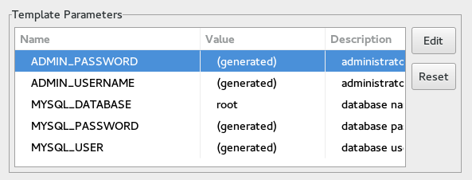
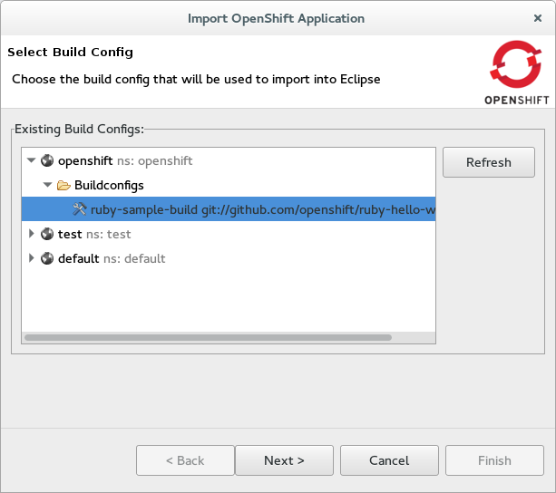

= OpenShift What's New in OpenShift 3.0.0.Beta1
:page-layout: whatsnew
:page-component_id: openshift
:page-component_version: 3.0.0.Beta1
:page-product_id: jbt_core
:page-product_version: 4.3.0.Beta1

== Authenticate using OAuth
Starting with JBoss Tools 4.3.0.Beta1 you can now connect and authenticate to an OpenShift v3 server configured to use OAuth.
You retrieve a token by clicking the retrieve link, following the prompts in the browser, and pasting it back into the connection wizard.

image::./images/connect-oauth.png[]

http://www.openshift.org/#v3["OpenShift v3"] is not available online yet, as it is for OpenShift v2 at https://www.openshift.com/.
If you want to check it out, you can run it from source, in a docker container or with vagrant, as described here: http://fabric8.io/guide/getStartedOpenShift.html

related_jira::JBIDE-19829[]

== Create a V3 application from template
You can now use templates to create OpenShift v3 resources that make up an application.
The wizard allows you to use a template offered by the server, or to provide a template that you have ready on your local file system.

Once the template is selected, you can edit the template parameters to customize it for your needs.

You can add labels so that you will be able to reference those new resources once they are created.

image:./images/edit-template-labels.png[]

related_jira::JBIDE-19009[]

== Show Application in Browser
You can easily point your browser to your OpenShift v3 application via the context menu.
Pick your project in the OpenShift explorer and choose menu:[Show In>Web Browser] and it will open up in the browser.

image:./images/show-in-browser-1.png[]

OpenShift routes are used to figure out the url to open to your application.
If there are several routes, you will choose the one to use.

related_jira::JBIDE-19849[]

== Import to an Eclipse project
An OpenShift v3 application can now be imported into Eclipse using JBoss Tools.
The import wizard prompts you to select a build config which contains the URI of your source repository.
The wizard clones the source repository and imports the code into your Eclipse workspace as an Eclipse project.

All source repositories are imported as general Eclipse projects that you can manually configure to match your needs, except
those which utilize Maven.  Maven is recognized by the import process and the Eclipse projects are enabled via Eclipse's Maven support.
Eclipse project type detection will be improved in upcoming releases via the new Eclipse https://wiki.eclipse.org/E4/UI/Smart_Import["Smart Import"] facility.

related_jira::JBIDE-19787[]

== Show routes
4.3.0.Beta1 will show you OpenShift v3 routes in the OpenShift Explorer, as they have been defined in your OpenShift project.
The properties view unveils all details for the selected route.

image:./images/route.png[]

related_jira::JBIDE-19760[]

== Delete Resources
You can now delete OpenShift v3 resources that you browse in the OpenShift explorer.

image:./images/delete-resource.png[]

related_jira::JBIDE-19008[]
