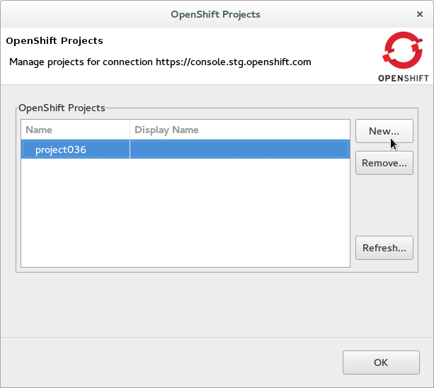
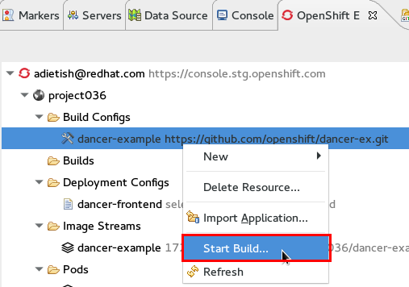
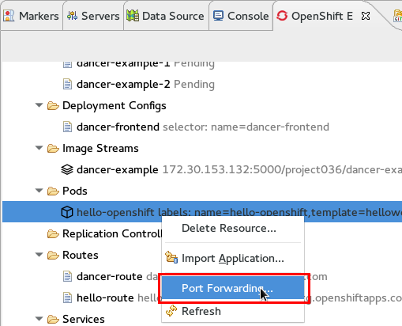
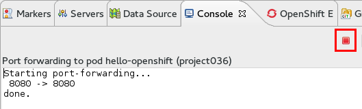

= OpenShift What's New in OpenShift 3.0.0.Beta2
:page-layout: whatsnew
:page-component_id: openshift
:page-component_version: 3.0.0.Beta2
:page-product_id: jbt_core
:page-product_version: 4.3.0.Beta2

== Manage your OpenShift Projects
From JBoss Tools 4.3.0.Beta2 onwards, you can now create and delete OpenShift projects.

You launch this new wizard from the context menu of connections in the OpenShift Explorer.

image::./images/manage-projects.png[]

IF an application is created without a project, the tools prompt you to create a project for the application.
When the application is complete, you can manage your OpenShift projects via a link in the application wizard.

image::./images/manage-projects-link.png[]

related_jira::JBIDE-20016[]

== Manually Trigger Builds
You can now manually trigger builds when selecting your Build Configs in the OpenShift Explorer.

When a build is triggered, a new build appears in the Builds category in the OpenShift Explorer.
The build state displays next to its name or in the properties view.
Refresh the Explorer to see the build progress and completion.

related_jira::JBIDE-20047[]

== Port Forwarding
If your application exposes ports, they can now be forwarded to your local machine with JBoss Tools 4.3.0.Beta2.

JBoss Tools uses the "oc" command line tool that you can get from the https://github.com/openshift/origin[OpenShift origin] project on github.
You can build it from source or get the binary for your platform on the https://github.com/openshift/origin/releases[releases] page.
You have to provide JBoss Tools the path to the "oc" binary in the Eclipse preferences.
You can use "Browse" to point JBoss Tools to the right location or let it look it up on your global system path by hitting "Restore Defaults".

Once Eclipse knows where to find "oc", you can launch the port forwarding wizard in the pod context menu.

The upcoming wizard then lets you forward the ports that your application is exposing.
You can also stop an existing tunnel by hitting "Stop All".

image::./images/port-forwarding-wizard.png[]

The Eclipse Console displays which ports the wizard is forwarding and allows you to stop the tunnel via a red knob in the title bar.

The port forwarding feature is still in early stages and it might fail at times.
We know it to work against latest OpenShift origin code while it fails with older versions (like it is with our internal stage server).
We are also aware of problems when tracking if a session already exists, allowing users to try to start a new session while there's already one.
We also know that errors are swallowed at times.

related_jira::JBIDE-19850[]
