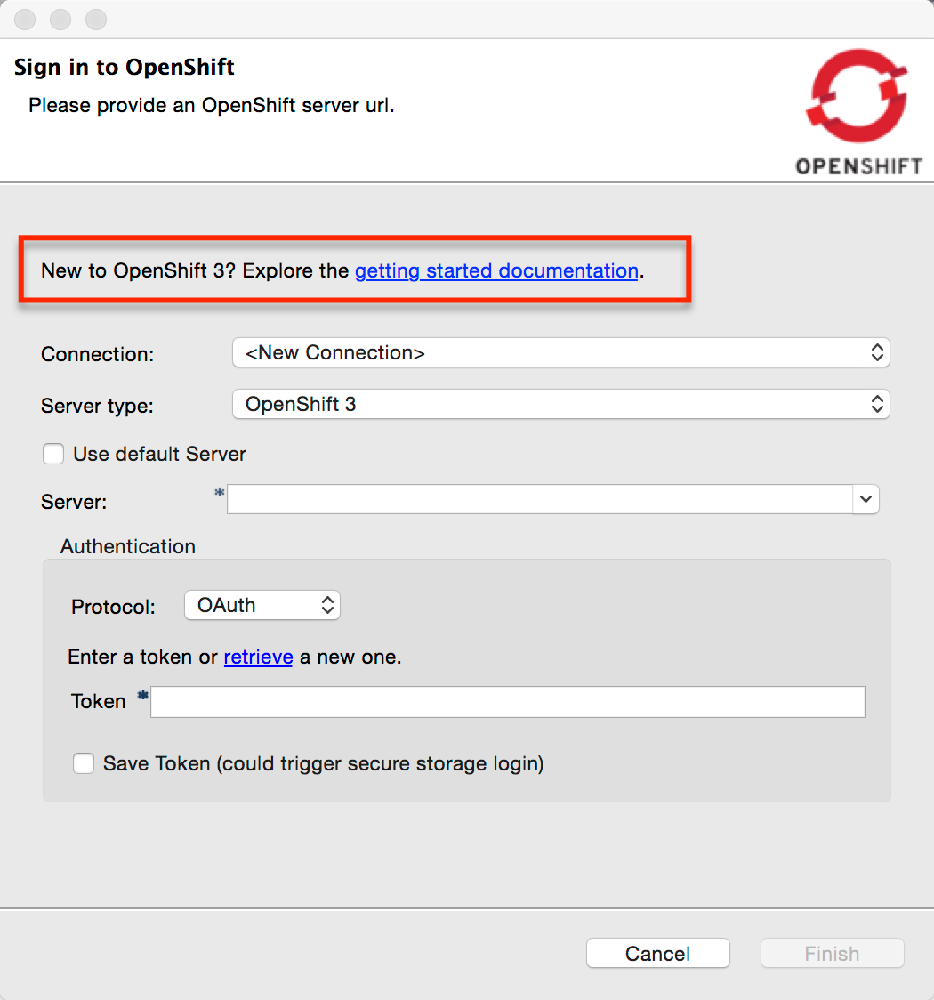
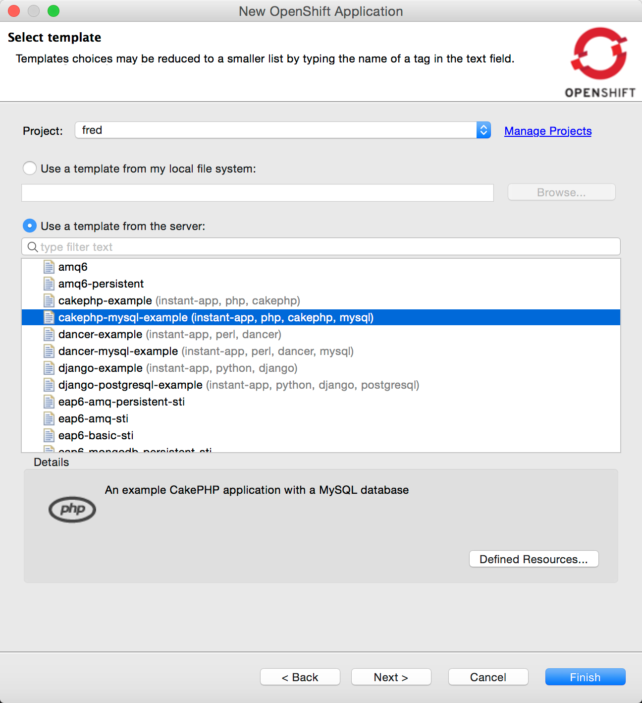
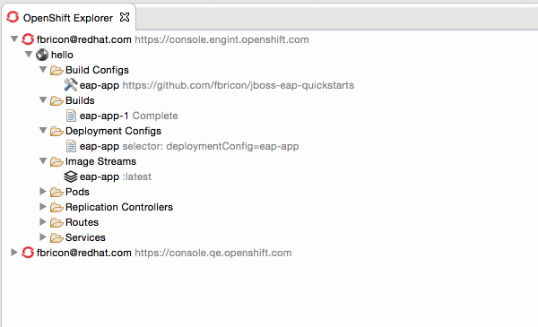
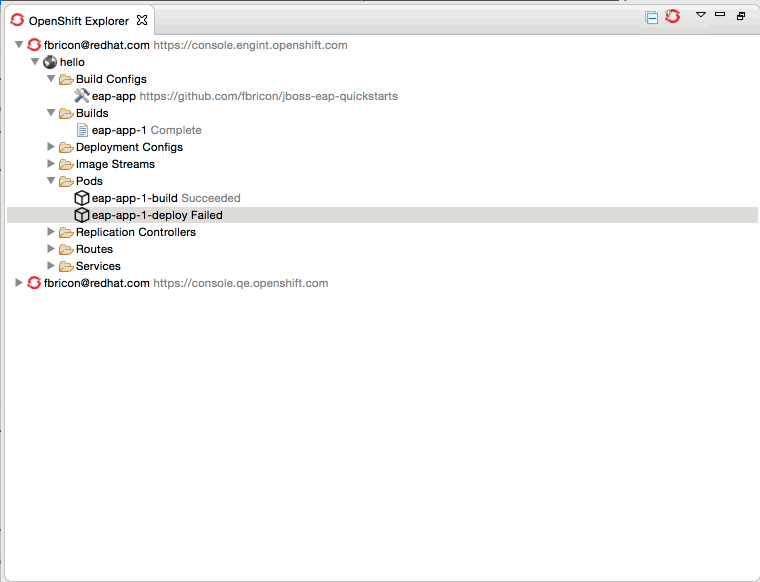
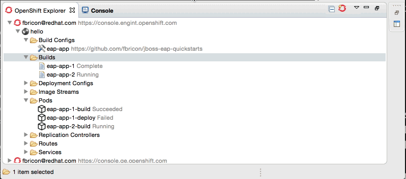

= OpenShift What's New in OpenShift 3.0.0.CR1
:page-layout: whatsnew
:page-component_id: openshift
:page-component_version: 3.0.0.CR1
:page-product_id: jbt_core
:page-product_version: 4.3.0.CR1

== OpenShift 3 integration available from JBoss Central
We've made great progress in the OpenShift 3 Eclipse Tooling,
but a few features are still missing, like deploying an existing workspace project,
or editing existing build configurations. And we have some ideas to provide an even better
OpenShift Explorer user experience.

So we decided to provide the OpenShift 3 tooling as a TechPreview feature,
available from the JBoss Central Software/Updates page.
Once we're fully satisfied with the quality of its feature set, OpenShift 3 tooling will mature to a Supported feature,
 in the upcoming months, and will then be installed by default in JBDS.

== Improvements in New Connection Wizard
Because OpenShift 3 concepts and behavior are a quite different from OpenShift 2,
we thought it would be a good idea to display a link to the online documentation from the connection wizard for OpenShift 3.
Hopefully that should help you get started with OpenShift 3 in Eclipse.

== Improvements in New Application Wizard
The New OpenShift 3 application wizard received a whole lot of enhancements in this release:

* template presentation is now less cluttered, templates are ordered alphabetically,
* templates can be selected by double-click,
* a detail panel is shown for selected template parameters,
* template parameters can be edited by double-click,
* required template properties are enforced,
* a new resource name collision detection now prevents the creation of incomplete applications,
* a summary of all generated application parameters is shown, with a copy-to-clipboard button,
* Webhook build triggers are now directly accessible, once the application has been created,
* application code is automatically imported in the workspace, after the application is created,

== Improvements in OpenShift Explorer
A number of new features have been added to the OpenShift Explorer, that ought to provide you with a much better user experience:

* Create project from the `New` menu
* New `Delete project` menu
* New `Show In > Web Console` menu: opens an OpenShift connection or resource directly in the Web Console, in a browser
* New `Properties` menu: opens the Properties view on any given OpenShift 3 Connection/Project/Resource
* New `Show Webhooks...` menu on Build Configs: opens a dialog allowing you to easily copy git hook URLs, used to trigger new builds on git push
* New `Build Log...` and `Pod Log...` menus, for Builds and Pods (see <<log-streaming>>)
* New `Deploy Docker Image...` menu, see <<integration-with-docker-tooling>>

related_jira::JBIDE-20502,JBIDE-20487,JBIDE-20451,JBIDE-20291,JBIDE-20022,JBIDE-19010[]

== Easy setup for 'oc' binary
The Port Forwarding and <<Log Streaming>> features require the `oc` binary to be installed on your machine.
When it's missing, an error dialog will prompt you to configure its location in the OpenShift 3 preferences.
If you don't have a local copy of the `oc` binary, a link will guide you to its download page.

related_jira::JBIDE-20371,JBIDE-20455,JBIDE-20354[]

== Log Streaming
Provided you set up the 'oc' binary in Eclipse's preferences,
you can now, from the OpenShift Explorer, stream logs from Build
(`Build Log...` menu) or Pod (`Pod Log...`) nodes. This is the same feature as `Tail Log` in OpenShift 2.

Logs will open in a Console view. This will allow you to monitor builds or application server logs in real time.

related_jira::JBIDE-20099[]

== Integration with Docker tooling
TODO Jeff
