= OpenShift What's New in 3.0.0.Final
:page-layout: whatsnew
:page-component_id: openshift
:page-component_version: 4.3.0.Final
:page-product_id: jbt_core
:page-product_version: 4.3.0.Final
:page-include-previous: false

== New OpenShift 3 support
OpenShift 3 tooling is provided as a TechPreview feature, available from the JBoss Central Software/Updates page.
A few features are still missing, like deploying an existing workspace project,
or editing existing build configurations. We have some ideas to provide an even better
OpenShift Explorer user experience. Once we are fully satisfied with the quality of its feature set, OpenShift 3 tooling will mature to a Supported feature
 in the upcoming months, and will then be installed by default in JBDS.

it will add an option to create OpenShift 3 connections in the OpenShift Connection wizard.

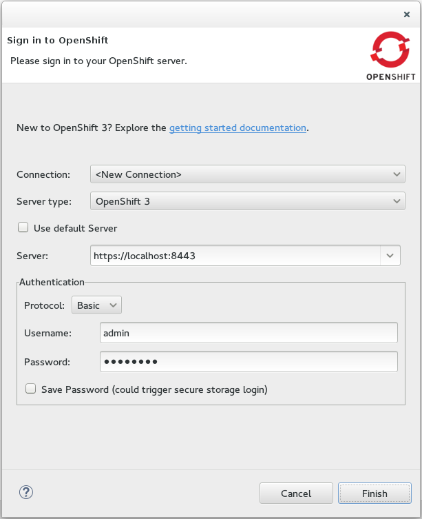

http://www.openshift.org/#v3["OpenShift 3"] is not available as an online offering yet. Please refer to the link:/documentation/howto/openshift3_getting_started.html[Getting Started] documentation

OpenShift 3 tooling supports 2 authentication schemes:

- Basic Authentication: type in your login/password
- OAuth Authentication: you retrieve a token by clicking the retrieve link, following the prompts in the browser, and pasting it back into the connection wizard.

related_jira::JBIDE-19096[]

=== Create an OpenShift 3 application from template
The New Application Wizard integrates with OpenShift 3. If you're not familiar with OpenShift 3, a link to the link:/documentation/howto/openshift3_getting_started.html[getting started] online documentation is available for quick access.

You can use templates to create OpenShift 3 resources that make up an application.
The wizard allows you to use a template offered by the server, or to provide a template that you have ready on your local file system.

image:./images/new_v3_application.png[]

Details of the selected templates are displayed on the bottom of the wizard.

Once the template is selected, the next page allows you to edit the template parameters, to customize them for your needs.

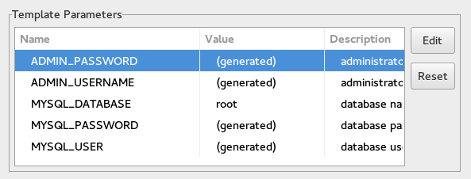

Finally, you can add labels so that you will be able to reference those new resources once they are created.

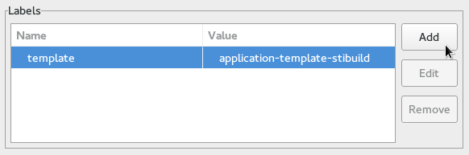

A resource name collision detection prevents the creation of incomplete applications.
A summary of all generated application parameters is shown, with a copy-to-clipboard button and a link to Webhook build triggers, once the application has been created.

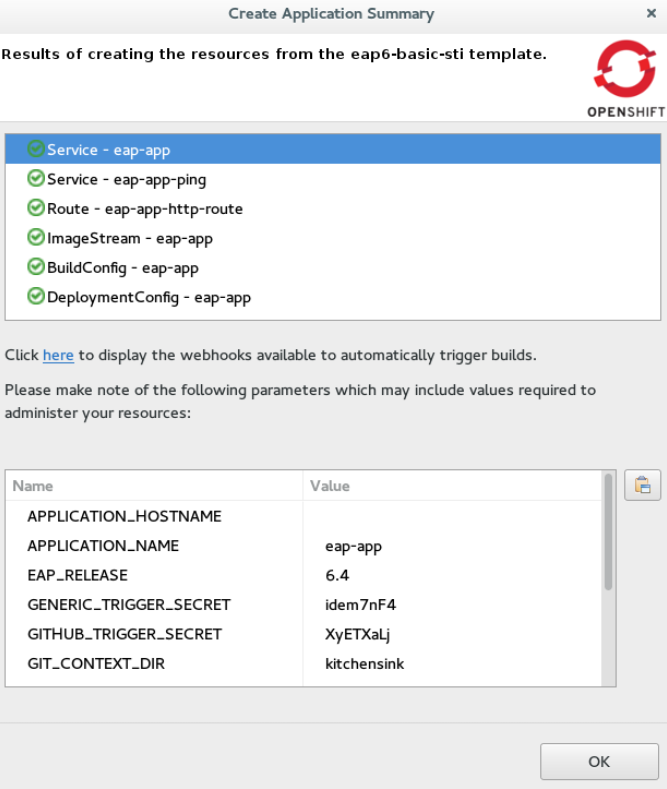

If applicable, the application code is automatically imported in the workspace once the wizard closes.

related_jira::JBIDE-19009[]

=== Changes in OpenShift Explorer
The OpenShift Explorer now supports all the following features for working with OpenShift 3 resources :

* Create Connection/Project/Application from the `New` menu.
* Delete resources (Connection/Project/Resources).
* `Import Application...` menu at the connection and project levels.
* `Show In > Web Browser` menu opens your application in a browser, if a route as been defined. If there are several routes, you will choose the one to use.
* `Show In > Web Console` menu: opens an OpenShift connection or resource directly in the Web Console in a browser.
* `Properties` menu: opens the Properties view on any given OpenShift 3 Connection/Project/Resource.
* `Show Webhooks...` menu on Build Configs: opens a dialog allowing you to easily copy git hook URLs. This is used to trigger new builds on git push.
* `Start Build...` menu available in the Builds category. The build state displays next to its name or in the properties view. For now, you need to manually refresh the Explorer to see the build progress and completion.
* `Build Log...` and `Pod Log...` menus, for Builds and Pods (see <<log-streaming>>).
* `Deploy Docker Image...` menu, see <<integration-with-docker-tooling>>.

image::./images/openshift-menus.gif[]

related_jira::JBIDE-20502,JBIDE-20487,JBIDE-20451,JBIDE-20291,JBIDE-20022,JBIDE-19010[]

=== Import application source into the workspace
An existing OpenShift 3 application can be imported into Eclipse using the `Import Application...` menu in the OpenShift Explorer.
The import wizard prompts you to select a build config which contains the URI of your source repository.
The wizard clones the source repository and imports the code into your Eclipse workspace as an Eclipse project.

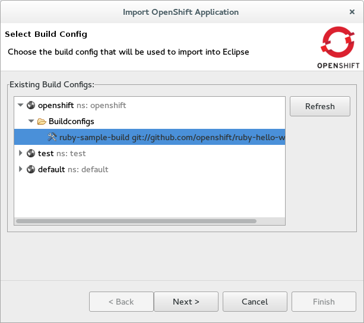

All source repositories are imported as general Eclipse projects that you can manually configure to match your needs, except
those which utilize Maven.  Maven is recognized by the import process and the Eclipse projects are enabled via Eclipse's Maven support.
Eclipse project type detection will be improved in future releases via the new Eclipse https://wiki.eclipse.org/E4/UI/Smart_Import["Smart Import"] facility.

related_jira::JBIDE-19787[]

=== Manage your OpenShift Projects
The OpenShift 3 Project concept is similar to OpenShift 2 namespace. Not to be mistaken for the Eclipse Project.
You can create or delete OpenShift projects from the `Manage Projects...` menu of an existing OpenShift Connection:

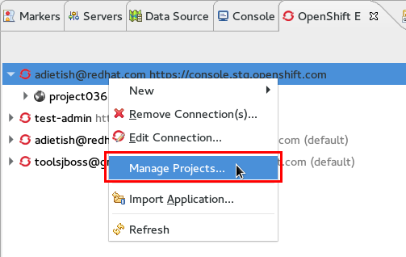

or when creating a new OpenShift 3 application:

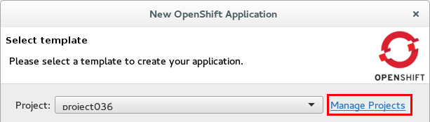

If an application is created without a project, the tools prompt you to create a project for the application beforehand:

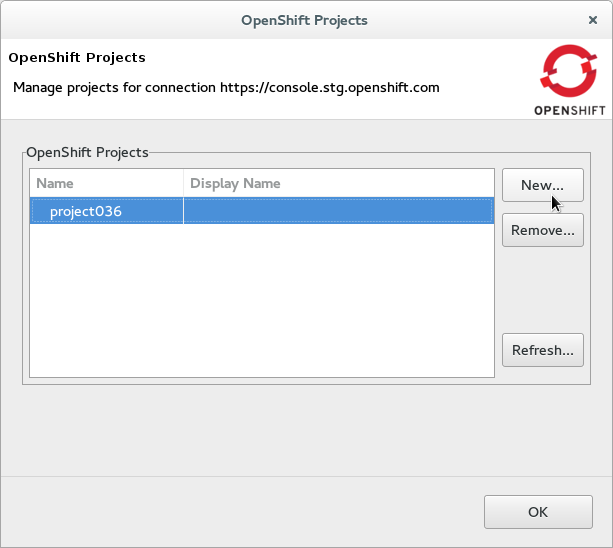

related_jira::JBIDE-20016[]

=== Manually Trigger Builds
Automatic build triggers require using Webhook triggers. However, you can still manually trigger builds when selecting your Build Configs in the OpenShift Explorer.

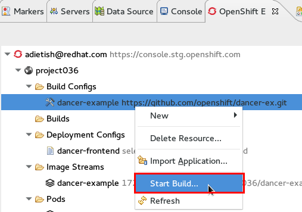

related_jira::JBIDE-20047[]

=== Easy setup for 'oc' binary
The <<Port Forwarding>> and <<Log Streaming>> features require that the OpenShift Client (OC) binary is installed on your machine.
If the OC binary is missing, an error dialog will prompt you to configure its location in the OpenShift 3 preferences.
If you don't have a local copy of the OC binary, a link guides you to its download page.

image::./images/setup-oc-binary.gif[]

related_jira::JBIDE-20371,JBIDE-20455,JBIDE-20354[]

=== Port Forwarding
If your application exposes ports, they can be forwarded to your local machine.

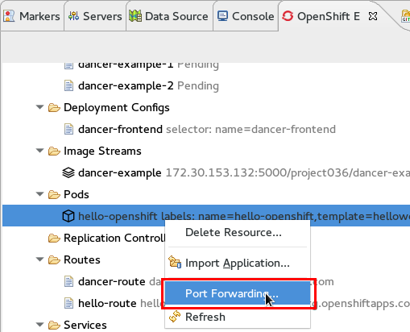

The upcoming wizard then lets you forward the ports that your application is exposing.
You can also stop an existing tunnel by hitting "Stop All".

image::./images/port-forwarding-wizard.png[]

The Eclipse Console displays which ports the wizard is forwarding and allows you to stop the tunnel via a red knob in the title bar.

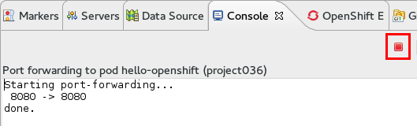

related_jira::JBIDE-19850[]

=== Log Streaming
Provided the OC binary was set up in Eclipse's preferences,
you can, from the OpenShift Explorer, stream logs from Build
(`Build Log...` menu) or Pod (`Pod Log...`) nodes. This is the same feature as `Tail Log` in OpenShift 2.

Logs display in a Console view, allowing users to monitor builds or application server logs in real time.

image::./images/stream-logs.gif[]

related_jira::JBIDE-20099[]

=== Integration with Docker tooling
The OpenShift 3 Eclipse Tooling provides some integration with the Docker tooling
with further improvements coming soon. Docker images can be deployed to the OpenShift cluster with an initial set of OpenShift resources. The `Deploy Image` wizard can be initiated from either the OpenShift or Docker
explorer views. This wizard allows you to:

* Choose an OpenShift project
* Manually provide a Docker image URI from a local connection
* Override Environment Variables
* Expose image ports
* Create a public route
* Attach custom OpenShift labels to the generated OpenShift resources

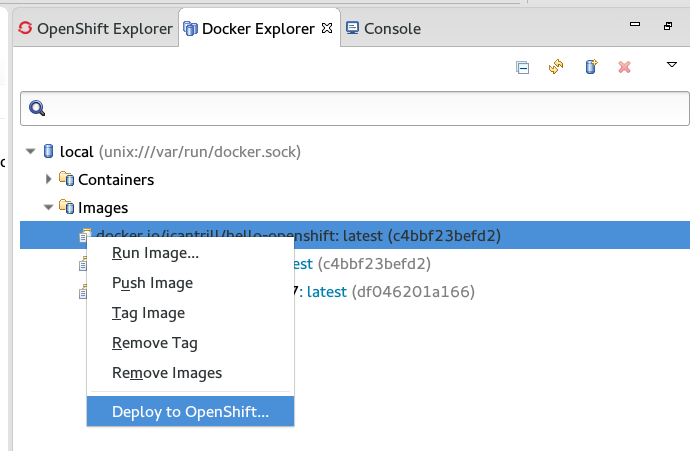
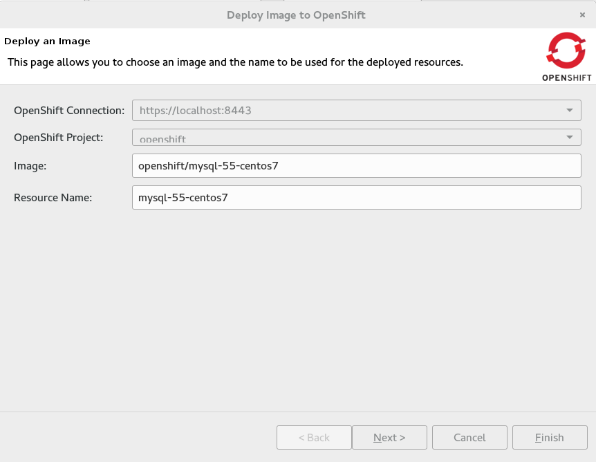
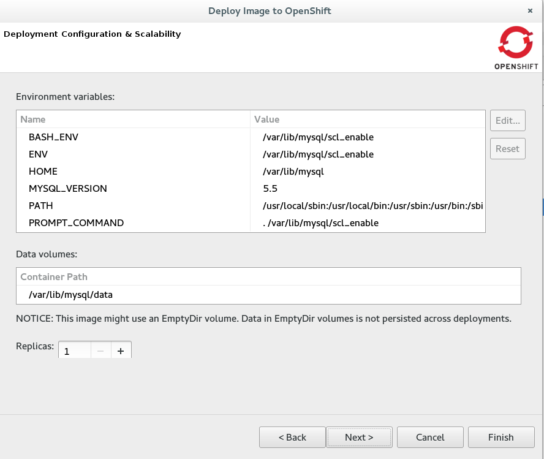
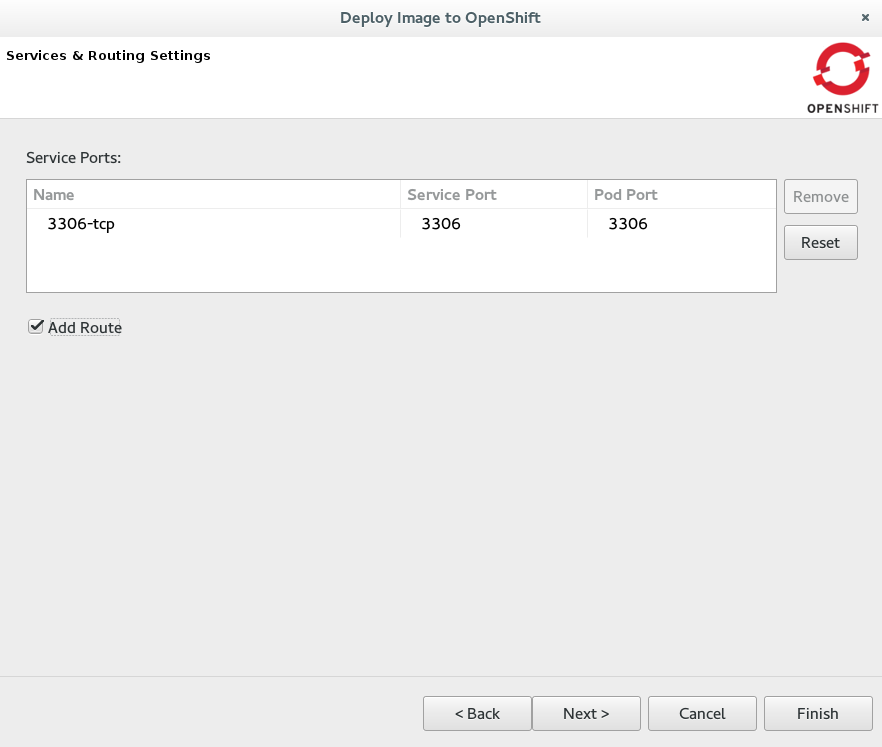
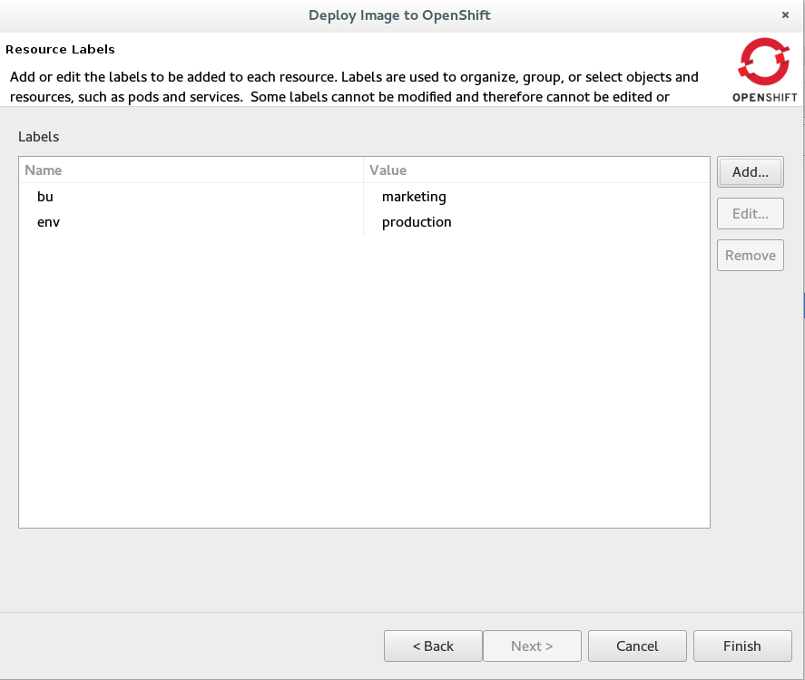

related_jira::JBIDE-19010,JBIDE-20402[]

=== New OpenShift 3 java client library
The OpenShift 3 tooling is based upon a new java client library to talk to the OpenShift 3 backend.
This all new client library is hosted at:

  https://github.com/openshift/openshift-restclient-java

related_jira::JBIDE-19555[]
