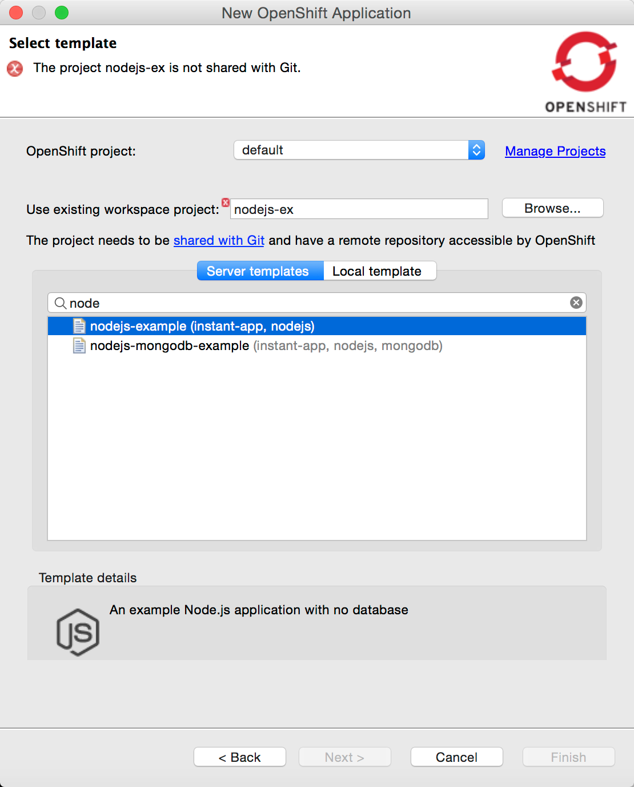
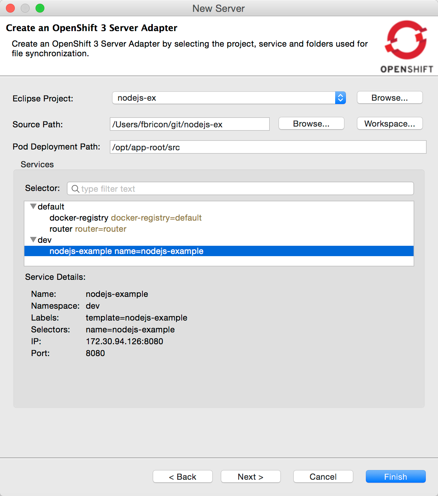
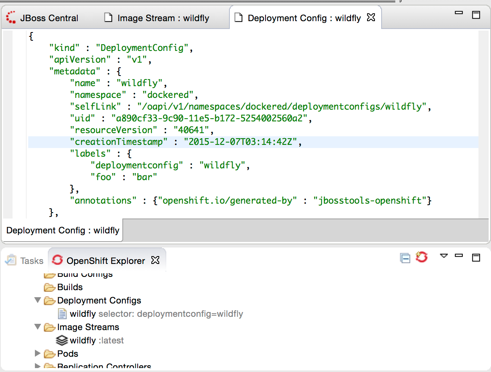
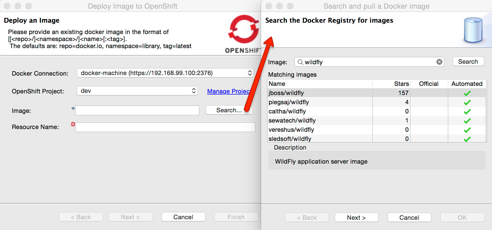
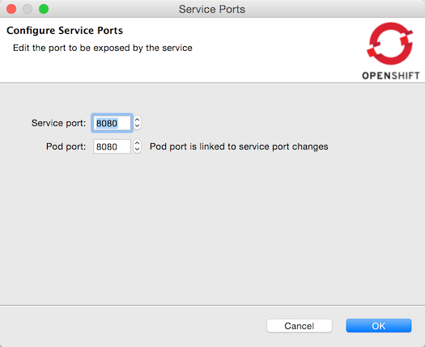
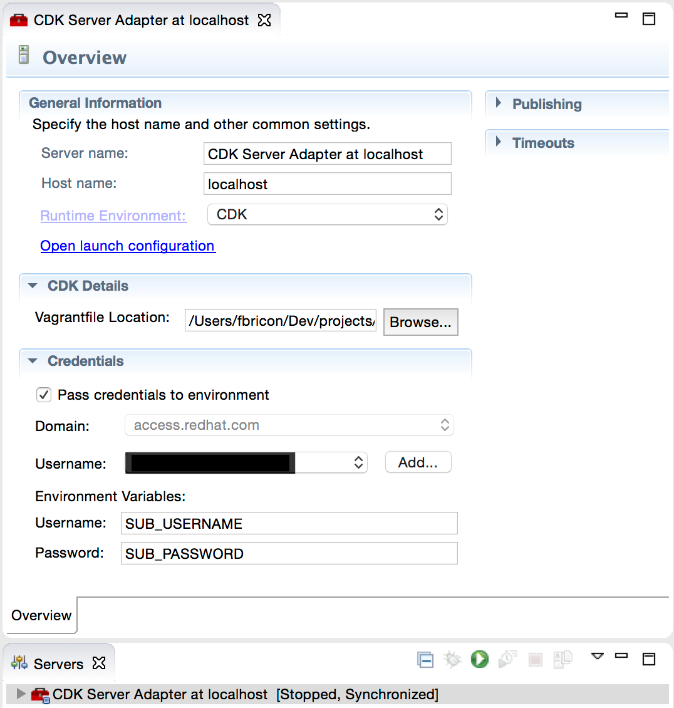

= OpenShift What's New in 3.1.0.Beta1
:page-layout: whatsnew
:page-component_id: openshift
:page-component_version: 4.3.1.Beta1
:page-product_id: jbt_core
:page-product_version: 4.3.1.Beta1
:page-include-previous: false

== OpenShift 3 support improvements

More than 80 issues are fixed in this release of the OpenShift tooling, mostly targeting OpenShift 3 support.
OpenShift 3 was introduced as a technology preview feature in JBDS 9.0.0.GA but will graduate to a supported feature in the upcoming JBDS 9.1.0.GA release. The following is a list of improvements and additions in this release:

=== Deploy workspace projects
You can now deploy existing workspace projects to OpenShift 3 instances. You can either create a new OpenShift application, using an OpenShift 3 connection and then select the workspace project to deploy, or you can start by right-clicking on a project and use the `Configure...` > `Deploy to OpenShift...` menu.

The project needs to be shared with git and declared a remote git repository using the HTTP(S) protocol. That repository needs to be accessible from the target OpenShift instance. Once a project is selected, a selection of compatible templates will be displayed, matching the type of the project. The remote git URL is injected as a value for the `SOURCE_REPOSITORY_URL` (or legacy `GIT_URI`) template parameter.

related_jira::JBDS-3489[]

=== New OpenShift 3 server adapter

A prototype for a new OpenShift 3 server adapter is now available. Its goal is to allow incremental deployment of workspace resources directly into the deployed node on OpenShift, bypassing the build step. Its capabilities are currently limited and require a number of manual steps to set up, but the usage will be streamlined in subsequent releases. Currently only Node and PHP based applications are supported.

[NOTE]
This feature requires a version of the OpenShift binary *higher than 1.1.0.1*. If no https://github.com/openshift/origin/releases[official release] is available, you can download a CI build for your OS from https://ci.openshift.redhat.com/jenkins/job/devenv_ami/lastSuccessfulBuild/artifact/origin/artifacts/release/

To create a new OpenShift 3 server adapter, ensure that you have:

- the oc binary available in your system PATH, or set in `Preferences > JBoss Tools > OpenShift 3`
- it's strongly recommended rsync be on the PATH too, to get a faster turnaround
- an existing OpenShift 3 connection
- a workspace project (preferably Node.js or PHP for now) already deployed to that connection

From the Servers view, create a new Server, select `OpenShift 3 Server Adapter` and click the `Next` button to reach:

Select the workspace project to deploy and this updates the `Source path` to synchronize from. For Node.js and PHP projects, that means the root of the project will be deployed. Other types of projects could use different source folders (for example, an exploded WAR folder for web projects, but this is currently not heavily tested/working).
The `Pod Deployment Path` is the target location where the files will be copied on the OpenShift pod. The current value is set to work for Node.js and PHP applications, but that could potentially be some place else for other kind of projects. Finally, you need to select the target OpenShift service. You can click finish directly once you're set.

Now, every time you want to push your local changes directly to OpenShift without having to commit and push them to git first, right-click on your new OpenShift 3 server, in the `Servers` view, and click `Publish`. The content of `Source path` will be automatically synchronized to the deployed pod. The initial deployment might take several seconds to perform, but subsequent deployments will be much faster. If the deployed application support resource updates (for examples, Node.js supports html updates, but needs to be restarted for JS ones, unless it's started in debug mode), then you should be able to see your changes by simply refreshing your browser.

In future releases, this will become more streamlined. Server creation should be more automatic, changes will be automatically published (and faster) without having to manually hit the Publish menu every time, we should also be able to better support incremental deployment of JavaEE applications.

related_jira::JBIDE-20764[]

=== OpenShift Explorer improvements
==== Real-time resources updates
The explorer is now listening to server side events, so it can automatically refresh itself for instance, if it detects a new build or deployment has been triggered, even from the command line or the web console.

related_jira::JBIDE-20571[]

==== Edit resources

A new `Edit...` menu is available in the OpenShift Explorer, allowing you to edit any resource (except Builds) as JSON in a text editor. This is equivalent to the `oc edit` command in a terminal. If a JSON editor is installed, it will be used to open the configuration, else the standard text editor will be called. When saving the configuration changes in the editor, its content will be sent to the OpenShift instance to update the underlying resource. This can be useful to, for instance, add label to resources or edit the git source URL.

[WARNING]
Be aware this is a very powerful tool, to use with caution, as you might risk accidentally corrupting your OpenShift project.

related_jira::JBIDE-20761[]

=== Integration with Docker tooling

==== Search for Docker images
When deploying a Docker image, searching for a docker image has never been easier. Click on the `Search...` button and find your favorite image from the the selected Docker registry:

Please note that the image needs to have been pulled in the selected docker registry, before it can be deployed to OpenShift, or else we won't be able to perform port mapping and OpenShift will fail to create the service.

related_jira::JBIDE-20530,JBIDE-21133[]

==== Expose additional ports from the docker image

It is now possible to expose ports to a deployment, other than just those explicitly exposed on the docker image (they still need to be exposed by the image though).

The default exposed ports can be changed, reset, but not removed, as opposed to the new aforementioned ports.

related_jira::JBIDE-20531[]

=== Integration with Red Hat Container Development Kit

A new server adapter has been added to help start and stop the Red Hat Container Development Kit (CDK), a set of tools meant to quickly set up an OpenShift instance inside a Docker container running inside a virtual machine. While the server adapter itself has limited functionality, it is able to start and stop the CDK virtual machine via its Vagrantfile. Once started, Docker and OpenShift connections should appear in their respective views, allowing the user to quickly create a new Openshift application and begin developing their AwesomeApp in a highly-replicatable environment.

This plugin is still experimental, mainly due to the rapidly changing, fast-paced development going on in the underlying CDK. It's also worth noting that several features will not work with the raw Red Hat CDK, and depend on the presence of a `.cdk` file in the same folder as your `Vagrantfile`.  This `.cdk` file is included alnog with the `Vagrantfile` available at the `openshift-vagrant` github repository.  Instruction to install and use this enhanced CDK Vagrantfile can be found at https://github.com/redhat-developer-tooling/openshift-vagrant.

related_jira::JBIDE-21157[]
