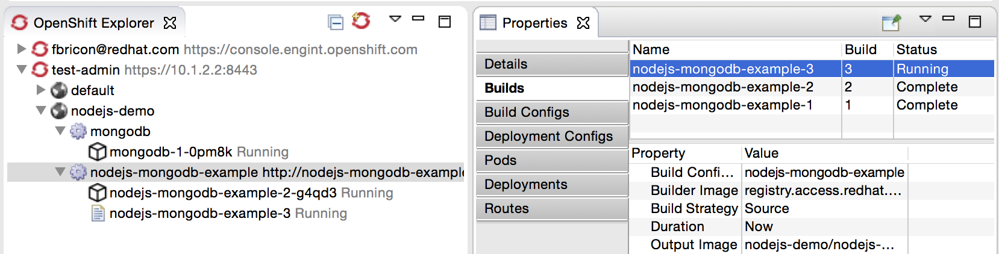

= OpenShift What's New in 3.1.0.Beta2
:page-layout: whatsnew
:page-component_id: openshift
:page-component_version: 4.3.1.Beta2
:page-product_id: jbt_core
:page-product_version: 4.3.1.Beta2
:page-include-previous: false

== OpenShift 3 support improvements

More than 60 issues targeting OpenShift 3 support have been fixed in this release of the OpenShift tooling.
The OpenShift 3 integration was introduced as a technology preview feature in JBDS 9.0.0.GA but will graduate to a supported feature in the upcoming JBDS 9.1.0.GA release.
Here's a selection of the most interesting fixes and improvements in this release:

=== OpenShift 3 server adapter improvements

[NOTE]
This feature requires the OpenShift binary version 1.1.1 or higher. You can download the binary matching your OS from the https://github.com/openshift/origin/releases[official release page on github.com]

The following improvements have been made to the OpenShift 3 server adapter:

==== Support for incremental publishing
The OpenShift 3 server adapter now respects the auto-publish settings as declared in the server editor,
giving the user the option to automatically publish on workspace changes,
build events, or only when the user requests it.
The server adapter is also able to incrementally deploy the server's
associated project with a quick call to rsync, ensuring minimal over-the-wire
transfers and a fast turnaround for testing your project.

related_jira::JBIDE-21371[]

==== Support for Java EE projects
Experimental support for Java EE projects (Web and EAR) is now available.
When the workspace project associated with the OpenShift 3 server is a Dynamic
or Enterprise Application project, the server adapter builds an exploded version of the archive to a temporary
local directory and replaces the version deployed on the remote OpenShift
pod. That `Pod Deployment Path`, is now inferred automatically from the image stream tags on the remote Pod.
A `.dodeploy` marker file is created for the remote server to redeploy the module if necessary (for EAP/WildFly servers supporting it).

This is currently an experimental feature and users must ensure they are aware of the following caveats before using the feature:

- currently, incremental support for Java EE projects only applies to static resources (web pages, Javascript, CSS, images, etc.).
- Java classes are not reloaded (this requires enabling debugging mode on the remote server).
- locally deleted files are not deleted remotely because this would break other deployment use cases.

The listed issues are tracked and will be fixed in future releases of this tooling.

related_jira::JBIDE-21481,JBIDE-21452[]

==== Support for LiveReload
The new tooling includes link:/features/livereload.html[LiveReload] support for OpenShift 3 server adapters.
This is accessible from the `Show In > Web Browser via LiveReload Server` menu. When a file
is published to the server adapter, the Browser connected to the LiveReload server instance will automatically refresh.

image::./images/openshift3-livereload-menu.png[width=600]

This is particularly effective in conjunction with the Auto Publish mode for the OpenShift 3 server adapters, as all it takes to reload a web
resource is saving the file under edition (Ctrl+S, or Cmd+S on Mac).

related_jira::JBIDE-21429[]

=== OpenShift Explorer improvements
==== Simplified view for OpenShift 3 resources
Previously, the OpenShift 3 resources representation exposed a large amount of unnecessary information about OpenShift.
The explorer view is now simplified and specific (and made much more robust) and focuses on an application-centric view.

Multiple OpenShift projects are included under a single OpenShift 3 connection. Under each project, application deployments,
each associated with one service, are displayed. When relevant, the default route displays next to the service name.
It can be conveniently opened from the `Show In > Web Browser` menu.

Under a service deployment, the node displays running Pods and/or Builds in progress.

These changes may prompt the question about what happened to the remaining OpenShift resources.
The answer is that everything that is no longer displayed directly under the OpenShift Explorer
is accessible in the Properties view.
Opened via the `Properties` menu in the OpenShift Explorer (or `Ctrl+I`, `Cmd+I` on Mac), the Properties view is
dynamically linked to any selected resource in the workspace.
When selecting a Project or Service, it displays a series of tabs, each matching a set of OpenShift
resources linked to the one selected in the OpenShift Explorer.
In each tab, you can edit or delete a resource, open it in the Web Console or access more
specific options via a right-click.

The Properties view is dynamically bound to server side events,
so it refreshes itself automatically whenever a resource change has occurred.

related_jira::JBIDE-19178[]

=== Red Hat Container Development Kit server adapter

The Red Hat Container Development Kit (CDK) server adapter now provides menus to quickly access the Docker Explorer and the OpenShift Explorer.
Right-click on a running CDK server adapter and select an option in the `Show In` menu:

image::./images/cdk-server-show-in-menus.png[width=600]

related_jira::JBIDE-21304[]
