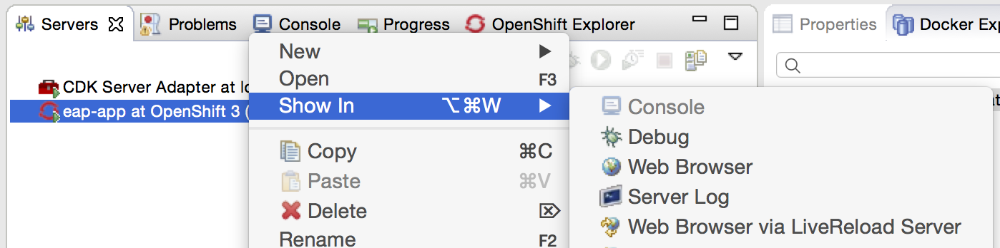
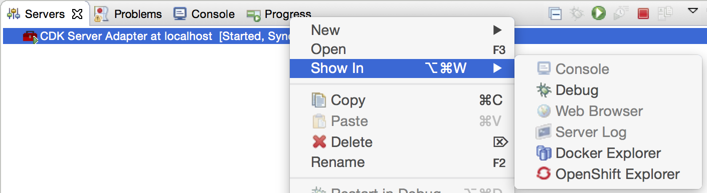

= OpenShift What's New in 3.1.0.Final
:page-layout: whatsnew
:page-component_id: openshift
:page-component_version: 4.3.1.Final
:page-product_id: jbt_core
:page-product_version: 4.3.1.Final
:page-include-previous: false

== Improved OpenShift 3 support
OpenShift 3 was introduced as a technology preview feature in JBDS 9.0.0.GA. We're happy to see it graduate to the level of *supported* feature in this release.
More than https://issues.jboss.org/issues/?jql=project%20in%20%28JBIDE%2C%20JBDS%29%20AND%20issuetype%20in%20standardIssueTypes%28%29%20AND%20resolution%20%3D%20Done%20AND%20fixVersion%20in%20%284.3.1.Beta1%2C%204.3.1.Beta2%2C%204.3.1.CR1%2C%204.3.1.Final%2C%209.1.0.Beta1%2C%209.1.0.Beta2%2C%209.1.0.CR1%2C%209.1.0.GA%29%20AND%20component%20in%20%28cdk%2C%20openshift%29[300 issues and enhancements] were tackled in this version, here is an excerpt of the most noteworthy bits:

=== OpenShift Explorer improvements
The explorer view has been simplified (and made much more robust) and focuses on an application-centric view.

Multiple OpenShift projects are included under a single OpenShift 3 connection. Under each project, application deployments,
each associated with one service, are displayed. When relevant, the default route displays next to the service name.
It can be conveniently opened from the `Show In > Web Browser` menu.

Under a service deployment, the node displays running Pods and/or Builds in progress.

More details on OpenShift resources are accessible in the Properties view.
Opened via the `Properties` menu in the OpenShift Explorer, or `Ctrl+I` shortcut (`Cmd+I` on Mac), the Properties view is
dynamically linked to any selected OpenShift resource in the workspace.
When selecting a Project or Service, it displays a series of tabs, each matching a set of OpenShift
resources linked to the one selected in the OpenShift Explorer.
In each tab, you can, via a right-click, edit or delete a resource, open it in the Web Console or access more
specific options.

The OpenShift Explorer and the Properties view are listening to server side events, so they're immediately refreshed,
when a new build or deployment has been triggered, even from the command line or the web console. Try it, it's pretty uncanny!

=== Deploy workspace projects
You can now deploy existing workspace projects to OpenShift 3 instances. You can either create a new OpenShift application, 
using an OpenShift 3 connection and then select the workspace project to deploy, or you can start by right-clicking on a project 
and use the `Configure...` > `Deploy to OpenShift...` menu.

The project needs to be shared with git and declared a remote git repository using the HTTP(S) protocol. That repository needs 
to be accessible from the target OpenShift instance. Once a project is selected, a selection of compatible templates will be 
displayed, matching the type of the project. The remote git URL is injected as a value for the `SOURCE_REPOSITORY_URL`
 (or legacy `GIT_URI`) template parameter.

image::./images/deploy-workspace-project.png[width=600]

related_jira::JBDS-3489[]

=== New OpenShift 3 server adapter

A new OpenShift 3 server adapter is available. Its goal is to allow incremental deployment of workspace resources directly 
into the deployed pods on OpenShift, bypassing the build step, to provide a much quicker turnaround. 

[NOTE]
Publishing files to a remote pod requires to add the OpenShift binary (version 1.1.1 or higher) to your OpenShift preferences 
(in `Preferences > JBoss Tools > OpenShift 3`). 
You can download the binary matching your platform from the https://github.com/openshift/origin/releases[official] 
release page on github.com. It's strongly recommended rsync be on the PATH too.

From the OpenShift Explorer, right-click on a deployed Service a select the `Server Adapter...` menu: it will either  
 create a new Server adapter or display one in the Servers view if it already exists.
 
[WARNING]
The application must be fully built and deployed on OpenShift before creating the server adapter, else an error will occur.

image::./images/new-openshfit3-server-adapter-wizard.png[width=600]

If the OpenShift Service has a Build Config with a git URL matching the git remote URL of one of the workspace projects, 
that project will be pre-selected. If no match is found, you will need to select the project manually.

Once created, the Server Adapter will start publishing the workspace project content to the remote running Pod via RSync.

The OpenShift 3 server adapter respects the auto-publish settings as declared in the server editor, so when enabled, 
every changed file in your project will automatically be published to the pod.

.Support for Java EE projects
[NOTE] 
When the workspace project associated with the OpenShift 3 server is a Dynamic
or Enterprise Application project, the server adapter builds an exploded version of the archive to a temporary
local directory and replaces the version deployed on the remote OpenShift
pod. 
A `.dodeploy` marker file is created for the remote server to redeploy the module if necessary (for EAP/WildFly servers supporting it).

related_jira::JBIDE-20764, JBIDE-21371[]

==== Debug Mode support
The OpenShift 3 server adapter supports running in debug mode. When you click on the debug button, a series of actions are performed under the hood:

- the Deployment Configuration on OpenShift is modified to enable debug mode if necessary
- the server adapter waits for a new pod to be redeployed, if the deployment configuration was modified
- once the remote pod is ready, port forwarding is enabled if necessary, binding the remote ports to local ones
- local resources are synchronized to the remote pod
- a remote debugger attempts to attach itself to the local port bound to the remote debug port (port 8787)

This provides a similar level of debug support as a locally-run application server. So you will be able to set breakpoints in your source files,
dynamically change the value on variables on the remote JVM, and even be able to perform some limited hot class reloading.

Debug mode has been tested to work on EAP based applications deployed on OpenShift. 
Let us know if you have trouble running it in other use cases.

==== Support for LiveReload
The OpenShift 3 server adapter supports link:/features/livereload.html[LiveReload], accessible from the 
`Show In > Web Browser via LiveReload Server` menu. When a file
is published to the server adapter, the Browser(s) connected to the LiveReload server instance will automatically refresh.

This is particularly effective in conjunction with the Auto Publish mode for the OpenShift 3 server adapters, as all it takes to reload a web
resource is saving the file under edition.

related_jira::JBIDE-21429[]

=== Preference to manage Accepted Certificates
When connecting to an OpenShift instance, a dialog opens to allows users to accept/refuse untrusted SSL certificates.
Those authorizations can now be reviewed and potentially revoked in a preferences page `Preferences > JBoss Tools > OpenShift 3 > SSL Certificates`.

=== Edit resources

A new `Edit...` menu is available in the OpenShift Explorer or the Properties view, allowing you to edit any resource (except Builds) as JSON
in a text editor. This is equivalent to the `oc edit` command in a terminal. If a JSON editor is installed,
it will be used to open the configuration, else the standard text editor will be called. When saving the configuration changes in the editor,
its content will be sent to the OpenShift instance to update the underlying resource. This can be useful to, for instance,
add label to resources or edit the git source URL.

This feature can be used to, for instance, set the number of replicas in a Deployment Config, or change the url in a Route.

[WARNING]
Be aware this is a very powerful tool, to use with caution, as you might risk accidentally corrupting your OpenShift project.

related_jira::JBIDE-20761[]

=== Search for Docker images
When deploying a Docker image, searching for an image has never been easier. Click on the `Search...` button and find your favorite image from the the selected Docker registry:

image::./images/search_docker_images.png[width=800]

related_jira::JBIDE-20530,JBIDE-21133[]

== Integration with Red Hat Container Development Kit

A new server adapter has been added to help start and stop the https://www.redhat.com/en/about/blog/introducing-red-hat-container-development-kit-2-beta[Red Hat Container Development Kit (CDK)],
a set of tools meant to quickly set up an OpenShift instance inside a Docker container running inside a virtual machine.
While the server adapter itself has limited functionality, it is able to start and stop the CDK virtual machine via its Vagrantfile.

Simply hit `Ctrl+3` (`Cmd+3` on OSX) and type CDK, that will bring up a command to setup and/or launch the CDK server adapter.
All you have to do is set the credentials for your https://access.redhat.com[Red Hat account] and the location of the CDK's Vagrantfile. Once you're finished,
a new CDK Server adapter will then be created and visible in the Servers view.

Once the server is started, Docker and OpenShift connections should appear in their respective views, allowing the user to quickly
create a new Openshift application and begin developing their AwesomeApp in a highly-replicatable environment.

[NOTE]
The connection created for the local OpenShift instance uses the `openshift-dev` user and `devel` password. 

image::./images/cdk-server-adapter.png[width=600]

Right-click on a running CDK server adapter and select an option in the `Show In` menu to display the OpenShift or Docker Explorer:

related_jira::JBIDE-21157,JBIDE-21304[]
