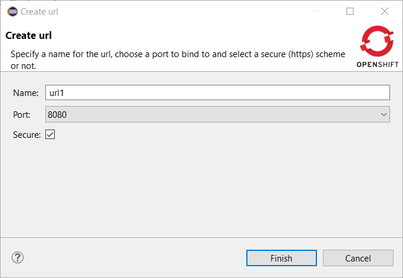
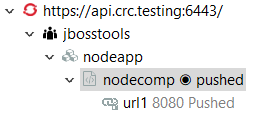

= OpenShift What's New in 3.11.0.AM1
:page-layout: whatsnew
:page-component_id: openshift
:page-component_version: 4.16.0.AM1
:page-product_id: jbt_core
:page-product_version: 4.16.0.AM1
:page-include-previous: true

=== Secure URL support

It is now possible to create secured URLs in the Application Explorer View.
If you select this option, the created URL will be accessible through `https`.

When such an URL is displayed in the tree, the icon now has a secure lock indicator.

related_jira::JBIDE-27121[]

