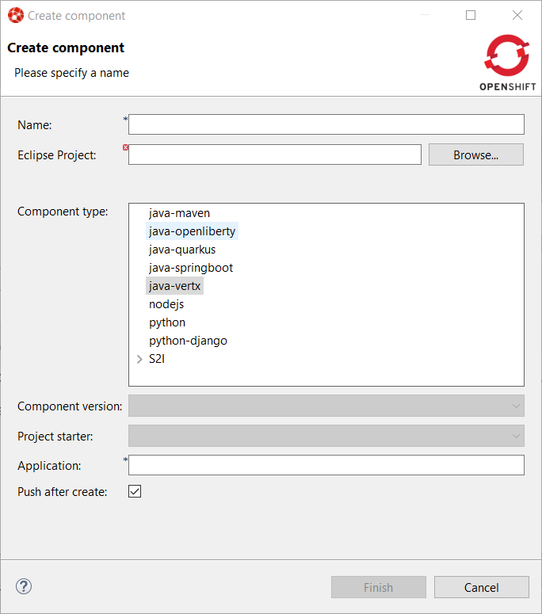
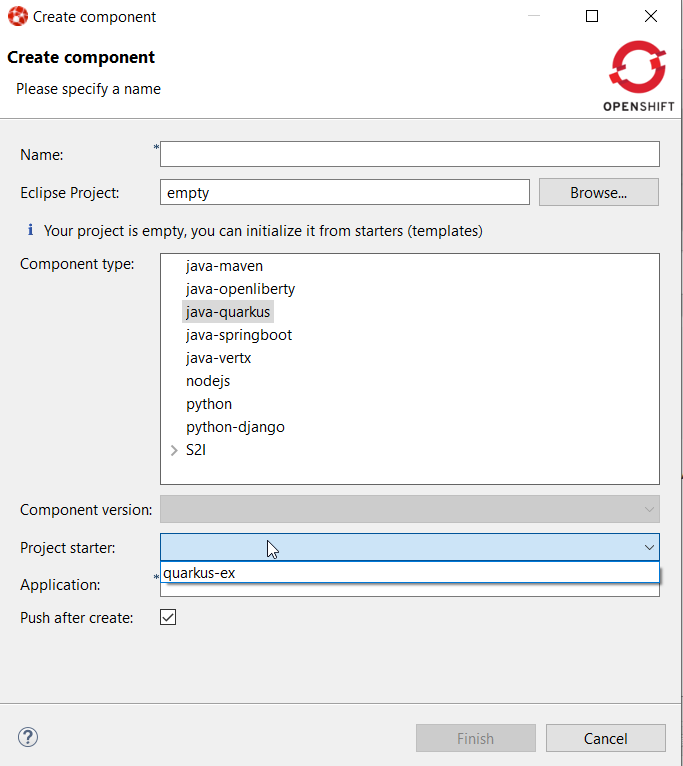

= OpenShift What's New in 3.13.0.AM1
:page-layout: whatsnew
:page-component_id: openshift
:page-component_version: 4.18.0.AM1
:page-product_id: jbt_core
:page-product_version: 4.18.0.AM1
:page-include-previous: true

=== Devfile based deployments

The Application Explorer view is now based on odo 2.x, which allows deployments
to be based on devfile (developer oriented manifest file). The components from
the default odo registry are listed with legacy S2I components:

It is also now possible to bootstrap from an empty project as the components
from the registry may expose starter projects (sample code that will initialize
your empty project).

related_jira::JBIDE-27531[]
related_jira::JBIDE-27553[]
related_jira::JBIDE-27563[]

