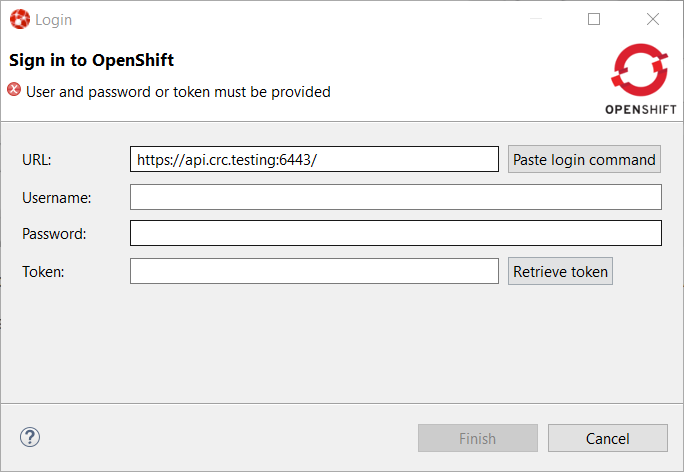
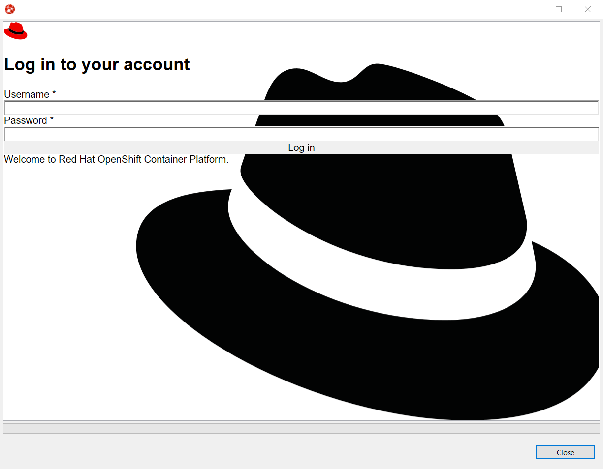
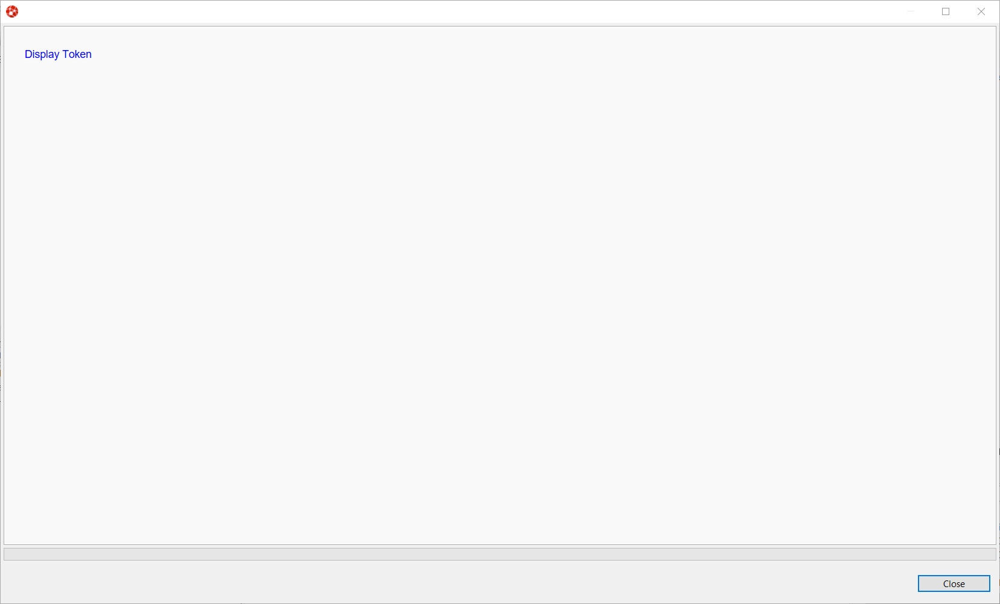
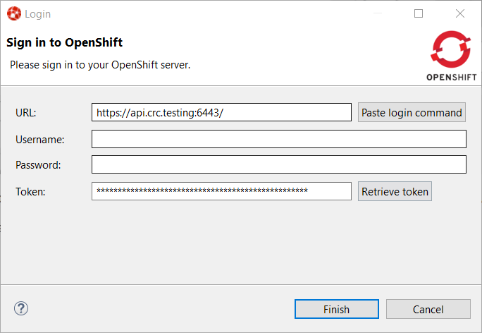
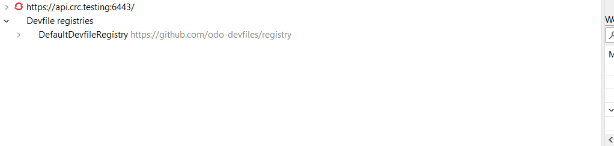
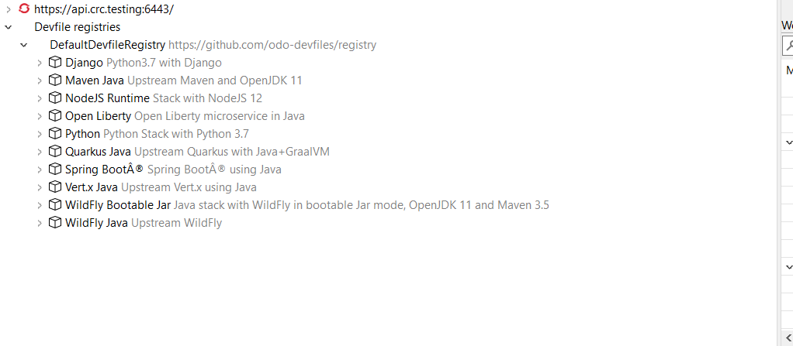

= OpenShift What's New in 3.14.0.AM1
:page-layout: whatsnew
:page-component_id: openshift
:page-component_version: 4.19.0.AM1
:page-product_id: jbt_core
:page-product_version: 4.19.0.AM1
:page-include-previous: true

=== Browser based login to an OpenShift cluster

When it comes to login to a cluster, OpenShift Tools supported two different authentication mechanisms:

- user/password
- token

The drawback is that it does not cover clusters where a more enhanced and modern authentication infrastructure is in place. So it is now possible to login to the cluster through an embedded web browser.

In order to use it, go to the Login context menu from the Application Explorer view:

Click on the `Retrieve token` button and an embedded web browser will be displayed:

Complete the workflow until you see a page that contains `Display Token`:

Click on `Display Token`:

The web browser is automatically closed and you'll notice that the retrieved token has been set in the original dialog:

related_jira::JBIDE-27667[]

=== Devfile registries management

Since JBoss Tools 4.18.0.Final, the preferred way of developing components is now based on devfile, which is a YAML file that describe how to build the component and if required, launch other containers with other containers.
When you create a component, you need to specify a devfile that describe your component. So either you component source contains its own devfile or you need to pick a devfile that is related to your component.
In the second case, OpenShift Tools supports devfile registries that contains a set of different devfiles. There is a default registry (https://github.com/odo-devfiles/registry) but you may want to have your own registries. It is now possible to add and remove registries as you want.

The registries are displayed in the OpenShift Application Explorer under the `Devfile registries` node:

Please note that expanding the registry node will list all devfiles from that registry with a description:

A context menu on the `Devfile registries` node allows you to add new registries, and on the registry node to delete it.

related_jira::JBIDE-27610[]

=== Devfile enhanced editing experience

Although devfile registries can provide ready-to-use devfiles, there may be some advanced cases where users need to write their own devfile. As the syntax is quite complex, the YAML editor has been completed so that to provide:

- syntax validation
- content assist

related_jira::JBIDE-27612[]

=== Support for Python based components

Python based components were supported but debugging was not possible. This released brings integration between the Eclipse debugger and the Python runtime.

related_jira::JBIDE-27612[]