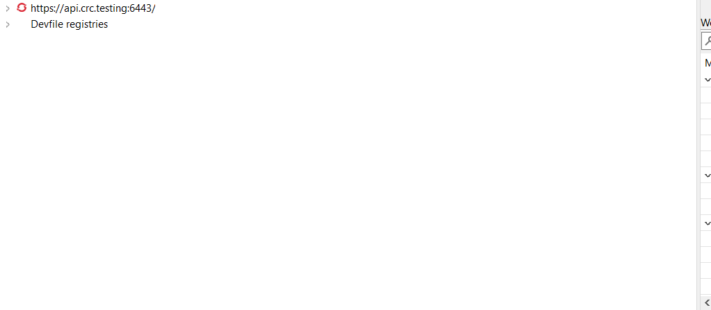
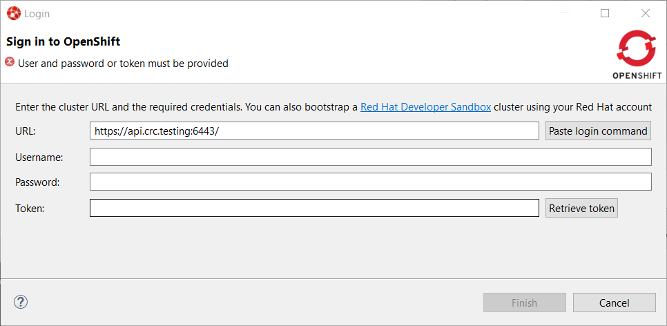
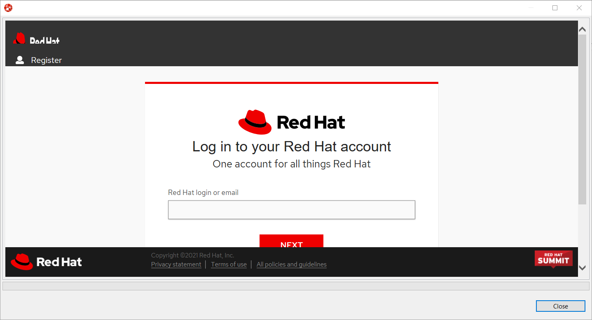
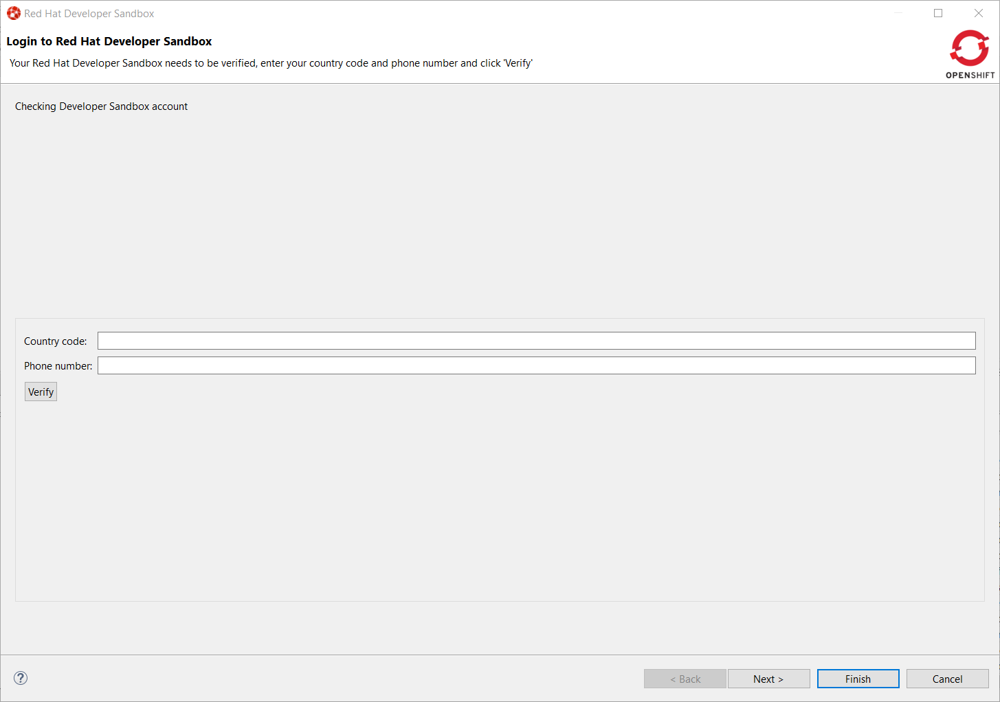
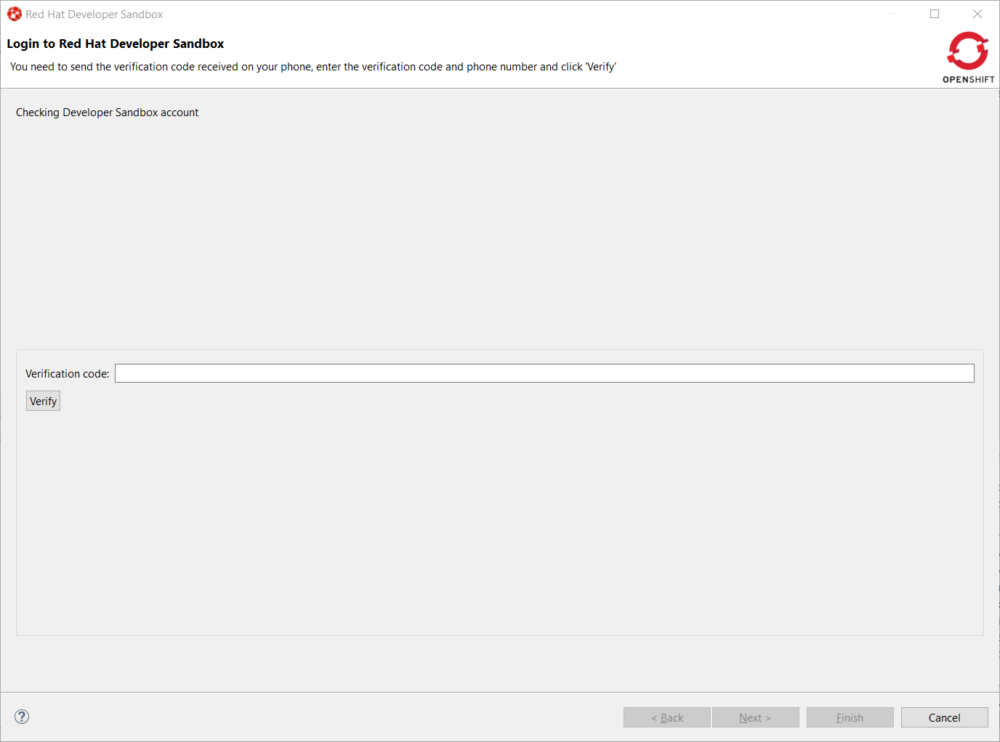
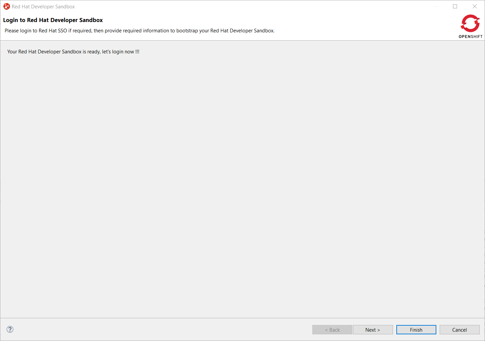
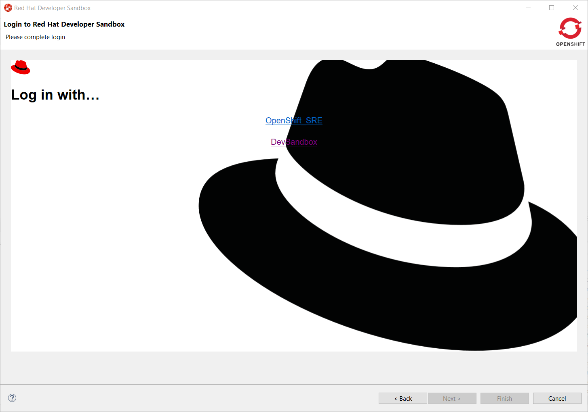
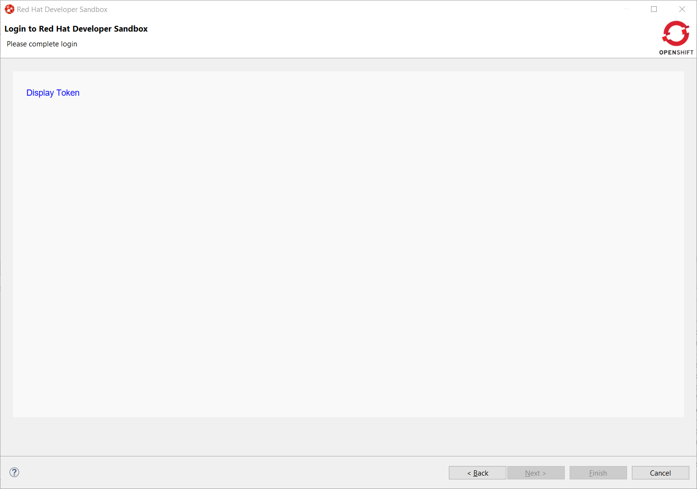
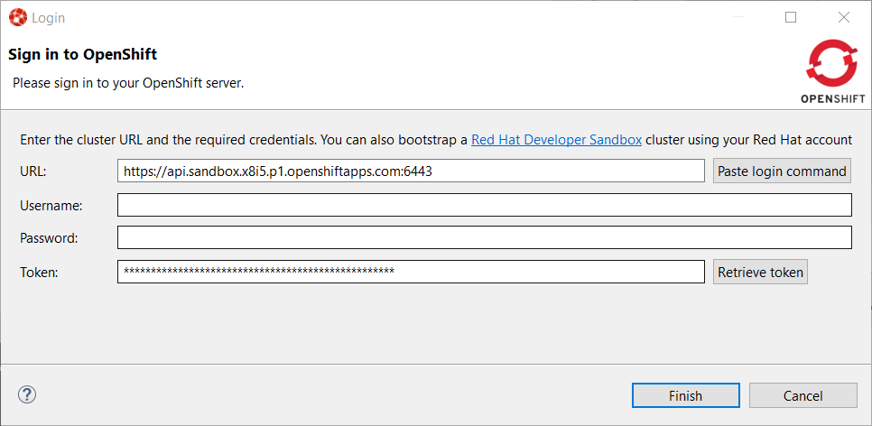
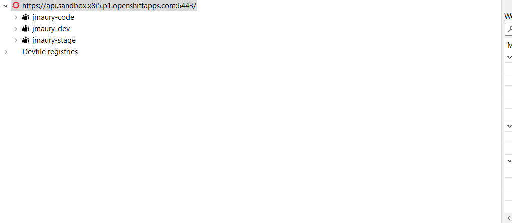

= OpenShift What's New in 3.14.0.Final
:page-layout: whatsnew
:page-component_id: openshift
:page-component_version: 4.19.0.Final
:page-product_id: jbt_core
:page-product_version: 4.19.0.Final
:page-include-previous: true

=== Login to Developer Sandbox from the tooling

Red Hat provides an online OpenShift environment called 
https://red.ht/dev-sandbox[Developer Sandbox] that makes it easy for developers to build, test and deploy cloud
native applications and microservices.

In order to use Developer Sandbox, you must own a Red Hat SSO account (which can be linked to social accounts like
GitHub,...). Once logged in into Red Hat SSO, you will get an environment provisioned in Developer Sandbox but
the first time you will try to login in to Developer Sandbox, your account needs to be verified (in order to
prevent crypto miners and robots) thus you need to go through a verification phase where you will be asked to provide:

- first your phone number and country code
- then a verification code that you will receive on your smartphone.

So it is now possible to provision and log in to Developer Sandbox from the OpenShift tooling and connect it to the Developer Sandbox environment.

Open the `OpenShift Application Explorer` view (`Window -> Show View -> Other...`, enter `open` and double click on `OpenShift Application Explorer`):

Right click on the first node and select the `Login` context menu:

In order to provision the Developer Sandbox environment, click on the `Red Hat Developer Sandbox` link: a browser window will open and you will be required to login to your Red Hat SSO account:

Login to your account (please note that if you don't have a Red Hat account, you can create a new one). Once
you're logged in, you should see the following window:

Enter your contry code (+XX) and phone number and click the `Verify` button:

You will be required to provide the verification code that you should have received on your phone:

Once your Developer Sandbox environment is provisioned; you will see the following window:

Click on the Ǹext` button to log in to your Developer Sandbox environment:

Click on the `DevSandbox` link and log in with the same credentials: you will see the following window:

Click on the `Display Token` link and the click on the `Finish` button, you should be back to the Login wizard:

Please note that the `URL` and `Token` fields have been updated. Click the `Finish` button, the `OpenShift Application Explorer` will be updated with the Developer
Sandbox URL and if you expand it, you will see 3 namespaces/projects available for you to start playing with:

You're now ready to work against this environment for free !!!.
