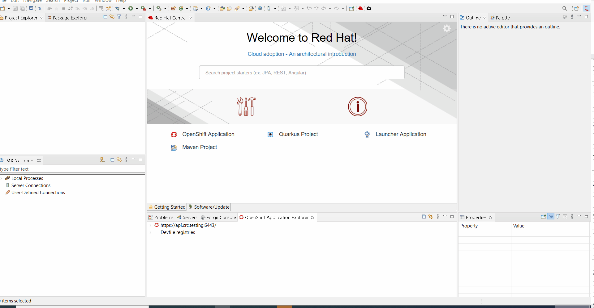
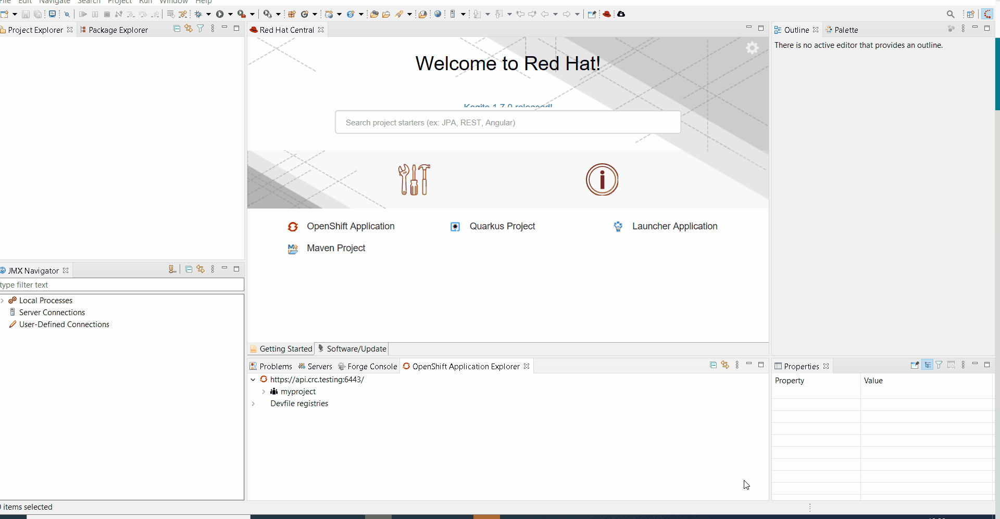

= OpenShift What's New in 3.15.0.AM1
:page-layout: whatsnew
:page-component_id: openshift
:page-component_version: 4.19.1.AM1
:page-product_id: jbt_core
:page-product_version: 4.19.1.AM1
:page-include-previous: true

=== Improved OpenShift Application explorer

When the OpenShift cluster has no applications or projects, user is required to create them. However,
it may not be obvious for the user that the corresponding function is available from a sub menu of the
New context menu.

So now, a link will be provided within the tree with an explanation message.

If no projects are available, user will be guided to create one:

If no applications are available in a project, user will be guided to create a new component:

related_jira::JBIDE-27829[]