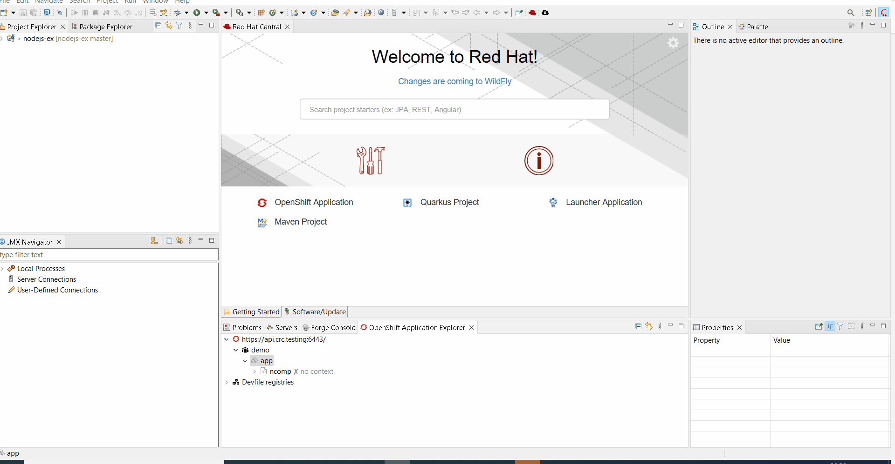
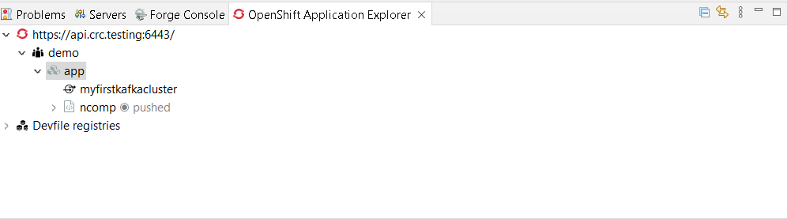

= OpenShift What's New in 3.16.0.Final
:page-layout: whatsnew
:page-component_id: openshift
:page-component_version: 4.21.0.Final
:page-product_id: jbt_core
:page-product_version: 4.21.0.Final
:page-include-previous: true

=== Operator based services

When developing cloud native applications on OpenShift, developer may need to
launch services (databases, messaging system,...) that the application under
development may need to connect to. The OpenShift tooling allowed to launch such
services but it was based on the service catalog which is not available anymore on OpenShift 4.

The new feature is based on operators which is the devops way of installing and
managing software on Kubernetes clusters. So when you want to launch a service
for your application, you will have to choose from the list of installed
operators on your cluster and then select type of deployment you want.

In the following example, there are two operators installed on our cluster:
the https://strimzi.io[Strimzi] operator for setting up Kafka clusters on Kubernetes
and a Postgresql operator.

For each operator, we can select the type of deployment we want to setup. For each type
of deployment, specific parameters may be specified. In this example, we decided to
set the replicas number to 4 for a Kafka cluster.

After you've entered the name of your service, it will appear in the application explorer view:

related_jira::JBIDE-27985[]