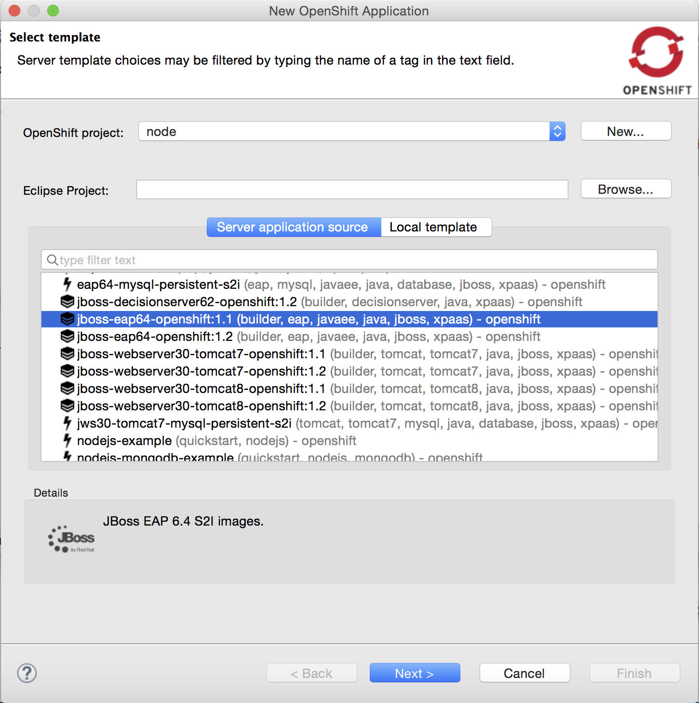
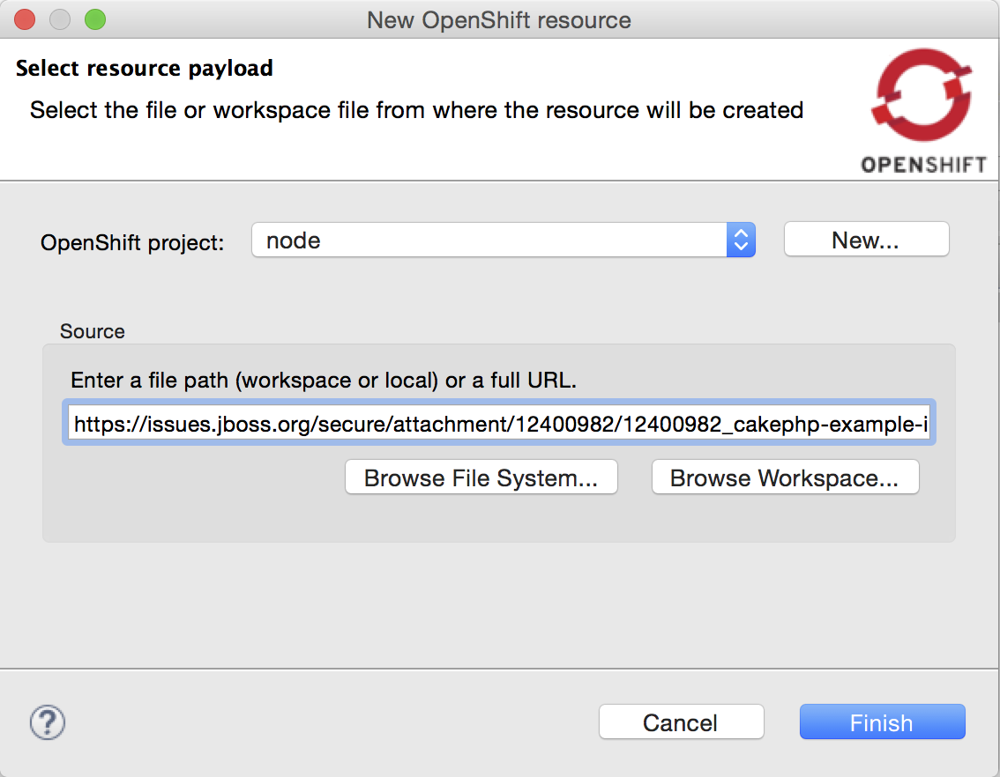
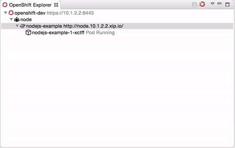

= OpenShift What's New in 3.2.0.Alpha2
:page-layout: whatsnew
:page-component_id: openshift
:page-component_version: 4.4.0.Alpha2
:page-product_id: jbt_core
:page-product_version: 4.4.0.Alpha2
:page-include-previous: false

== Improved OpenShift 3 support

=== New support for builder images
The New OpenShift Application wizard now supports builder images, on top of the existing template support:

Compared to regular templates, with the builder image-based workflow, users will be able to define:

- git source url
- build triggers
- environment variables
- data volumes
- replicas
- exposed service ports and routes

related_jira::JBIDE-22118[]

=== Create new resources
The OpenShift Explorer now provides a `New > Resource` menu, that lets you create new OpenShift resources from an existing file, similar to the `oc create -f some_resource.json` command.
Resource files can be local (from File System or Workspace), or remote, by providing a URL.

Once the file is uploaded and processed by the OpenShift server, a summary dialog will display the list of all the resources that have been created.

related_jira::JBIDE-20937[]

=== Scaling pods
It is now possible to scale pods up and down, from the Service context menu in the OpenShift Explorer, or the Deployments and Deployment Configuration context menus in the Properties view.
`Scale > Up` will spin up one more pod, `Scale > Down` will remove one pod. `Scale > To...` will open a pop-up dialog to let you set the amount of pods you want your OpenShift to spin up.

related_jira::JBIDE-21634[]

=== Create application from remote template
The new OpenShift 3 Application wizard now supports URLs, when using a custom template.

related_jira::JBIDE-22190[]

=== Automatically select OAuth token
When creating a new OpenShift 3 connection in OAuth mode, an integrated browser opens, to connect to the Openshift instance. 
The OAuth token displayed on the page is now automatically copied and pasted to the token field of the connection wizard, 
once the browser is closed. 

related_jira::JBIDE-22360[]

