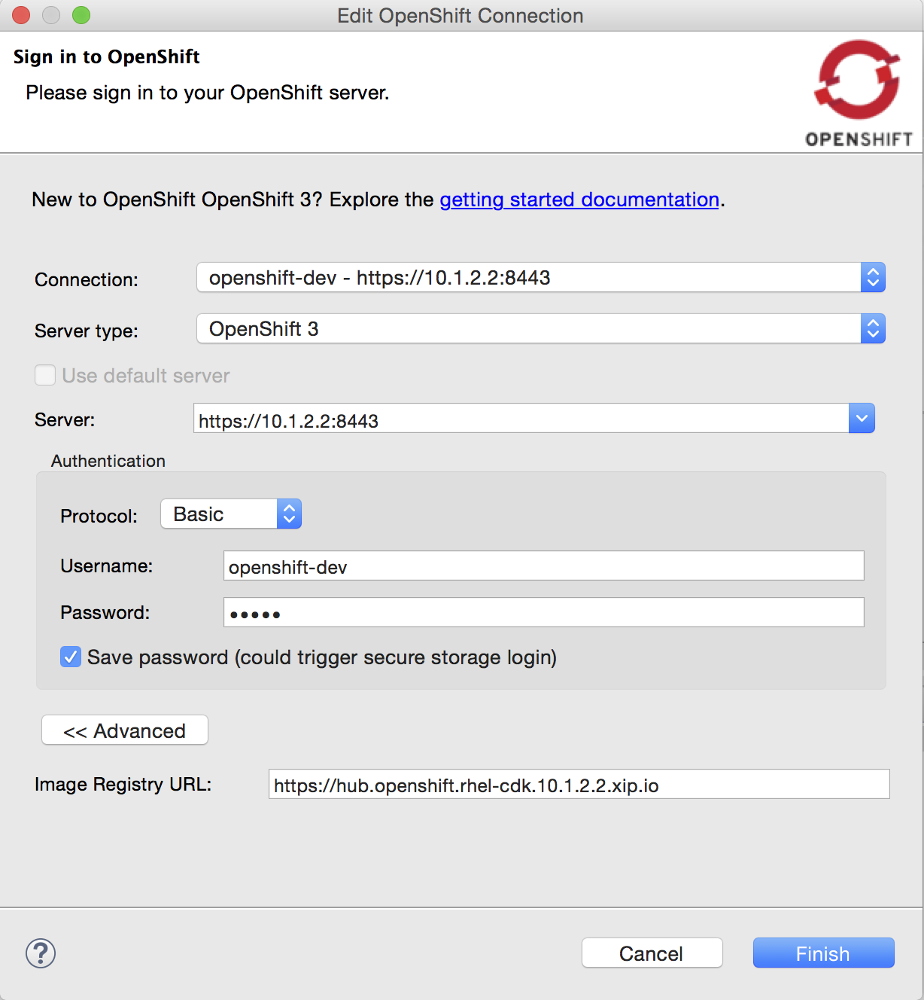
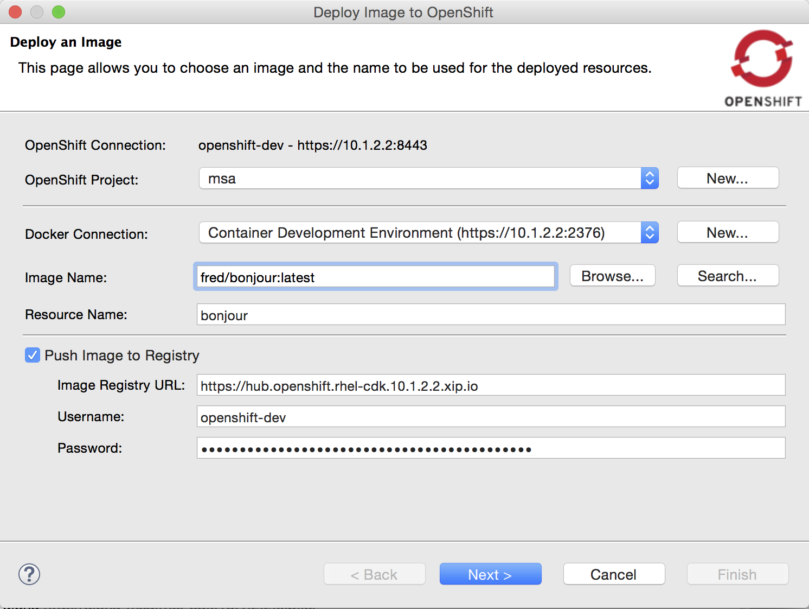
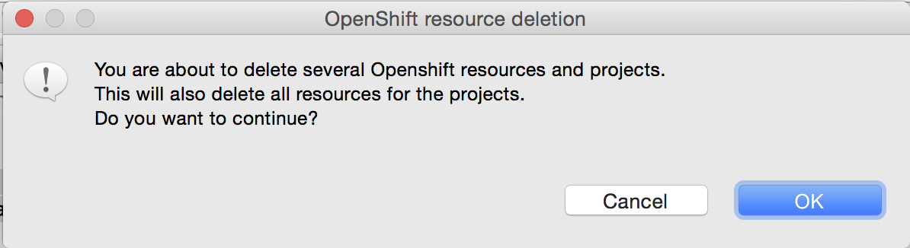
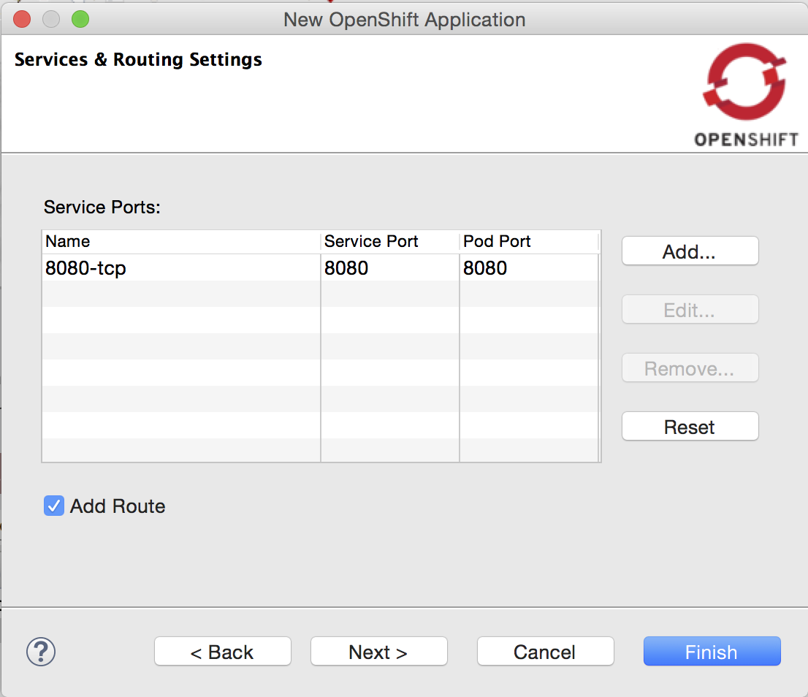

= OpenShift What's New in 3.2.0.Final
:page-layout: whatsnew
:page-component_id: openshift
:page-component_version: 4.4.0.Final
:page-product_id: jbt_core
:page-product_version: 4.4.0.Final
:page-include-previous: true

=== Deploy docker images to the CDK OpenShift registry
The New OpenShift Connection wizard now supports setting a Docker registry url in the advanced properties section:

This allows you to push docker images to the given Docker registry via the Deploy Docker Image wizard, right
before actually creating the OpenShift resources.

When using the OpenShift instance from http://developers.redhat.com/products/cdk/overview/[Red Hat's Container Development Kit], you must select the Container Development Environment Docker Connection. 
The username and password (actually the OpenShift token, as per this https://github.com/redhat-developer-tooling/openshift-vagrant#how-to-run-any-image-on-openshift[documentation]) are already preset for you.

If the CDK docker connection has a new version of the Docker image, it can be pushed again via the same mechanism.

related_jira::JBIDE-22193[]

=== Delete multiple projects
The OpenShift Explorer now supports deleting multiple OpenShift projects at once, via the `Delete Project...` menu

related_jira::JBIDE-21420[]

=== Route created by default
A route is now created by default when creating a new application from a builder image or when deploying a docker image:

You can uncheck the `Add Route` checkbox, if creating a route to your service is irrelevant to your use case. 

related_jira::JBIDE-22165[]