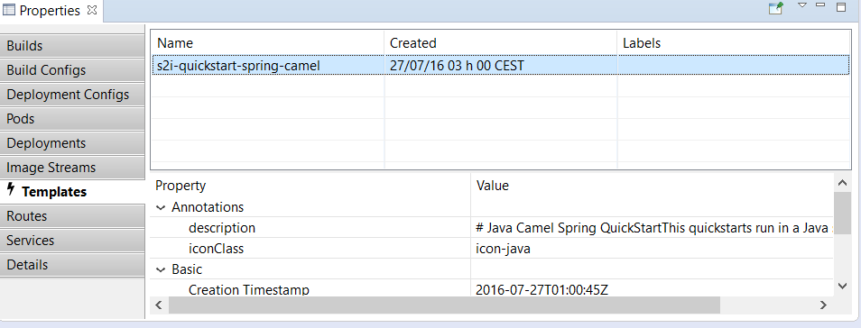

= OpenShift What's New in 3.3.0.AM2
:page-layout: whatsnew
:page-component_id: openshift
:page-component_version: 4.4.1.AM2
:page-product_id: jbt_core
:page-product_version: 4.4.1.AM2
:page-include-previous: true

=== Server templates can now be displayed / edited
Server templates are now displayed in the property view under the `Templates` tab:

You can access/edit the content of the template with the `Edit` command. 

related_jira::JBIDE-22457[]