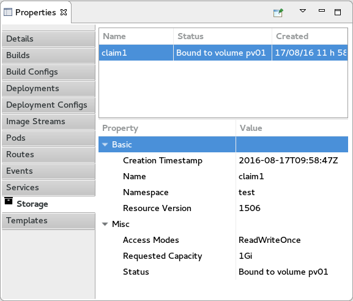

= OpenShift What's New in 3.3.0.AM3
:page-layout: whatsnew
:page-component_id: openshift
:page-component_version: 4.4.1.AM3
:page-product_id: jbt_core
:page-product_version: 4.4.1.AM3
:page-include-previous: true

=== Events can now be displayed
Events generated as part of the application livecycle are now displayed in the property view under the `Events` tab (available at the project level):


You can refresh the content of the event with the `Refresh` command or open the event in the OpenShift web console with the `Show In -> Web Console` command. 

related_jira::JBIDE-22817[]

=== Volume claims can now be displayed
Volume claims are now displayed in the property view under the `Storage` tab (available at the project level):


You can create a new volume claim using a resource file like the following:

```json
{
    "apiVersion": "v1",
    "kind": "PersistentVolumeClaim",
    "metadata": {
        "name": "claim1"
    },
    "spec": {
        "accessModes": [ "ReadWriteOnce" ],
        "resources": {
            "requests": {
                "storage": "1Gi"
            }
        }
    }
}
```

If you deploy such a resource file with the `New -> Resource` command at the project level, the `Storage` tab will be updated:



You can access/edit the content of the volume claim with the `Edit` command or open the volume claim in the OpenShift web console with the `Show In -> Web Console` command.

related_jira::JBIDE-22433[]