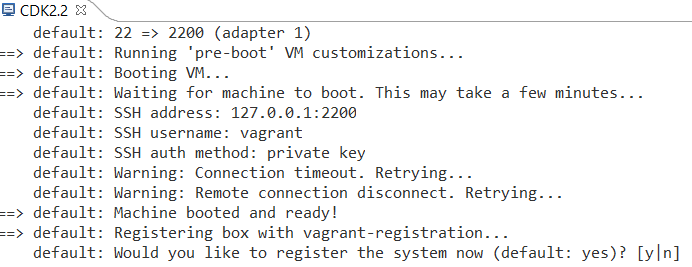
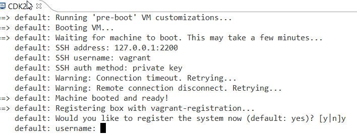
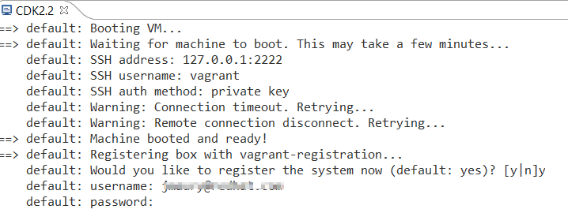

= OpenShift What's New in 3.3.1.AM1
:page-layout: whatsnew
:page-component_id: openshift
:page-component_version: 4.4.2.AM1
:page-product_id: jbt_core
:page-product_version: 4.4.2.AM1
:page-include-previous: true

=== Common namespace is now configurable
When looking for Openshift resources (builder images, templates), a common namespace is browserd. It used to be hardcoded to `òpenshift`
It is now configurable by the user and defaults to `òpenshift`.

WARNING: Please note that templates are still loaded from the `òpenshift` namespace and not the configured common namespace, this will be fixed for the next release.

It can be accessed and modified through the connection extended properties:

related_jira::JBIDE-23014[]

=== CDK server using native terminal for better user interactions

The CDK server adapter now uses a native terminal that allows better interaction with the user.
In the case credentials are not passed in the Vagrant environment, the user will be asked just as with
the standard Vagrant CLI and in case of registration failures, retries will be performed.

First, make sure your CDK server adapter is configured not to pass credentials:

Then, start the CDK server adapter and a new terminal window will open, asking for regsitration:

If you answered `y` to the previous questions, then the terminal window will ask for username:

Then the terminal window will ask for password:

If the registration fails, then the terminal window will perform retries and ask again for username and password:

related_jira::JBIDE-23039[]

