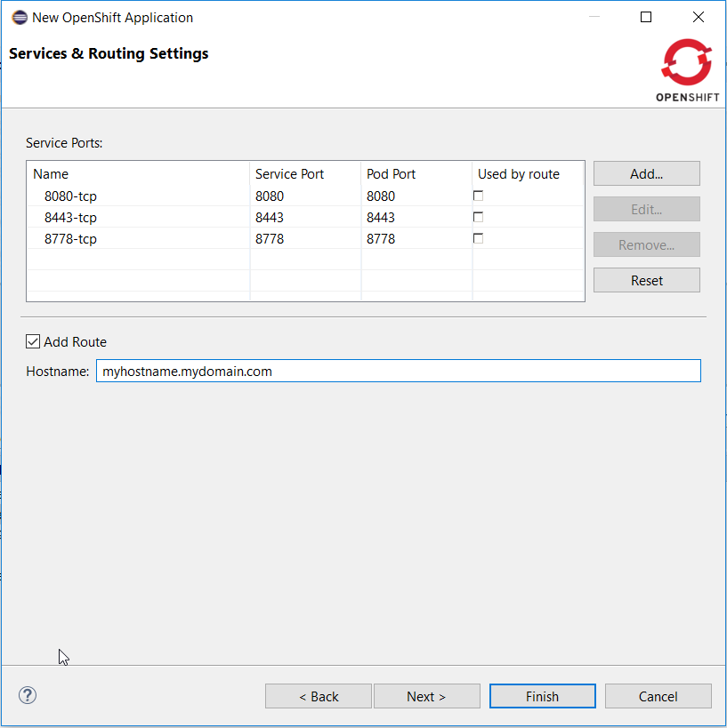
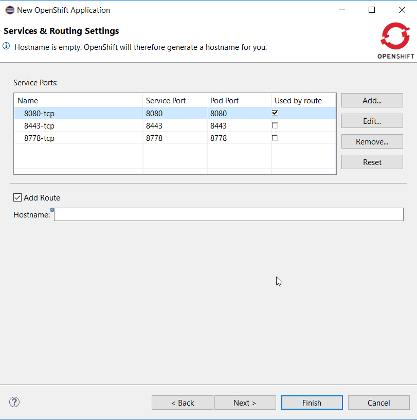

= OpenShift What's New in 3.3.1.AM2
:page-layout: whatsnew
:page-component_id: openshift
:page-component_version: 4.4.2.AM2
:page-product_id: jbt_core
:page-product_version: 4.4.2.AM2
:page-include-previous: true

=== Common namespace template support
Common namespace was link:4.4.2.AM1.html#openshift[added] but templates were still loaded from the hardcoded `openshift` namespace.
They are now loaded from the configured common namespace (which still default to `openshift`)

related_jira::JBIDE-23014[]

=== User controlled hostname when creating routes

When an application is being deployed to Openshift, a route is optionally created if required by the user.
Openshift/CDK used to create an http://xip.io[xip.io] based hostname. User can now set its own hostname.
This allows for both changing the DNS to local IP provider (http://nip.io[nip.io]) or using you own enterprise DNS naming strategy.

The hostname can be accessed from the Services and Routing Settings page when deploying an application:

related_jira::JBIDE-23147[]

=== Create routes targetting a specific service port

When an application is being deployed to Openshift, a route is optionally created if required by the user.
It is now possible to target a specific port (exposed by a to be created service). When the ports are being
displayed, it is now possible to select one of them to be used by the route. By default, none of the ports
is selected (this round robin is performed).

The route port can be accessed from the Services and Routing Settings page when deploying an application:

related_jira::JBIDE-23015[]

