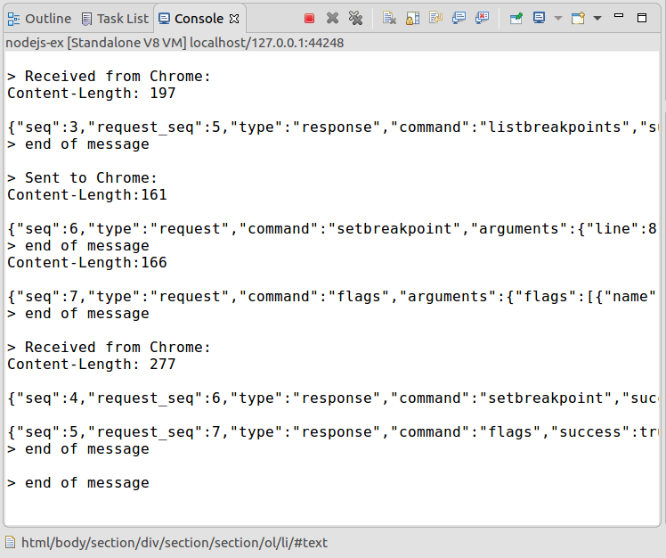
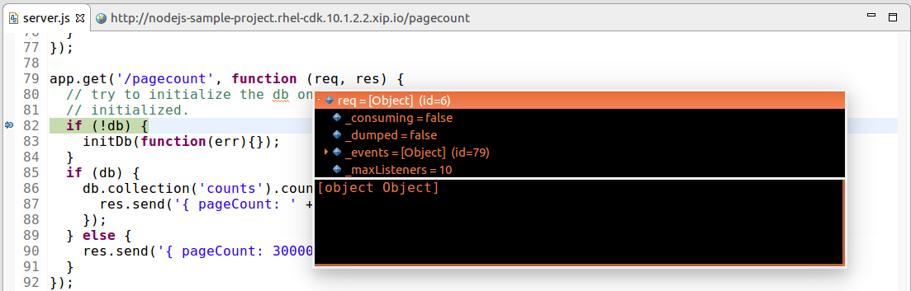

= OpenShift What's New in 3.3.1.AM3
:page-layout: whatsnew
:page-component_id: openshift
:page-component_version: 4.4.2.AM3
:page-product_id: jbt_core
:page-product_version: 4.4.2.AM3
:page-include-previous: true

=== Node.js Debugger 

Now it is possible to debug Node.js applications deployed to Openshift. All you need to do is creating a *Server Adapter* for the app and running it in the *Debug* mode. After that a new *V8* debug session will be created: 

Put some breakpoints in the code and start debugging!

Changing the code during the debug session is also supported - just save the file and new changes will be applied automatically. Here is a short demo video which describes the debugging process in action:

video::1cKPPQrlC4k[youtube, width=640, height=400]

related_jira::JBIDE-22225[]

