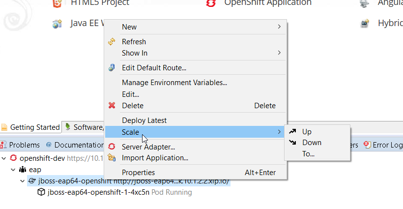
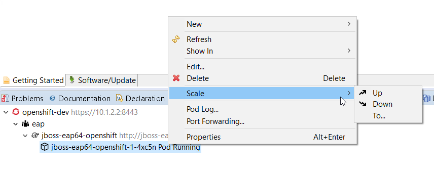

= OpenShift What's New in 3.3.2.AM1
:page-layout: whatsnew
:page-component_id: openshift
:page-component_version: 4.4.3.AM1
:page-product_id: jbt_core
:page-product_version: 4.4.3.AM1
:page-include-previous: true

=== Scaling from pod resources

When an application is being deployed to Openshift, it was possible to scale the pod resources from the 
service resource.

However, it was not a very logical choice. So the command is also available at the pod level, leading to better usability.

related_jira::JBIDE-22805[]

