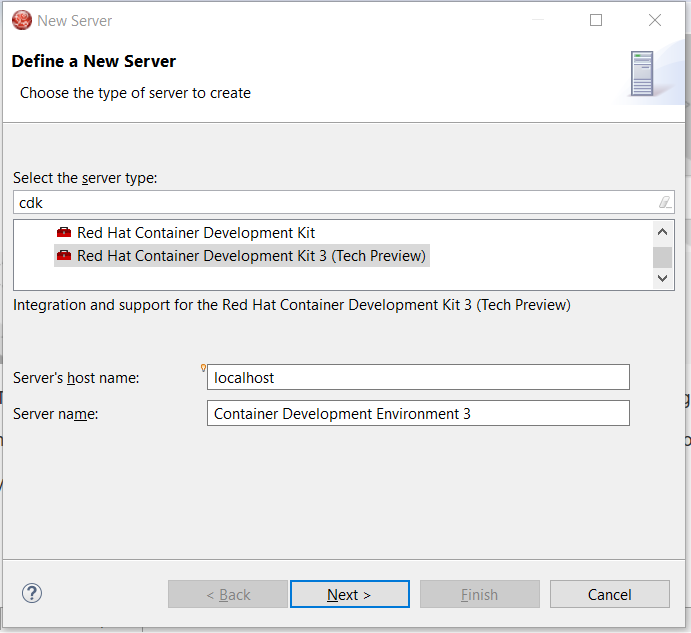
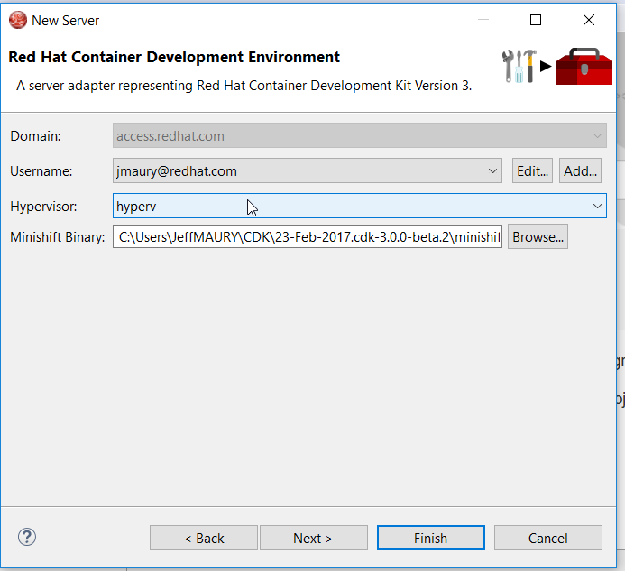
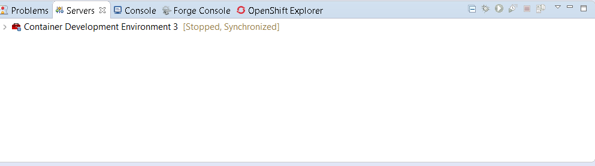
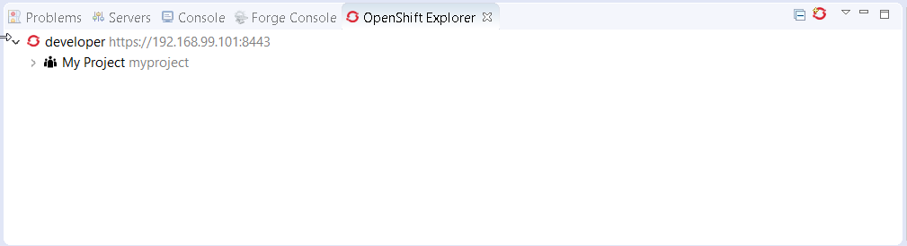
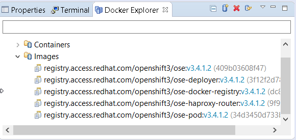

= OpenShift What's New in 3.3.2.Final
:page-layout: whatsnew
:page-component_id: openshift
:page-component_version: 4.4.3.Final
:page-product_id: jbt_core
:page-product_version: 4.4.3.Final
:page-include-previous: true

=== CDK 3 Beta Server Adapter

A new server adapter has been added to support the next generation of CDK 3. This is Tech Preview in this release as CDK 3 is Beta.
While the server adapter itself has limited functionality, it is able to start and stop the CDK virtual machine via its minishift binary.
Simply hit Ctrl+3 (Cmd+3 on OSX) and type CDK, that will bring up a command to setup and/or launch the CDK server adapter.
You should see the old CDK 2 server adapter along with the new CDK 3 one (labeled *Red Hat Container Development Kit 3 (Tech Preview)* ).

All you have to do is set the credentials for your Red Hat account and the location of the CDK’s minishift binary file and the type of virtualization hypervisor.

Once you’re finished, a new CDK Server adapter will then be created and visible in the Servers view.

Once the server is started, Docker and OpenShift connections should appear in their respective views, allowing the user to quickly create a new Openshift application and begin developing their AwesomeApp in a highly-replicatable environment.

WARNING: This is Tech Preview. The implementation is subject to change, may not work with next releases of CDK 3 and testing has been limited.
   
related_jira::JBIDE-23505[]

