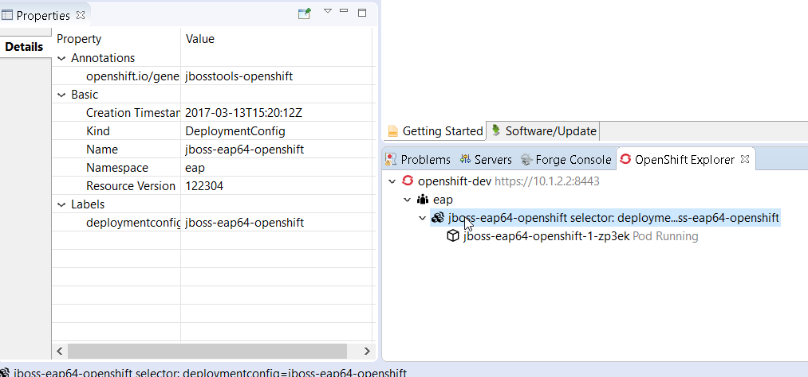
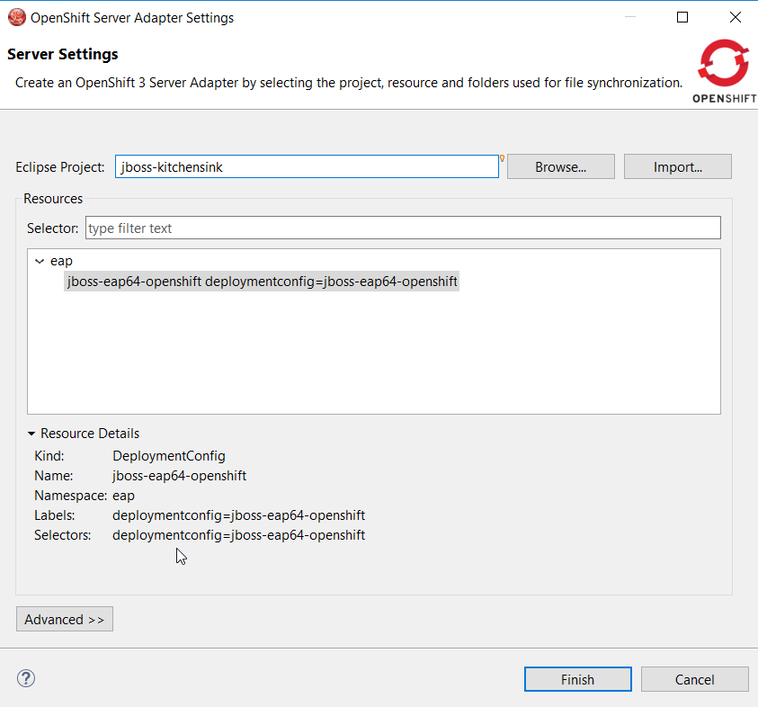
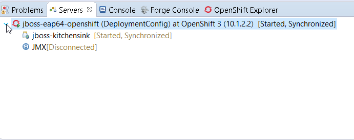
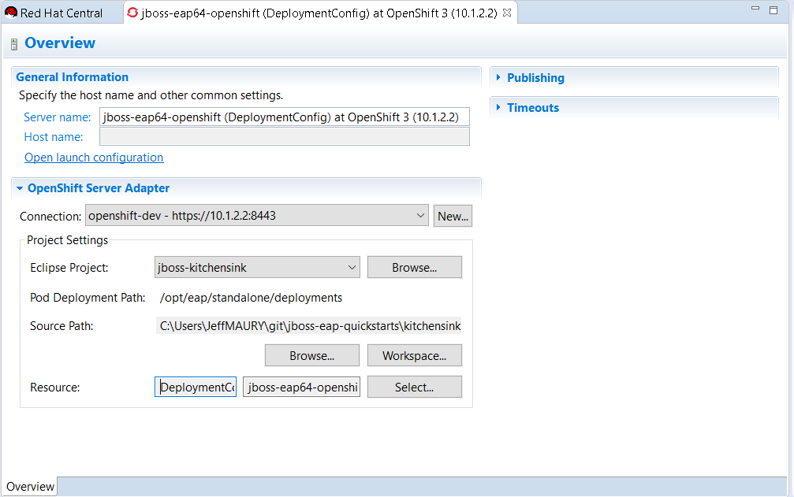

= OpenShift What's New in 3.3.3.AM1
:page-layout: whatsnew
:page-component_id: openshift
:page-component_version: 4.4.4.AM1
:page-product_id: jbt_core
:page-product_version: 4.4.4.AM1
:page-include-previous: true

=== OpenShift Server Adapter enhanced flexibility

OpenShift server adapter is a great tool that allows developers to synchronize local changes in the Eclipse workspace with running pods in the
OpenShift cluster. It also allows you to remote debug those pods when the server adapter is launched in Debug mode.
The supported stacks are Java and NodeJS.

As pods are ephemeral OpenShift resources, the server adapter definition was based on an OpenShift service resource and the pods are then
dynamically computed from the service selector.

This has a major drawback as it allows to use this feature only for pods that are part of a service, which may be logical for Web based applications
as a route (and thus a service) is required in order to access the application.

So, it is now possible to create a server adapter from the following OpenShift resources:

* service (as before)
* deployment config
* replication controller
* pod

If a server adapter is created from a pod, it will be created from the associated OpenShift resource, in the preferred order:

* service
* deployment config
* replication controller

As the OpenShift explorer used to display OpenShift resources that were linked to a service, it has been enhanced as well.
It now displays resources linked to a deployment config or replication controller.
Here is an example of a deployment with no service ie a deployment config:

So, as an OpenShift server adapter can be created from different kind of resources, the kind of associated resource is displayed when 
creating the OpenShift server adapter:

Once created, the kind of OpenShift resource adapter is also displayed in the Servers view:

This information is also available from the server editor:

 
related_jira::JBIDE-23490[]

