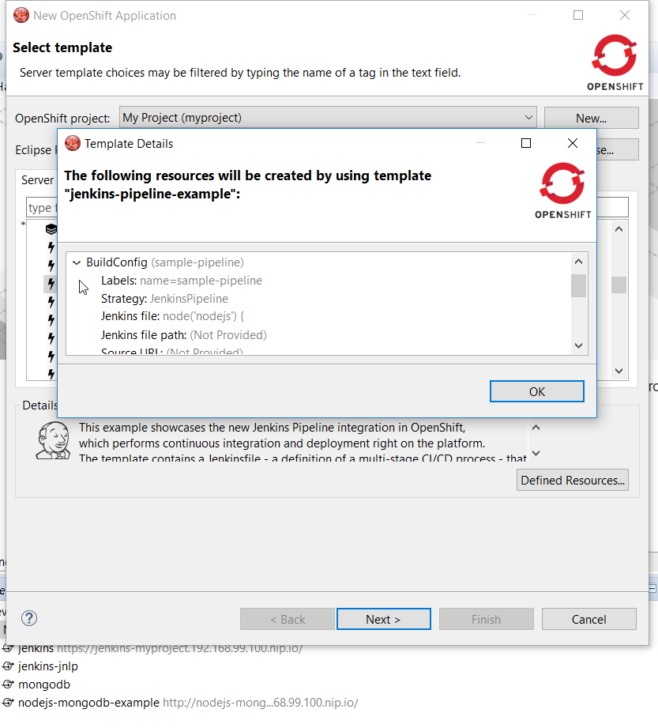
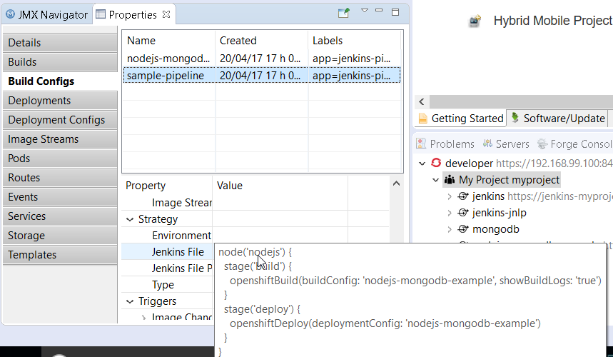

= OpenShift What's New in 3.3.3.AM3
:page-layout: whatsnew
:page-component_id: openshift
:page-component_version: 4.4.4.AM3
:page-product_id: jbt_core
:page-product_version: 4.4.4.AM3
:page-include-previous: true

=== Pipeline builds support

Pipeline based builds are now supported by the OpenShift tooling. 
When creating an application, if using a template, if one of the builds is based on pipeline, you can view the detail
of the pipeline:

When your application is deployed, you can see the details of the build configuration for the pipeline based builds:

More to come as we are improving the pipeline support in the OpenShift tooling.

related_jira::JBIDE-24146[]

