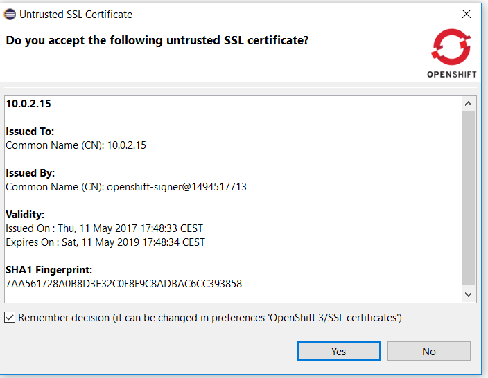
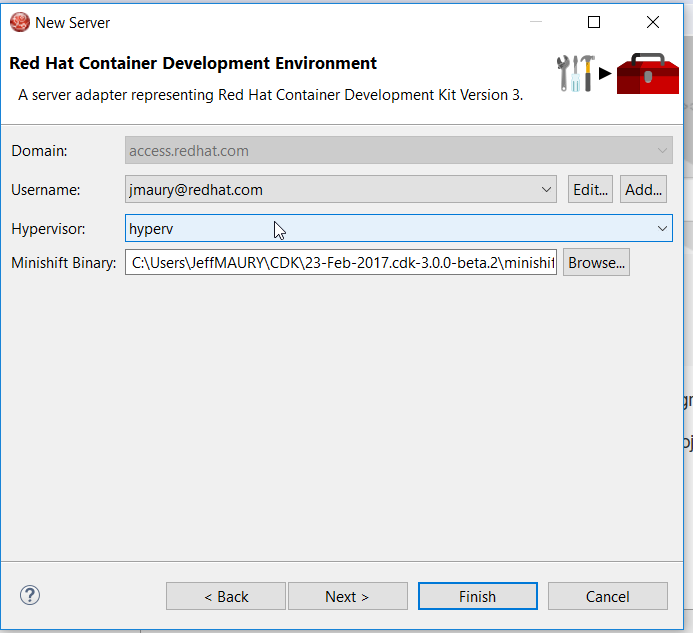
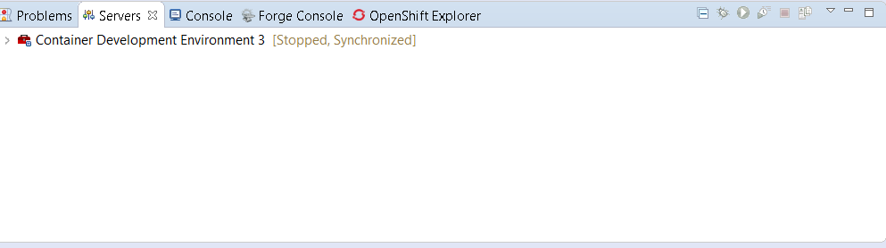
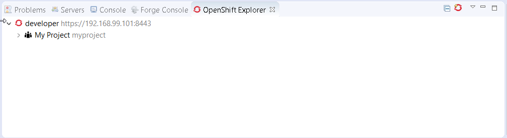
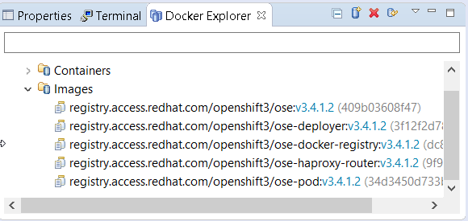

= OpenShift What's New in 3.3.3.Final
:page-layout: whatsnew
:page-component_id: openshift
:page-component_version: 4.4.4.Final
:page-product_id: jbt_core
:page-product_version: 4.4.4.Final
:page-include-previous: true

=== Security vulnerability fixed in certificate validation database

[IMPORTANT]
====
When you use the OpenShift tooling to connect to an OpenShift API server, the certificate of the OpenShift API server
is first validated. If the issuer authority is a known one, then the connection is then established. If the issuer is an
unknown one, a validation dialog is first shown to the user with the details of the OpenShift API server certificate as well
as the details of the issuer authority. If the user accepts it, then the connection is established. There is also an option to
store the certificate in a database so that next time a connection is attempted to the same OpenShift API server, then the certificate
will be considered valid an no validation dialog will be show again.

We found a security vulnerabilty as the certificate was wrongly stored: it was partially stored (not all attributes were stored) so we may
interpret a different certificate as validated where it should not.

We had to change the format of the certificate database. As the certificates stored in the previous database were not entirelly stored, there was
no way to provide a migration path. As a result, after the upgrade, the certificate database will be empty. So if you had previously accepted some
certificates, then you need to accept them again and fill the certificate database again.

related_jira::JBIDE-24312[]
====

=== CDK 3 Server Adapter

The CDK 3 server adapter has been here for quite a long time. It used to be Tech Preview as CDK 3 was not officially released. It is now officiallly available.
While the server adapter itself has limited functionality, it is able to start and stop the CDK virtual machine via its minishift binary.
Simply hit Ctrl+3 (Cmd+3 on OSX) and type CDK, that will bring up a command to setup and/or launch the CDK server adapter.
You should see the old CDK 2 server adapter along with the new CDK 3 one (labeled *Red Hat Container Development Kit 3*).

All you have to do is set the credentials for your Red Hat account and the location of the CDK’s minishift binary file and the type of virtualization hypervisor.

Once you’re finished, a new CDK Server adapter will then be created and visible in the Servers view.

Once the server is started, Docker and OpenShift connections should appear in their respective views, allowing the user to quickly create a new Openshift application and begin developing their AwesomeApp in a highly-replicatable environment.

=== OpenShift server adapter extensibility

The OpenShift server adapter had long support for EAP/Wildfly and NodeJS based deployments. It turns out that it does a great deal of synchronizing
local workspace changes to remote deployments on OpenShift which have been standardized through images metadata (labels). But each runtime has its
own specific. As an example, Wildfly/EAP deployments requires that a re-deploy trigger is sent after the files have been synchronized.

In order to reduce the technical debt and allow support for other runtimes (lots of them in the microservice world), we have refactored the OpenShift
server adapter so that each runtime specific is now isolated and that it will be easy and safe to add support for new runtime.

For a full in-depth description, see the following https://github.com/jbosstools/jbosstools-openshift/wiki/Openshift-server-adapter-profile-and-its-subsystems[wiki page]. 
