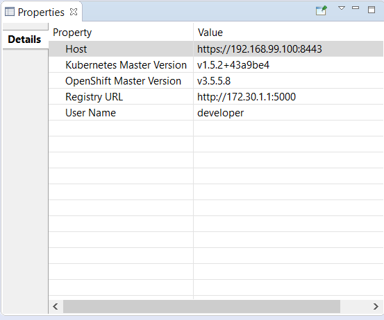
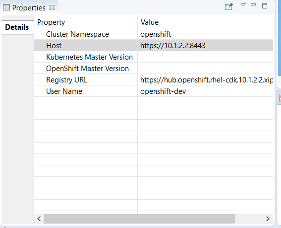

= OpenShift What's New in 3.4.0.AM2
:page-layout: whatsnew
:page-component_id: openshift
:page-component_version: 4.5.0.AM2
:page-product_id: jbt_core
:page-product_version: 4.5.0.AM2
:page-include-previous: true

=== OpenShift server and Kubernetes server versions displayed

The OpenShift server and Kubernetes server versions are now displayed in the OpenShift connection properties.
This information is retrieved using an un-authenticated request login to the OpenShift cluster is not required.
This allow user to verify the OpenShift and Kubernetes level when interacting.

Here is an example based on an OpenShift connection against CDK3:

if the cluster is not started or accessible, then no values are displayed:

related_jira::JBIDE-24539[]

