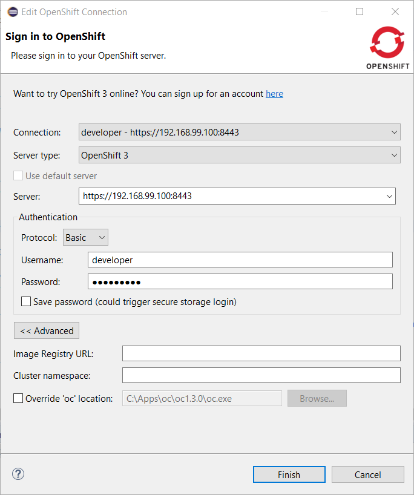
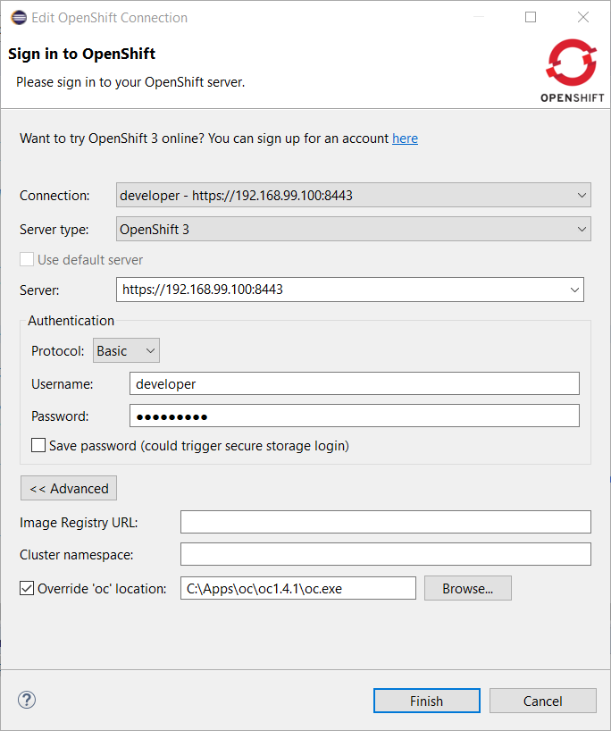
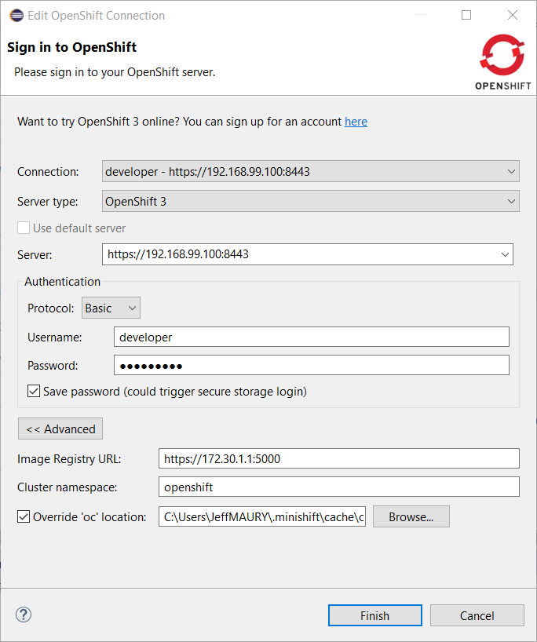

= OpenShift What's New in 3.4.0.Final
:page-layout: whatsnew
:page-component_id: openshift
:page-component_version: 4.5.0.Final
:page-product_id: jbt_core
:page-product_version: 4.5.0.Final
:page-include-previous: true

=== oc client selection per connection

Some operations (logs, file synchronization) require the user of the oc CLI client. It was possible to specific a single
instance of the used oc CLI tool for the whole workspace. This may cause some trouble when working simultaneously with several 
OpenShift clusters (that may have different version levels).
It is now possible to specify the oc CLI tool on the connection level. This is optional, and the default is to use the oc CLI tool
specified at the workspace level.

The connection specific oc CLI tool is accessible through the OpenShift connection edit dialog with the `Advanced` button:

Enable the *Override 'oc' location' flag and select a specific oc CLI tool for this connection through the *Browse* button:

OpenShift connections created by the CDK server adapter will automatically have a specific oc CLI tool set as the CDK
installs locally an oc CLI tool that is aligned with the embedded OpenShift version.

related_jira::JBIDE-24236[]

