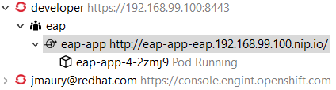

= OpenShift What's New in 3.4.1.AM2
:page-layout: whatsnew
:page-component_id: openshift
:page-component_version: 4.5.1.AM2
:page-product_id: jbt_core
:page-product_version: 4.5.1.AM2
:page-include-previous: true

=== New command to tune resource limits

A new command has been added to tune resource limits (CPU, memory) on an OpenShift deployment.
It's available for a Service, a DeploymentConfig, a ReplicationController or a Pod.

To activate it, go the the OpenShift explorer, select the OpenShift resource, right click and select `Edit resource limits`.
The following dialog will show up:

After you changed the resource limits for this deployment, it will be updated and new pods will be spawned (not for ReplicationController)

related_jira::JBIDE-24145[]

=== Discover Docker registry URL for OpenShift connections

When an OpenShift connection is created, the Docker registry URL is empty. When the CDK is started through the CDK server adapter, an OpenShift
connection is created or updated if a matching OpenShift connection is found. But what if you have several OpenShift connections, the remaining ones
will be left with the empty URL.

You can find the matching Docker registry URL when editing the OpenShift connection through the `Discover` button:

Click on the `Discover` button and the Docker registry URL will be filled if a matching started CDK server adapter is found:

 
related_jira::JBIDE-24491[]

