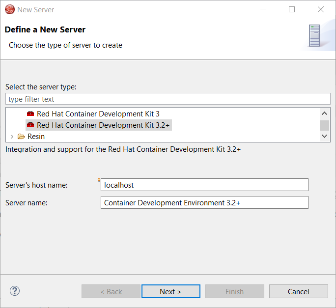
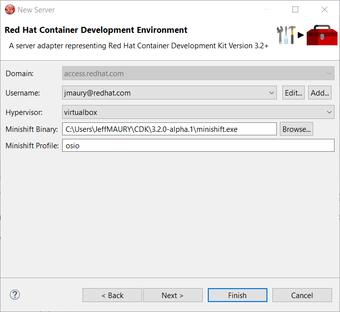
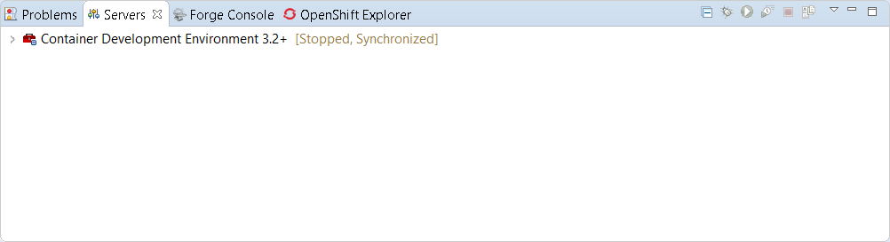
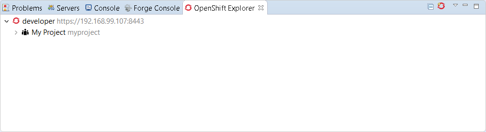
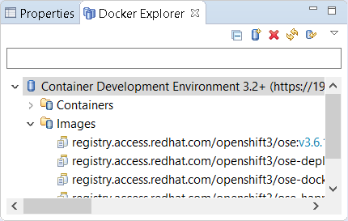

= OpenShift What's New in 3.4.1.AM3
:page-layout: whatsnew
:page-component_id: openshift
:page-component_version: 4.5.1.AM3
:page-product_id: jbt_core
:page-product_version: 4.5.1.AM3
:page-include-previous: true

=== OpenShift.io login

It is possible to login from JBoss Tools to OpenShift.io. A single account will be maintained per workspace. Once you initially logged onto OpenShift.io, all
needed account information (tokens,...) will be stored securely.

There are two ways to login onto OpenShift.io:

* through the UI
* via a third party service that will invoke the proper extension point

==== UI based login to OpenShift.io

In the toobar, you should see a new icon image:./images/osio-16x16.png[Toolbar]. Click on it and it will launch the login.

If this is the first time you login to OpenShift.io or if you OpenShift.io account tokens are not valid anymore, you should see a browser launched with the following content:

image::./images/osio-browser.png[]

Enter your RHDP login and the browser will then auto-close and an extract (for security reasons) of the OpenShift.io token will be displayed:

image::./images/osio-token-dialog.png[]

This dialog will be also shown if an OpenShift.io account was configured in the workspace and the account information is valid.

==== Via extension point

The OpenShift.io integration can be invoked by a third party service through the `org.jboss.tools.openshift.io.code.tokenProvider` extension point.
This extension point will perform the same actions as the UI but basically will return an access token for OpenShift.io to the third party service.
A detailed explanation of how to use this extension point is described here: https://github.com/jbosstools/jbosstools-openshift/wiki/OpenShift.io-token-provider[Wiki page]
 
You can display the account information using the Eclipse `Jboss Tools -> OpenShift.io` preference node. If you workspace does not contain an OpenShift.io account yet, you should see the following:

image::./images/osio-preferences.png[]

If you have a configured OpenShift.io account, you should see this:

image::./images/osio-preferences1.png[]

related_jira::JBIDE-24793[]

=== CDK 3.2 Beta Server Adapter

A new server adapter has been added to support the next generation of CDK 3.2. This is Tech Preview in this release as CDK 3.2 is Beta.
While the server adapter itself has limited functionality, it is able to start and stop the CDK virtual machine via its minishift binary.
Simply hit Ctrl+3 (Cmd+3 on OSX) and type CDK, that will bring up a command to setup and/or launch the CDK server adapter.
You should see the old CDK 2 server adapter along with the new CDK 3 one (labeled *Red Hat Container Development Kit 3.2+* ).

All you have to do is set the credentials for your Red Hat account, the location of the CDK’s minishift binary file, the type of virtualization hypervisor
and an optional CDK profile name.

Once you’re finished, a new CDK Server adapter will then be created and visible in the Servers view.

Once the server is started, Docker and OpenShift connections should appear in their respective views, allowing the user to quickly create a new Openshift application and begin developing their AwesomeApp in a highly-replicatable environment.

WARNING: This is Tech Preview. The implementation is subject to change, may not work with next releases of CDK 3.2 and testing has been limited.
   
related_jira::JBIDE-25055[]

