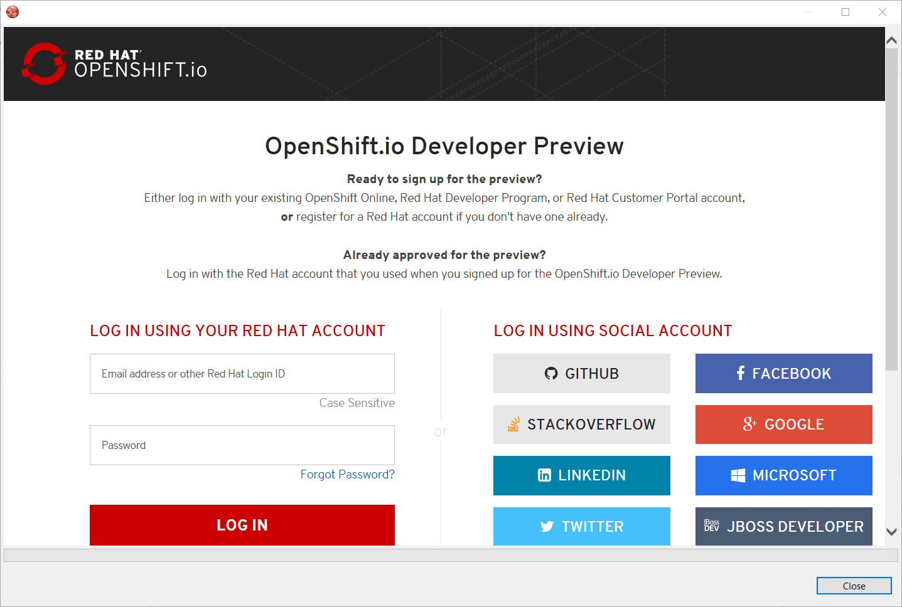
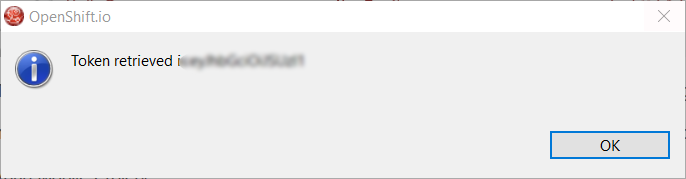
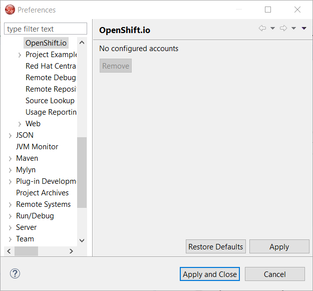
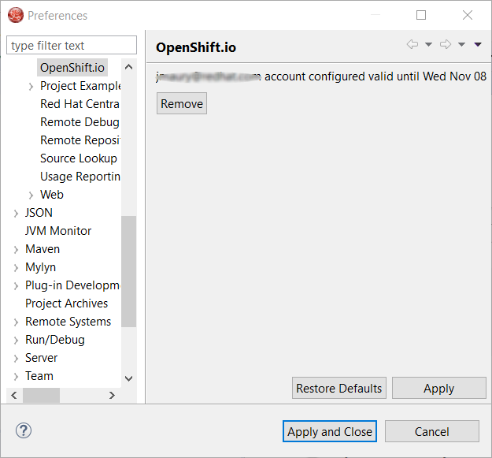

= OpenShift What's New in 3.4.1.AM3
:page-layout: whatsnew
:page-component_id: openshift
:page-component_version: 4.5.1.AM3
:page-product_id: jbt_core
:page-product_version: 4.5.1.AM3
:page-include-previous: true

=== OpenShift.io login

It is possible to login from JBoss Tools to OpenShift.io. A single account will be maintained per workspace. Once you initially logged onto OpenShift.io, all
needed account information (tokens,...) will be stored securely.

There are two ways to login onto OpenShift.io:
* through the UI
* via a third party service that will invoke the proper extension point

==== UI based login to OpenShift.io

In the toobar, you should see a new icon . Click on it and it will launch the login.

If this is the first time you login to OpenShift.io or if you OpenShift.io account tokens are not valid anymore, you should see a browser launched with the following content:

Enter your RHDP login and the browser will then auto-close and an extract (for security reasons) of the OpenShift.io token will be displayed:

This dialog will be also shown if an OpenShift.io account was configured in the workspace and the account information is valid.

==== Via extension point

The OpenShift.io integration can be invoked by a third party service through the `org.jboss.tools.openshift.io.code.tokenProvider` extension point.
This extension point will perform the same actions as the UI but basically will return an access token for OpenShift.io to the third party service.
A detailed explanation of how to use this extension point is described here: https://github.com/jbosstools/jbosstools-openshift/wiki/OpenShift.io-token-provider[Wiki page]
 
You can display the account information using the Eclipse `Jboss Tools -> OpenShift.io` preference node. If you workspace does not contain an OpenShift.io account yet, you should see the following:

If you have a configured OpenShift.io account, you should see this:

related_jira::JBIDE-24793[]

