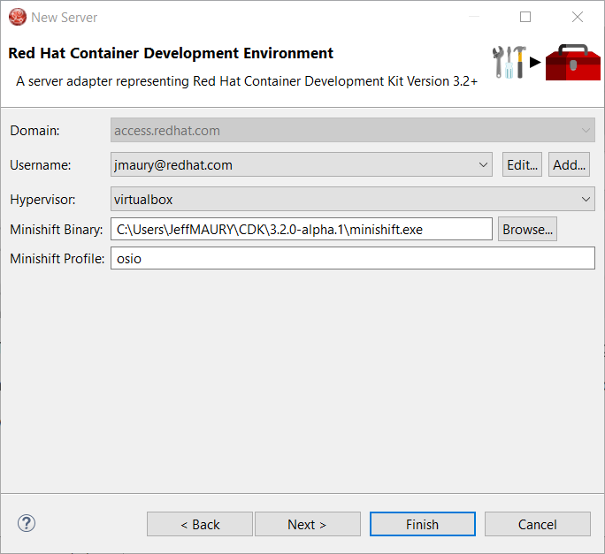
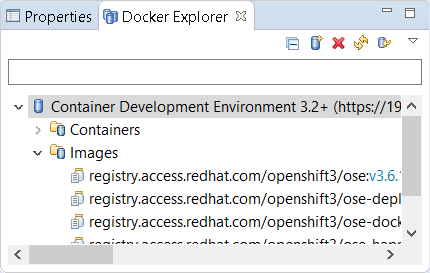

= OpenShift What's New in 3.4.1.Final
:page-layout: whatsnew
:page-component_id: openshift
:page-component_version: 4.5.1.Final
:page-product_id: jbt_core
:page-product_version: 4.5.1.Final
:page-include-previous: true

=== CDK 3.2 Server Adapter

A new server adapter has been added to support the next generation of CDK 3.2.
While the server adapter itself has limited functionality, it is able to start and stop the CDK virtual machine via its minishift binary.
Simply hit Ctrl+3 (Cmd+3 on OSX) and type CDK, that will bring up a command to setup and/or launch the CDK server adapter.
You should see the old CDK 2 server adapter along with the new CDK 3 one (labeled *Red Hat Container Development Kit 3.2+* ).

image::./images/cdk3.2-server-adapter.png[width=600]

All you have to do is set the credentials for your Red Hat account, the location of the CDK’s minishift binary file, the type of virtualization hypervisor
and an optional CDK profile name.

Once you’re finished, a new CDK Server adapter will then be created and visible in the Servers view.

image::./images/cdk3.2-server-adapter2.png[width=600]

Once the server is started, Docker and OpenShift connections should appear in their respective views, allowing the user to quickly create a new Openshift application and begin developing their AwesomeApp in a highly-replicatable environment.

image::./images/cdk3.2-server-adapter3.png[width=600]

related_jira::JBIDE-25055[]

