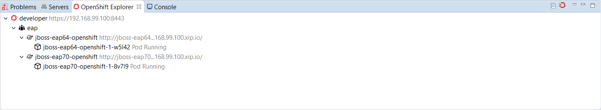
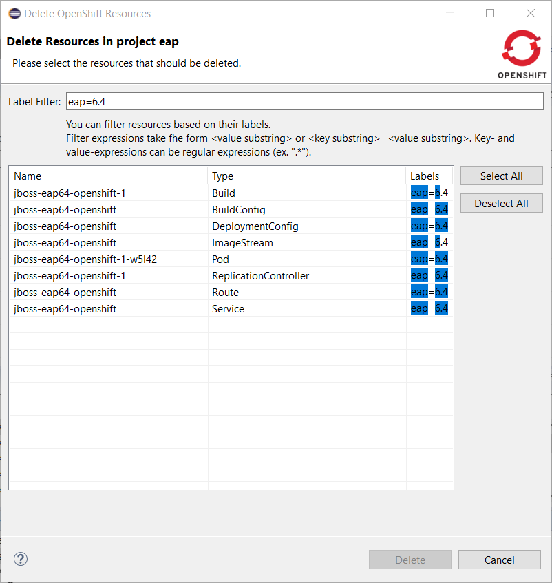
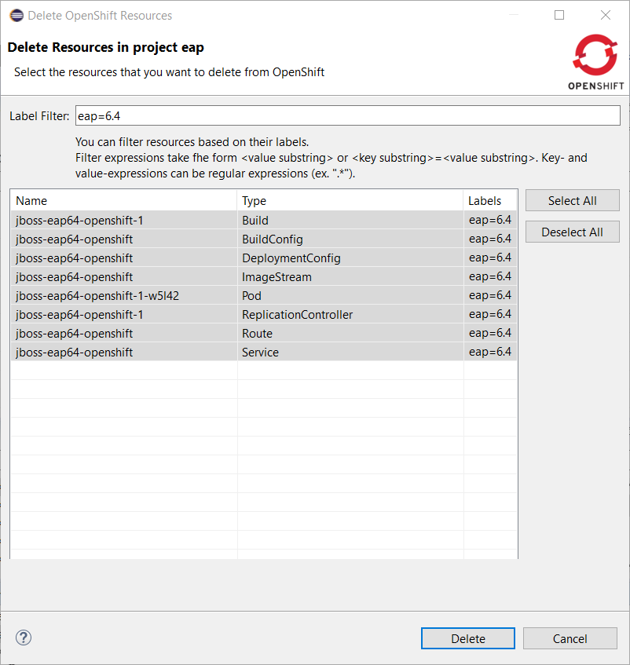
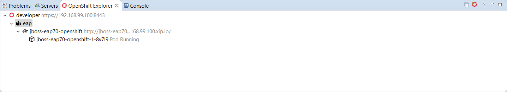

= OpenShift What's New in 3.4.2.Final
:page-layout: whatsnew
:page-component_id: openshift
:page-component_version: 4.5.2.Final
:page-product_id: jbt_core
:page-product_version: 4.5.2.Final
:page-include-previous: true

=== Enhanced command to delete resource(s)

When it comes to delete OpenShift resources, you had two different choices:

- individually delete each resource but as some resources are hidden by the OpenShift explorer, it may become troublesome
- delete the containing OpenShift project but you are then deleting more resources than required

There is now a new enhanced command to delete resources. It is available at the OpenShift project level and it will first
list all the available OpenShift resources for the selected OpenShift project. You can now select the ones you want to delete
and you can also filter the list using a filter that will be applied to the labels for each retrieved OpenShift resource.

So if you have two different deployments in a single OpenShift project (if you using OpenShift Online Starter for example) or if
you have different kind of resources in a single deployment, you can now distinct them.

Let's see this in action:

In this example, I have deployed an EAP6.4 based application and an EAP7.0 based one. Here is what you  can see from the OpenShift explorer:

Now, let's invoke the new delete command on the _eap_ OpenShift project: right click the OpenShift project and select *Delete Resources...*:

image::./images/new-delete-resources-dialog.png[]

Let suppose that we want to delete the EAP6.4 deployement. Enter _eap=6.4_ in the filter field:

Push the *Select All* button:

Close this dialog by pushing the *OK* button. The resources will be deleted and the OpenShift explorer will be updated accordingly:

related_jira::JBIDE-25111[]

