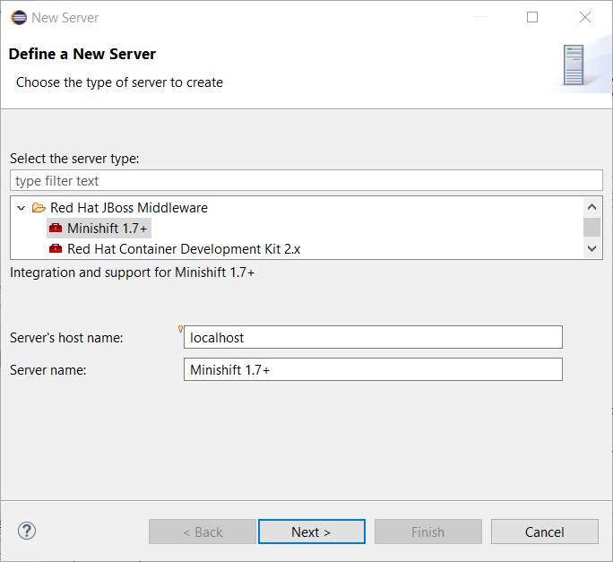
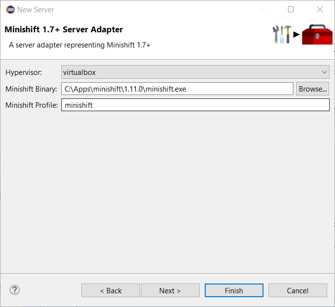
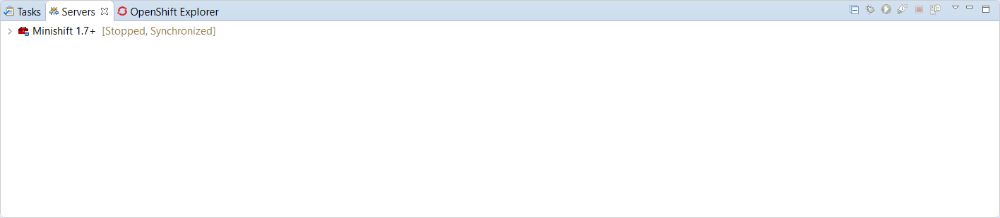
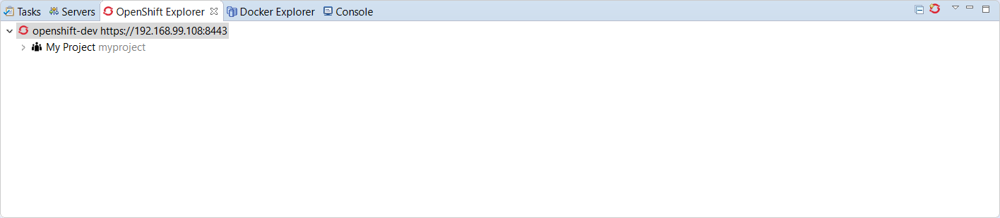
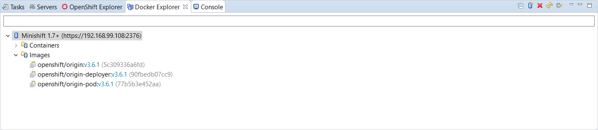

= OpenShift What's New in 3.4.3.AM1
:page-layout: whatsnew
:page-component_id: openshift
:page-component_version: 4.5.3.AM1
:page-product_id: jbt_core
:page-product_version: 4.5.3.AM1
:page-include-previous: true

=== Minishift Server Adapter

A new server adapter has been added to support upstream Minishift.
While the server adapter itself has limited functionality, it is able to start and stop the Minishift virtual machine via its minishift binary.
From the Servers view, click *New* and then type minishift, that will bring up a command to setup and/or launch the Minishift server adapter.

All you have to do is set the location of the minishift binary file, the type of virtualization hypervisor
and an optional Minishift profile name.

Once you’re finished, a new Minishift Server adapter will then be created and visible in the Servers view.

Once the server is started, Docker and OpenShift connections should appear in their respective views, allowing the user to quickly create a new Openshift application and begin developing their AwesomeApp in a highly-replicatable environment.

related_jira::JBIDE-25295[]

