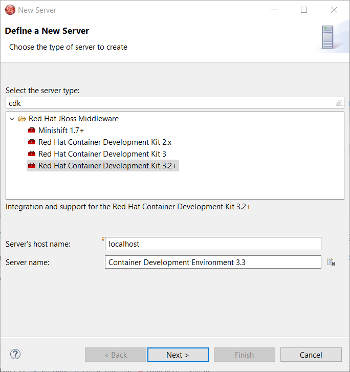

= OpenShift What's New in 3.4.3.AM2
:page-layout: whatsnew
:page-component_id: openshift
:page-component_version: 4.5.3.AM2
:page-product_id: jbt_core
:page-product_version: 4.5.3.AM2
:page-include-previous: true

=== CDK and Minishift Server Adapter better developer experience

When working with both CDK and upstream Minishift, it is recommanded to distinguish environments through the MINISHIFT_HOME variable.
It was possible before to use this parameter but it requires a two steps process:

- first create the server adapter (through the wizard)
- then change the MINISHIFT_HOME in the server adapter editor

It is now possible to set this parameter from the server adapter wizard. So now, everything is correctly setup when you create the
server adapter.

Let's see an example with the CDK server adapter.

From the *Servers* view, select the new Server menu item and enter cdk in the filter:

image::./images/cdk-server-adapter-wizard.png[width=600]

Select Red Hat Container Development Kit 3.2+

Click the *Next* button:

The MINISHIFT_HOME parameter can be set here and is defaulted.

related_jira::JBIDE-25692[]

