= OpenShift What's New in 3.4.3.AM3
:page-layout: whatsnew
:page-component_id: openshift
:page-component_version: 4.5.3.AM3
:page-product_id: jbt_core
:page-product_version: 4.5.3.AM3
:page-include-previous: true

=== CDK and Minishift Server Adapter runtime download

When working with both CDK and upstream Minishift, you needed to have previously downloaded the CDK
or Minishift binary. It is now possible to download the runtime to a specific folder when you create
the server adapter.

Let's see an example with the CDK server adapter.

From the *Servers* view, select the new Server menu item and enter cdk in the filter:

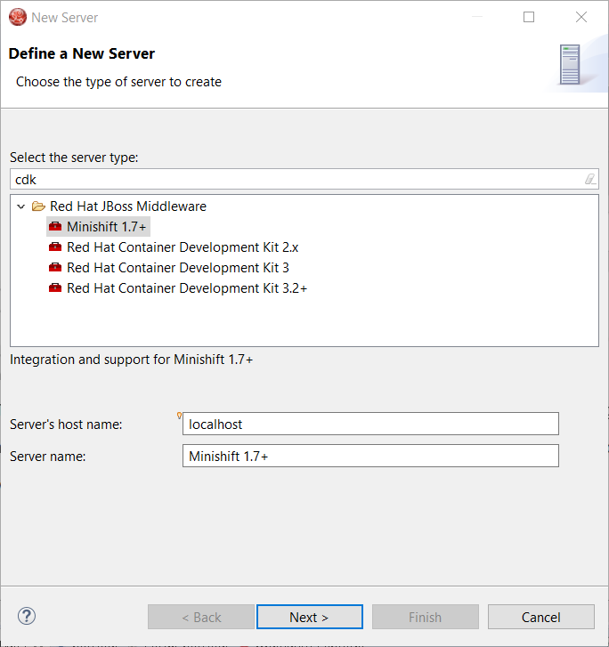

Select Red Hat Container Development Kit 3.2+

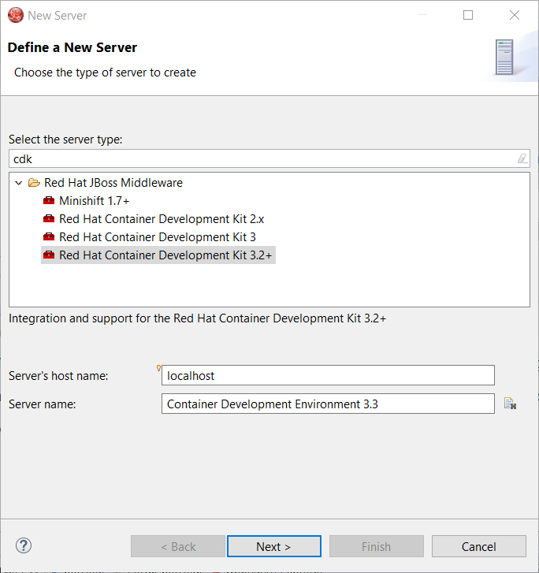

Click the *Next* button:

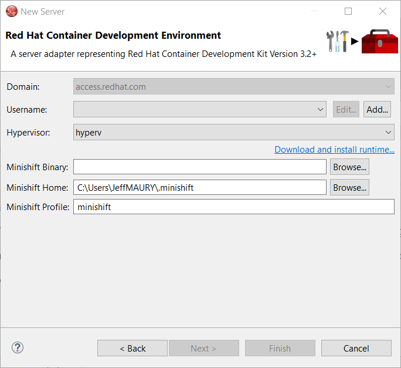

In order to download the runtime, click the *Download and install runtime...* link:

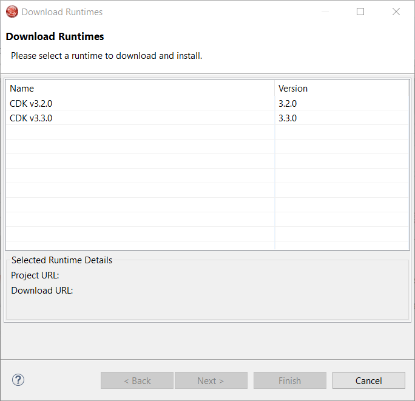

Select the version of the runtime you want to download

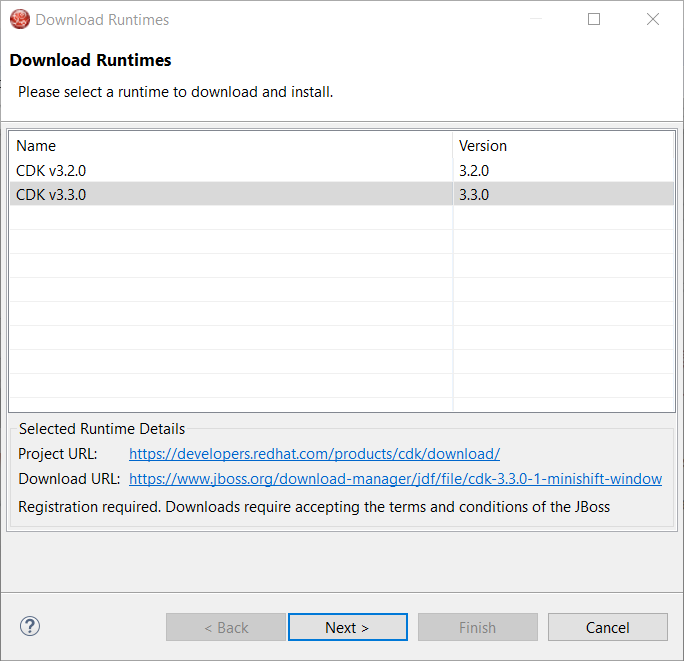

Click the *Next* button:

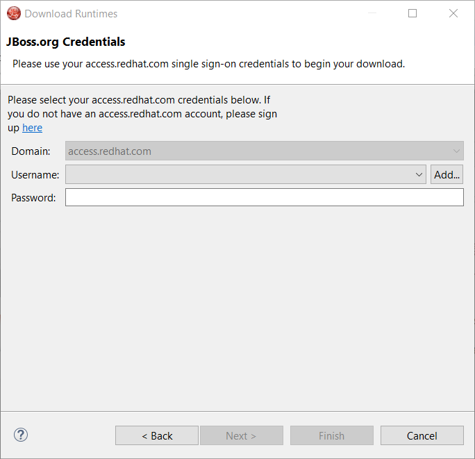

You need an account to download the CDK. If you already had configured credentials, select the one you
want to use. If you didn't, click the *Add* button to add your credentials.

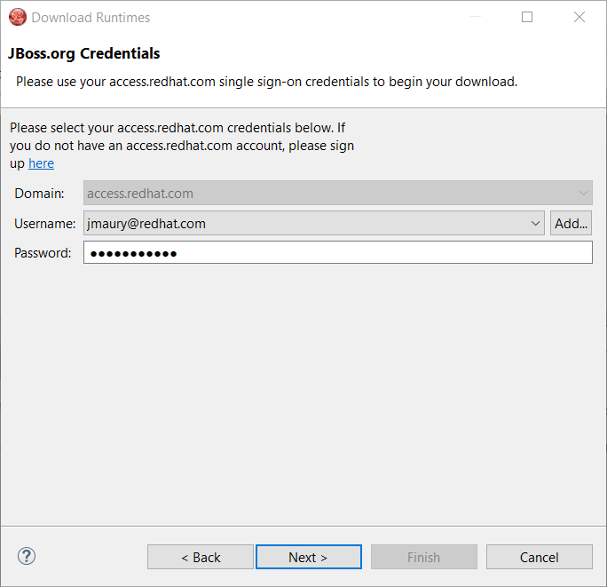

Click the *Next* button. Your credentials will be validated, and upon success, you must accept
the license agreement:

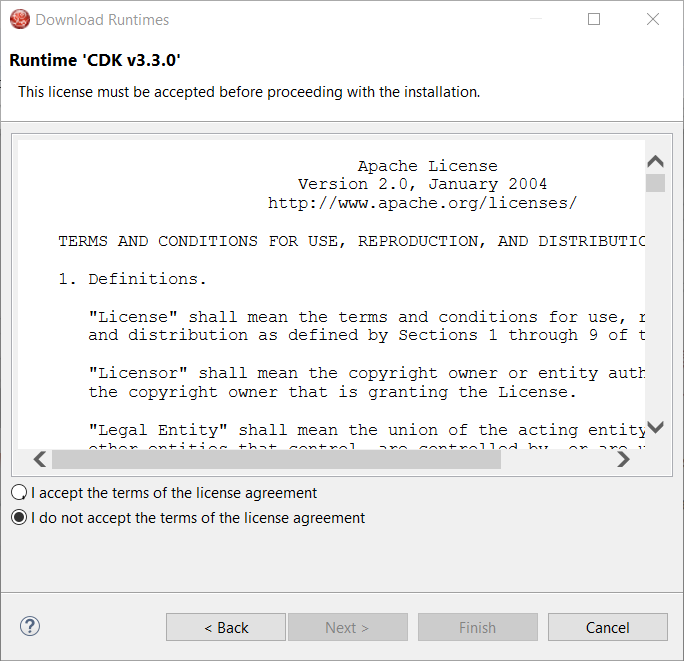

Accept the license agreement and click the *Next* button:

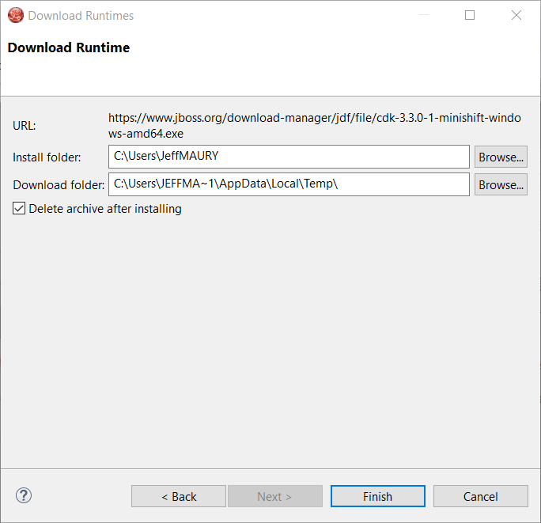

You can choose the folder where you want the runtime to be installed. Once you've set it,
click the *Finish* button:

The download of the runtime will be started and you should see the progression on the server adapter
wizard:

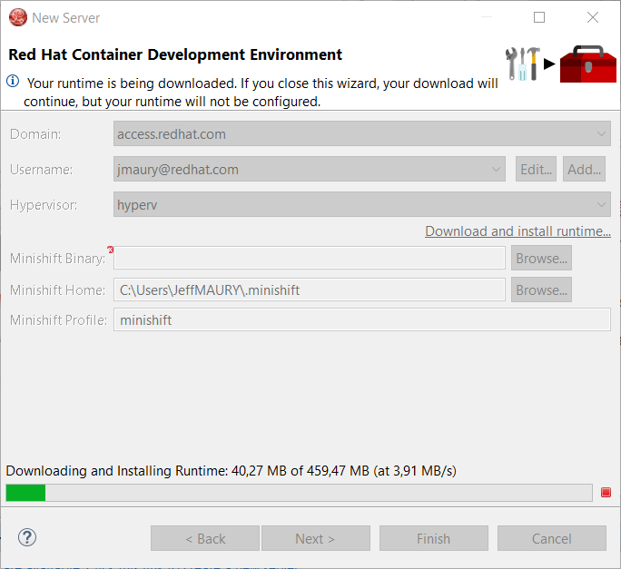

Once the download is completed, you will notice that the *Minishift Binary* and *Username* fields have been filled:

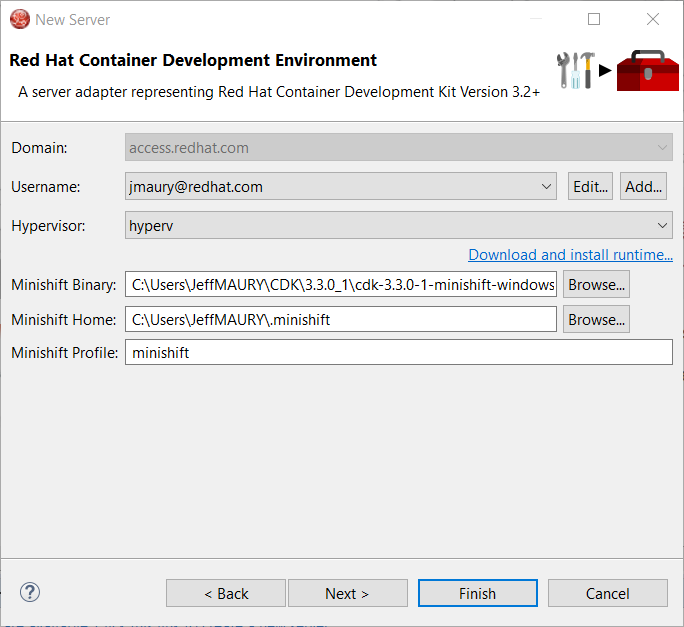

Click the *Finish* button to create the server adapter.

Please note that if it's the first time you install CDK, you must perform an initialization. In the *Servers* view, right click
the server and select the *Setup CDK* menu item:

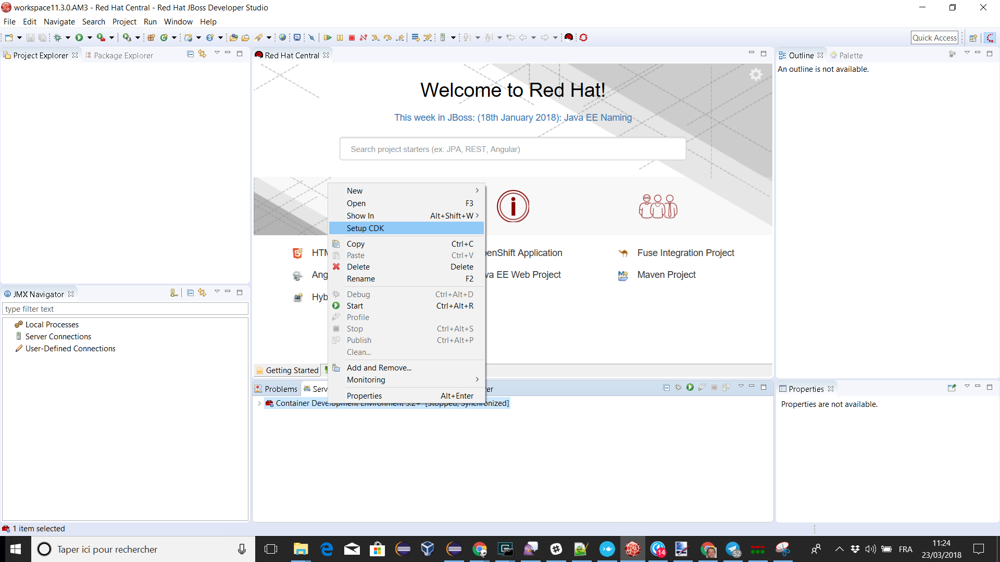

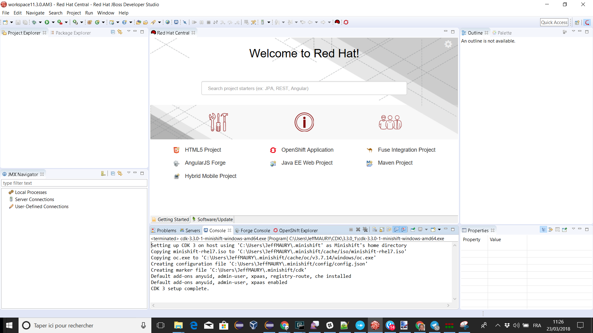

related_jira::JBIDE-25753[]

