= OpenShift What's New in 3.5.2.Final
:page-layout: whatsnew
:page-component_id: openshift
:page-component_version: 4.9.0.Final
:page-product_id: jbt_core
:page-product_version: 4.9.0.Final
:page-include-previous: true

=== Inner loop for Spring Boot applications

Although Spring Boot applications were already supported by the OpenShift server adapter,
the global developer experience has been enhanced. Let's complete the full workflow.

==== Bootstrapping your Spring Boot applications

A new generator (wizard) has been added to JBoss Tools. It's called the Launcher
application as it's based on the fabric8-launcher project. When you launch JBoss
Tools, you should see this in Red Hat Central:

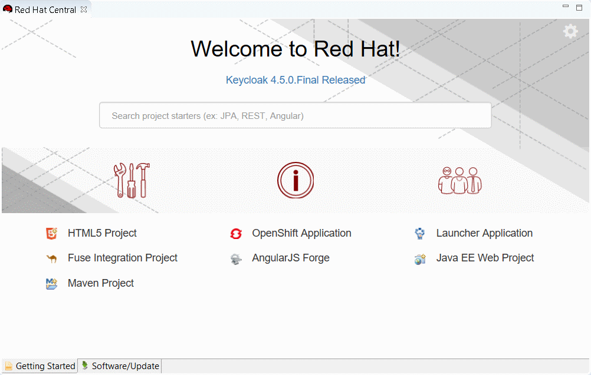

Click on the ```Launcher application``` link and the following wizard will appear:

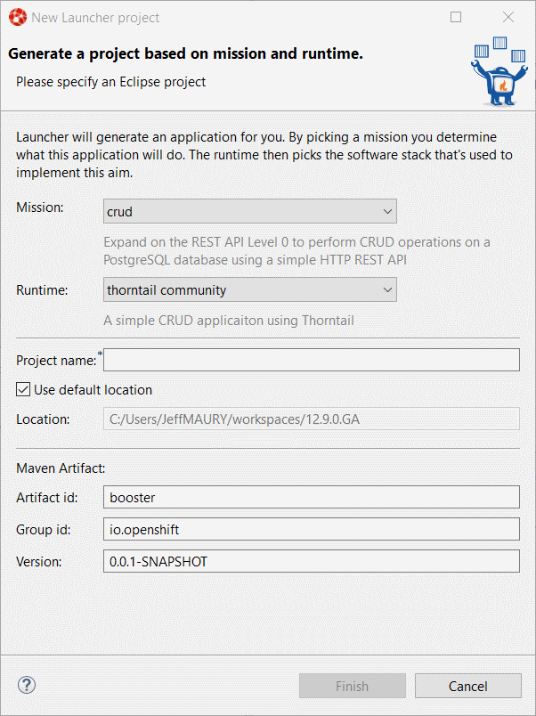

Switch the ```Mission``` field to ```rest-http ``` as we want to generate a simple
REST application and switch the ```Runtime``` field to ```spring-boot current-community```
as we want to generate a Spring Boot based application.

Then set the ```Project name``` field to ```myfirstrestapp``` and leave other fields as-is.

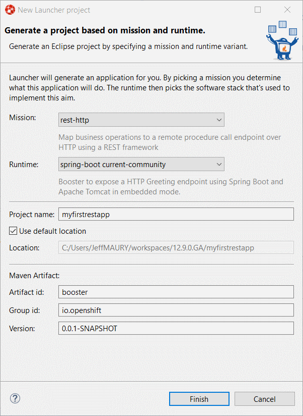

Click the ```Finish``` button. A new project will be added to your local workspace.
It may takes some times as Maven will resolve all the Spring Boot dependencies and
thus need to download them from the Internet.

When the project is build and if you expand the ```myfirstrestapp``` in the ```Project explorer```
window, you should see this:

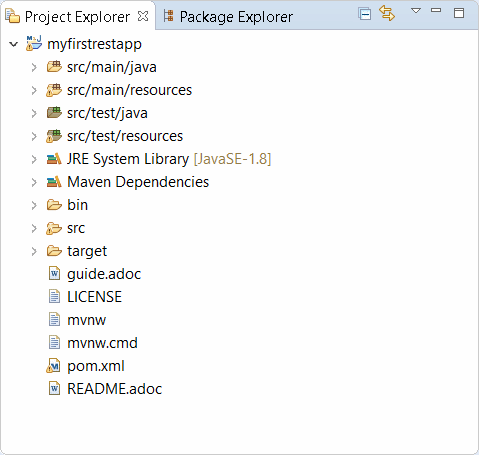

==== Storing your source code on GitHub

As OpenShift builder images retrieves code on a Git repository, we first need to push
the just generated application code to GitHub. The following section assumes that you
created a repository called ```myfirstrestapp``` under your GitHub account.

We will first create a local Git repository for our application code then push it to
GitHub.

Select the ```myfirstrestapp``` project and right click the ```Team -> Share project...```
menu item:

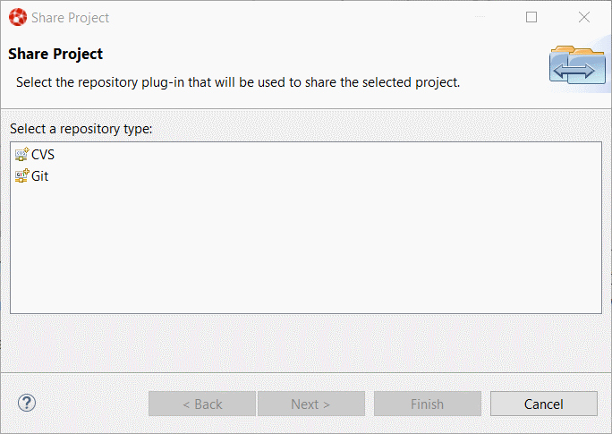

Then select the ```Git``` repository type and click the ```Next``` button:

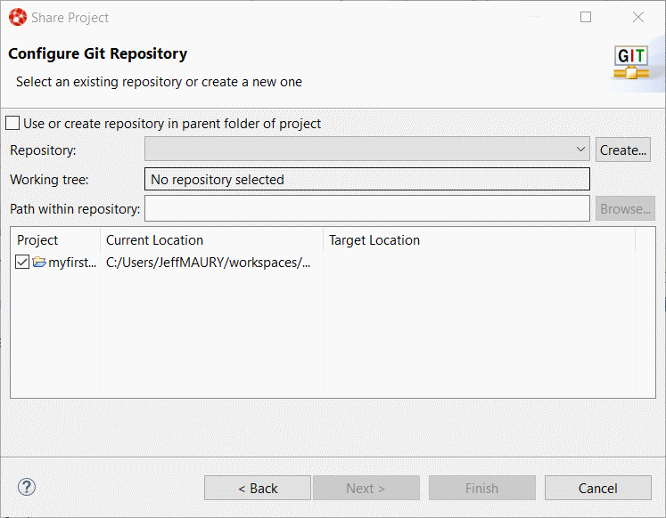

Select the ```Use or create repository in parent folder of project``` checkbox
then select the ```myfirstrestapp``` project:

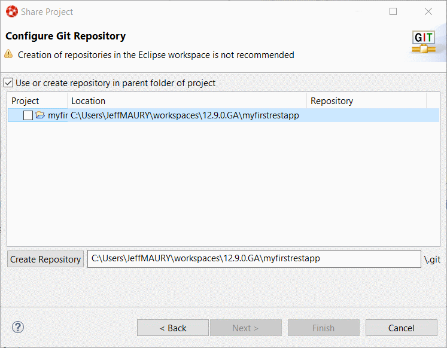
 
Click on the ```Create repository``` button and the on the ```Finish``` button.

The ```Project explorer``` view is updated:

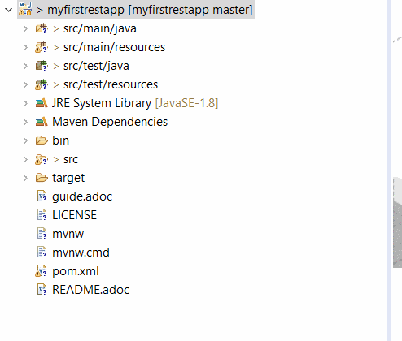

Select the ```myfirstrestapp``` project and right click
the ```Team -> Show in Repositories View``` menu item. A new view
called ```Git Repositories``` will be added to the perspective:

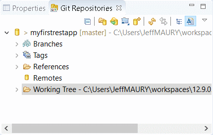

Inside this view, select the ```Remotes``` node and right click
the ```Create Remote...``` menu item. The following dialog will be displayed:

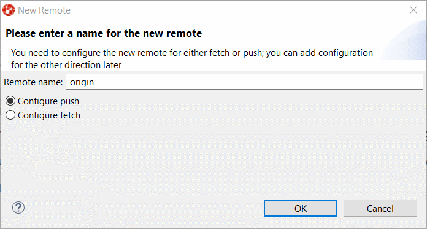

Click on the ```OK``` button, the following dialog will be displayed:

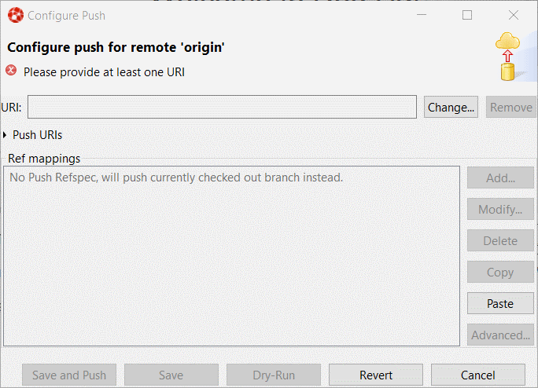

Click on the ```Change...``` button and enter ```git@github.com:GITHUB_USER/myfirstrestapp```
in the ```URI``` field, replacing ```GITHUB_USER``` by your real GitHub user name.

Then click the ```Finish``` button and then on the ```Save``` button.

===== Pushing code to GitHub

We are now ready to push our application code to GitHub. Select the ```myfirstrestapp``` project
in the ```Project explorer``` view, right click the ```Team -> Commit``` menu item. A new view
call ```Git Staging``` will open:

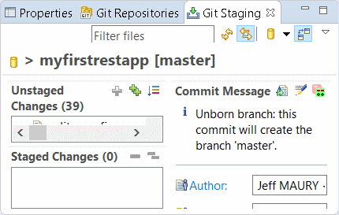

Double click on the view title to maximize it:

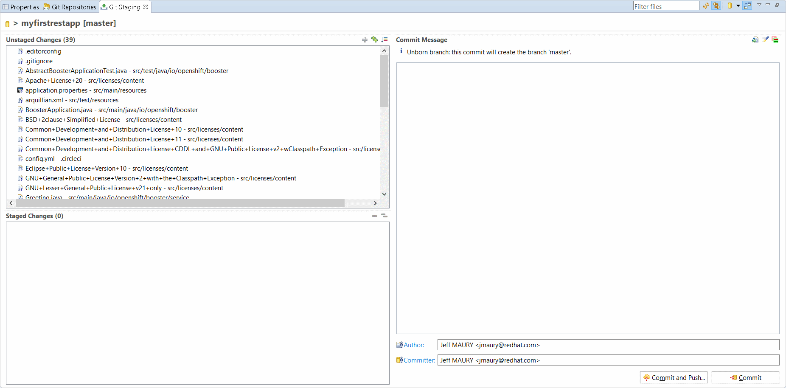

Select all the files listed in the ```Unstaged changes``` list and click the '+' button. The
files will then move to the ```Staged Changes``` list:

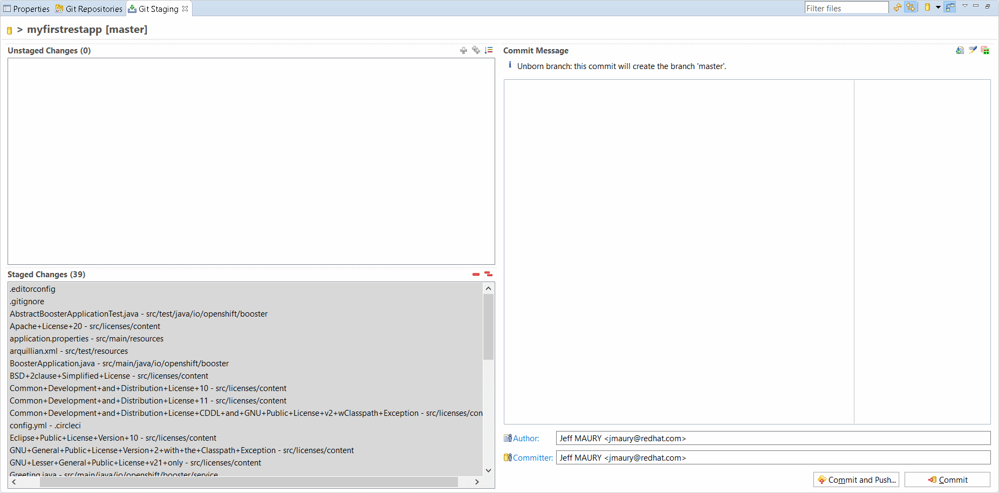

Enter a commit message (ex 'Initial version') and click the ```Commit and Push...``` button.
the following dialog will be displayed:

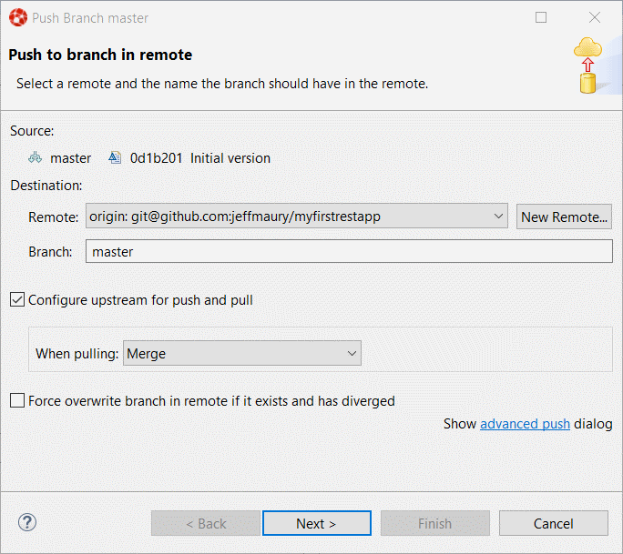

Click on the ```Next``` button:

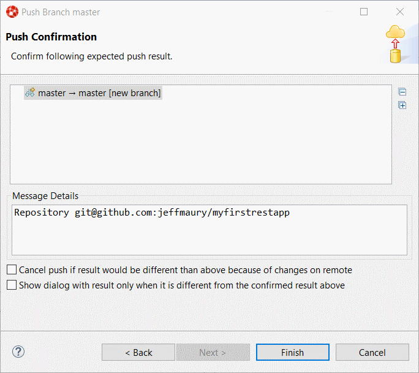

Click on the ```Finish``` button to start the push operation.

A dialog with the result of the push operation will be displayed. Click the ```OK``` to
dismiss it.

===== Add Spring Boot Devtools to the packaged application

In order to support live update on an OpenShift cluster, we must add Spring Boot
DevTools to our Spring Boot application.

Open the ```pom.xml``` in the  ```myfirstrestapp```. Locate the ```spring-boot-maven-plugin```
and add the following section:

```xml
            <configuration>
              <excludeDevtools>false</excludeDevtools>
            </configuration>
```

The whole ```spring-boot-maven-plugin``` section is given below:

```xml
      <plugin>
        <groupId>org.springframework.boot</groupId>
        <artifactId>spring-boot-maven-plugin</artifactId>
        <executions>
          <execution>
            <goals>
              <goal>repackage</goal>
            </goals>
            <configuration>
              <excludeDevtools>false</excludeDevtools>
            </configuration>
          </execution>
        </executions>
      </plugin>
```

Close and save the ```pom.xml``` file.

Push the change to GitHub: select the ```Team -> Commit...``` with a new commit
message (ex 'With DevTools')

==== Deploy the application on OpenShift

Before we can deploy the application on OpenShift, we must first create an ImageStream on
our OpenShift cluster. The reason is that the Spring Boot support relies on S2I builds
that will explode the Spring Boot uber JAR when Spring Boot DevTools is present. As this
is not supported by all Java based S2I images, we will use one that supports it, ie fabric8/s2i-java:2.2

First, in the ```myfirstrestapp``` project, create a new JSON file called ```springboot.json```
and set the content of this file to:

```json
{
    "apiVersion": "image.openshift.io/v1",
    "kind": "ImageStream",
	"metadata": {
		"name": "springboot"
	},
    "spec": {
        "lookupPolicy": {
            "local": false
        },
        "tags": [
            {
                "annotations": {
					"tags": "builder,java"
				},
                "from": {
                    "kind": "DockerImage",
                    "name": "registry.access.redhat.com/fuse7/fuse-java-openshift:1.1"
                },
                "importPolicy": {},
                "name": "1.1",
                "referencePolicy": {
                    "type": "Source"
                }
            }
        ]
    }
}
```

Then, from the OpenShift explorer view, select the OpenShift connection for your cluster (if you don't have
one already defined, you must define it), right click on the ```New -> Resource...``` menu item and the
following dialog will be displayed:

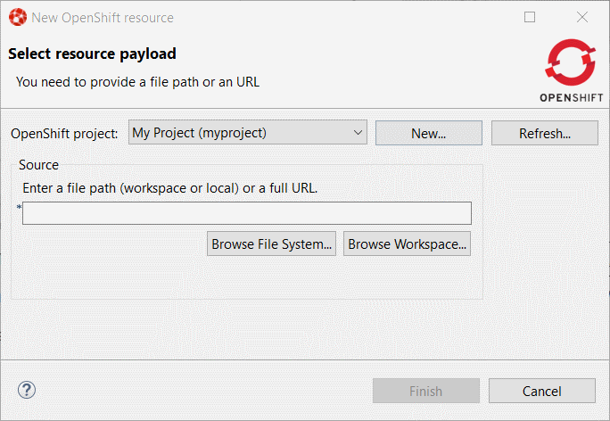

You can select the OpenShift project you want to work with and then click on
the ```Browse Workspace...``` button and select the ```springboot.json``` file
in the ```myfirstrestapp``` project:

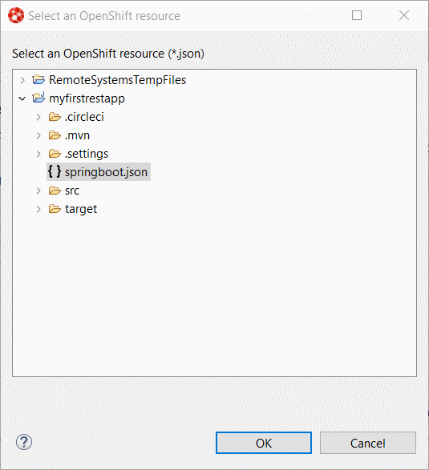

Click the ```OK``` and ```Finish``` buttons. The new ImageStream will be created and a status
dialog will be displayed:

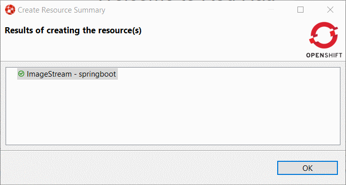

===== Create the application on OpenShift

We're now ready to create the application on the OpenShift cluster. Select the OpenShift
connection, right click the ```New -> Application...``` menu item. If you scroll down the
list, you should see the ```springboot``` ImageStream we just created:

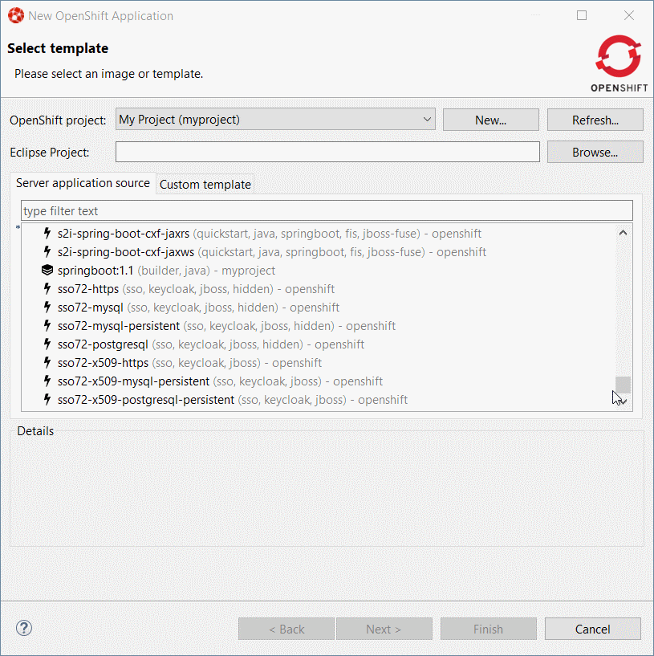

Select this ImageStream and click the ```Next``` button:

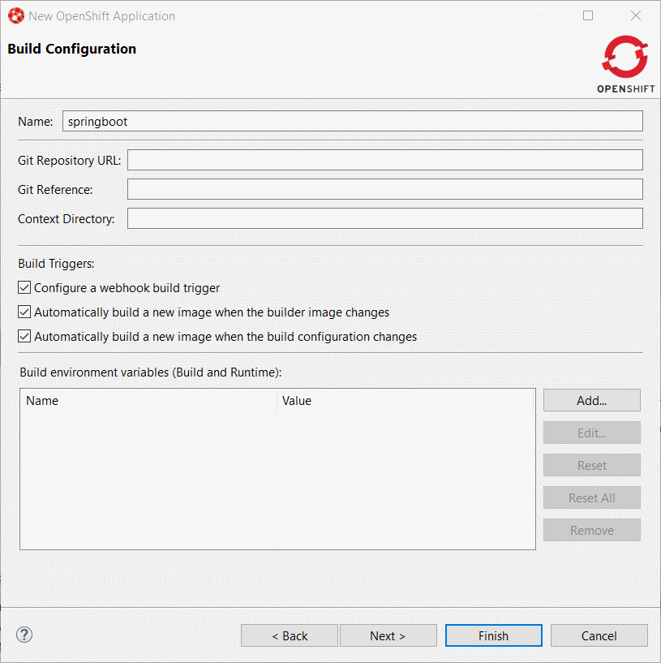

Enter ````myfirstrestapp``` in the ````Name````
field, ```https://github.com/GITHUB_USER/myfirstrestapp``` in the ```Git Repository URL```
field, replacing ```GITHUB_USER``` by your real GitHub user name and click
the ```Next``` button.

On the ```Deployment Configuration & Scalability``` dialog, click the ````Next``` button.

On the ```Service & Routing Settings```, select the ```8778-tcp``` port and click
the ```Edit``` button, change the 8787 value to 8080:

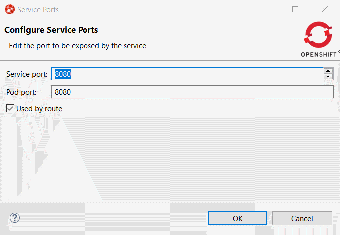

Click the ```OK``` button then the ```Finish``` button.

The list of OpenShift resources created will be displayed by a dialog:

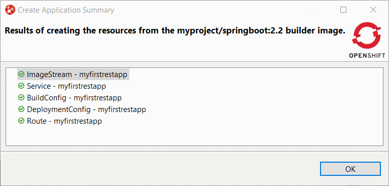

Click the ```OK``` button to dismiss it and when asked to import the application
code, click the ```Cancel``` button as we already have the source code.

After the build is run (this may takes several minutes as the Maven build will download
lots of dependencies), you should see a running pod:

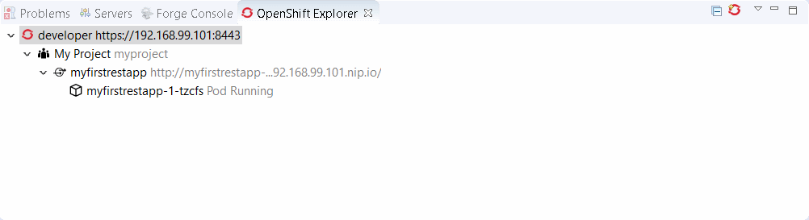

==== Inner loop setup

We are going to synchronize the local Eclipse project with the remote OpenShift pod. Each time a file
will be modified locally, then the pod will be updated accordingly.

Select the running pod in the ```OpenShift explorer```, right click the ```Server Adapter...``` menu
item, the following dialog will be displayed:

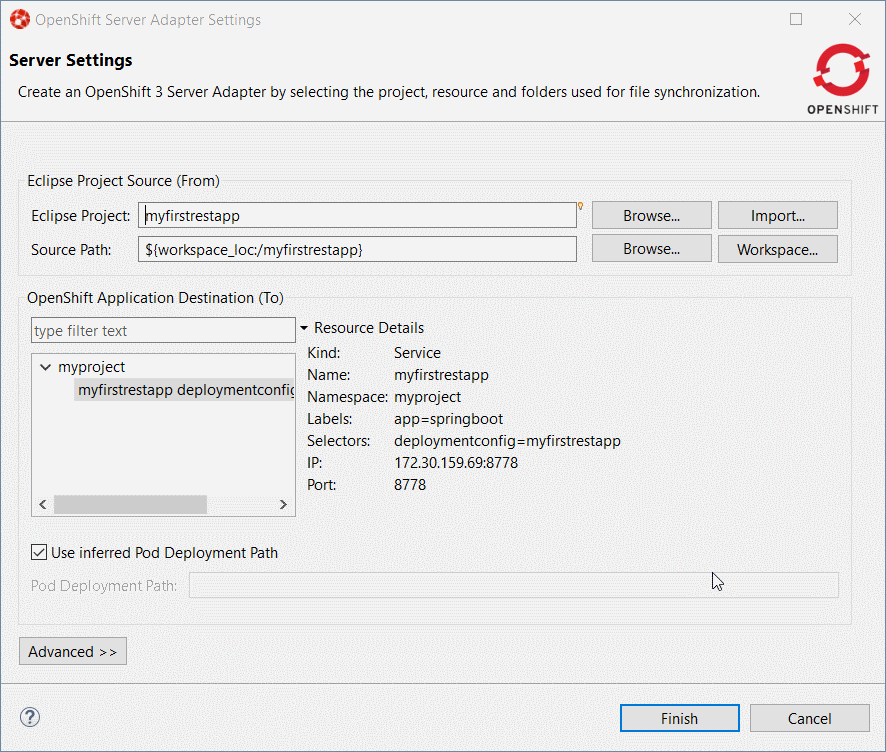

Click the ```OK``` button, the initial synchronization will be started and
the ```Servers``` view will be displayed:

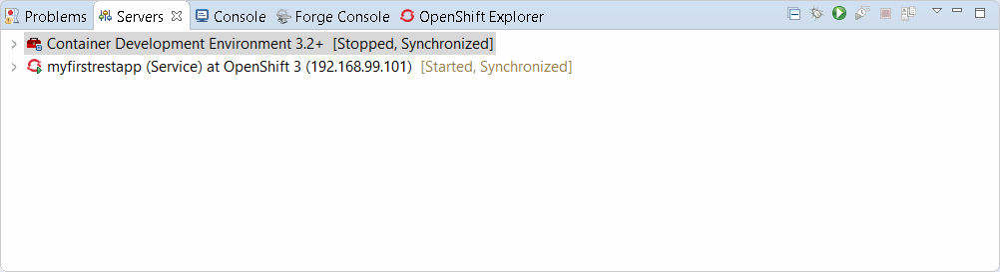

We've not setup the synchronization between our local Eclipse project and the remote
OpenShift project. Each modification done locally will be reported on the remote
OpenShift cluster.

Let's modify our local application code and see the changes applied almost
instantly:

Edit the file ```src/main/java/io/openshift/booster/service/Greeting.java```
in the ```myfirstrestapp``` project and change the ```FORMAT``` string
value from ```Hello, %s!``` to ```Hello, Mr %s!``` and save the file.

The file should be now:

```java
/*
 * Copyright 2016-2017 Red Hat, Inc, and individual contributors.
 *
 * Licensed under the Apache License, Version 2.0 (the "License");
 * you may not use this file except in compliance with the License.
 * You may obtain a copy of the License at
 *
 * http://www.apache.org/licenses/LICENSE-2.0
 *
 * Unless required by applicable law or agreed to in writing, software
 * distributed under the License is distributed on an "AS IS" BASIS,
 * WITHOUT WARRANTIES OR CONDITIONS OF ANY KIND, either express or implied.
 * See the License for the specific language governing permissions and
 * limitations under the License.
 */
package io.openshift.booster.service;

// tag::snippet-greeting[]
public class Greeting {

    public static final String FORMAT = "Hello, Mr %s!";

    private final String content;

    public Greeting() {
        this.content = null;
    }

    public Greeting(String content) {
        this.content = content;
    }

    public String getContent() {
        return content;
    }
}
// end::snippet-greeting[]
```

Then, in the ``ÒpenShift explorer``` view, select the ```myfirstrestapp``` deployment
and select the ````Show In -> Web Browser``` menu item and once the web browser is
displayed, ckick the ```Invoke``` button, you should see the following view:

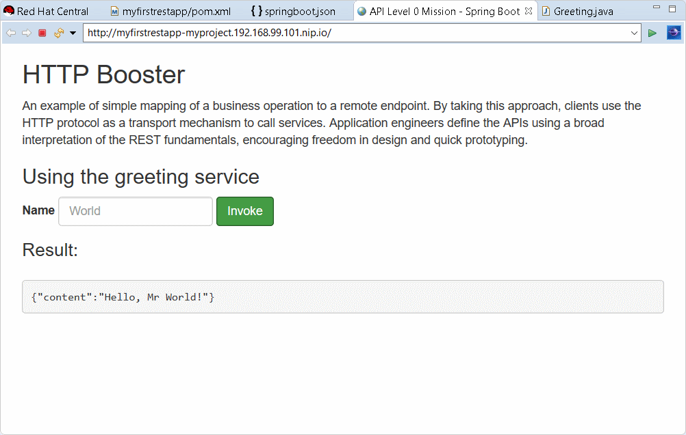

You've just experienced the inner loop on your Spring Boot application: any change done
locally is reported and testable almost immedialtely on your OpenShift cluster.

You can restart the deployment in debug mode and you'll be able to remote debug your
Spring Boot application. Amazing, no ?


related_jira::JBIDE-26162[]


