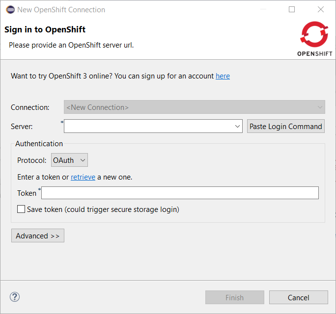
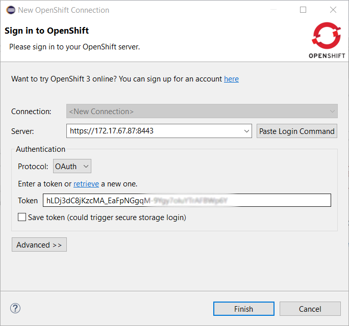

= OpenShift What's New in 3.6.0.AM1
:page-layout: whatsnew
:page-component_id: openshift
:page-component_version: 4.11.0.AM1
:page-product_id: jbt_core
:page-product_version: 4.11.0.AM1
:page-include-previous: true

=== New OpenShift connection helper

When you need to defined a new OpenShift connection, you need to provide the following information:

- cluster URL
- username and password or token

If you've already logged in your cluster through the OpenShift Web Console, you can copy an `oc` command
in the clipboard that contains both the cluster URL and your token. 

So, from now, there is a new option that allows you to initialize the wizard fields from the copied `oc`
command:

Click on the `Paste Login Command` button and the fields will be initialized:

related_jira::JBIDE-26117[]

